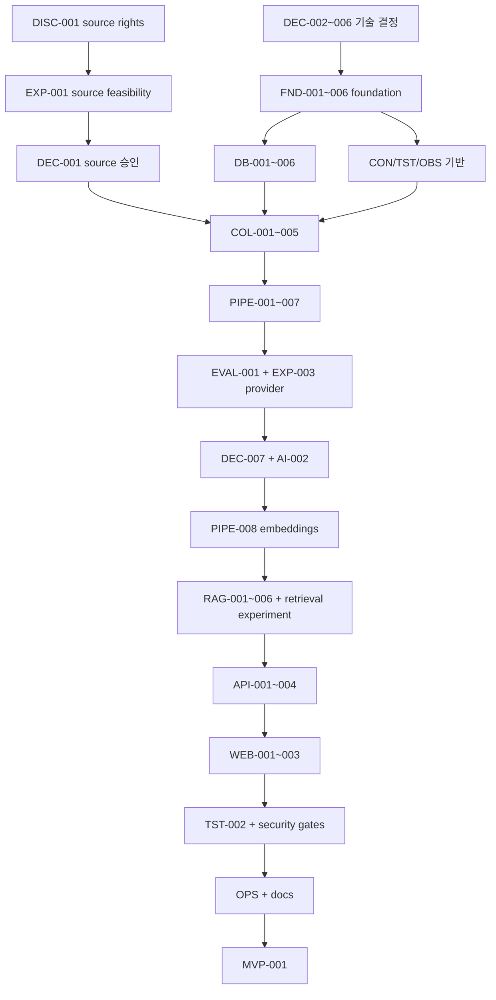

# TechPulse MVP Task Breakdown

- 상태: Implementation backlog
- 작성일: 2026-09-01
- 구현 상태: `FND-001`, `FND-002`, `FND-003`, `FND-004`, `FND-005`, `CON-001`, `OBS-001`, `TST-001`, `DB-001`, `DB-002`, `DB-003`, `DB-004`, `DB-005`, `DB-006`, `QUE-001`, `AI-001`, `DEC-008` 완료. `COL-001` 및 `FND-006` 착수 준비 상태이며, 나머지는 표의 상태와 dependency gate를 따른다
- 기준: [SSOT](./docs/SSOT.md), [PRD](./docs/PRD.md)

## 1. 사용 규칙

- 각 task는 한 사람이 대체로 0.5~2일 안에 완료·검증할 수 있는 크기를 목표로 한다.
- `Dependencies`가 모두 `DONE`일 때만 구현을 시작한다.
- `DEC-*`는 사용자의 승인이 필요한 decision gate다. 추천안을 적었다고 완료되지 않는다.
- `EXP-*`는 사전 정의된 실험 결과와 raw measurement가 있어야 완료다.
- 모든 구현 task의 공통 acceptance는 typecheck/lint, 영향 테스트, 관련 문서 동기화다.
- task를 추가·삭제·재정의하면 같은 변경에서 [TRACEABILITY.md](./docs/TRACEABILITY.md)를 갱신한다.
- 새 용어나 상태 값을 도입하면 [GLOSSARY.md](./docs/GLOSSARY.md)에 등록한다.
- production 구현이 승인됐다(2026-09-01). `READY` task를 dependency 순서로 실행하고 `BLOCKED`·`GATE` task를 앞질러 시작하지 않는다.

상태 값: `READY`(dependency가 모두 `DONE`이며 착수 가능), `BLOCKED`(선행 task 대기), `GATE`(명시적 승인 또는 사람의 준비 대기), `DONE`.

## 2. Decision and discovery

| ID | Task | Dependencies | Status | Acceptance criteria |
|---|---|---|---|---|
| DISC-001 | 초기 source rights matrix 작성 | - | DONE | [SOURCE_RIGHTS.md](./docs/SOURCE_RIGHTS.md)에 후보별 근거·인용·확인일이 기록됨; 채택 source key 11개(텍스트 7, 지표 4)와 제외·보류 10개가 결론과 함께 정리됨; Playwright 대상 확정; 사용자 확인 완료 2026-09-01 |
| DEC-001 | 초기 source set 승인 (권리 근거) | DISC-001 | DONE | ADR-0004가 Accepted(2026-09-01); 제외·포함 근거 기록; `verbatim_only`와 게시물별 license 규칙이 설계에 반영됨; SSOT §3.1·§3.2 동기화 완료 |
| DISC-002 | source 자격증명 확보와 인증 rate 재측정 | EXP-001 | GATE | `EXP-001` 측정으로 확인된 필수 자격증명이 준비되고 `.env.example`에 이름만 등록됨: GitHub PAT(releases 5,000/h, search 인증 필수 — 미인증 50% 실패), Stack Exchange API key(미인증 quota 299/일), Hugging Face token(rate 계층 상향). 실제 값은 커밋하지 않음. 자격증명 확보 후 인증 상태에서 rate limit과 10회 반복 성공률을 재측정하고 `github_search`가 ≥90%를 충족하는지 확인해 결과를 [SOURCE_CATALOG](./docs/SOURCE_CATALOG.md)에 기록함 |
| EXP-001 | source feasibility 실험 실행 | DISC-001 | DONE | run 1·2 측정 완료(2026-09-01). raw measurement: `experiments/exp-001/result.json`, `experiments/exp-001/repeat-result.json`. 11개 source 도달, 10개 source 10회 반복 100% 성공, `github_search` 미인증 5/10로 **인증 필수** 판정. 결과가 [SOURCE_CATALOG §14](./docs/SOURCE_CATALOG.md)와 [SOURCE_RIGHTS](./docs/SOURCE_RIGHTS.md)에 반영됨. 인증 상태 rate 재측정은 `DISC-002` acceptance로 이관 |
| DEC-002 | backend framework와 server runtime 승인 | EXP-005 | DONE | ADR-0001이 Accepted(2026-09-01); **Node runtime 위의 Elysia** 확정, Bun 미도입; 별도 schema library 없이 `t.*`가 단일 출처; 알 수 없는 필드 거부는 명시적 설정, 검증 실패는 400 매핑; SSOT §3.3·ARCHITECTURE §6 동기화 완료 |
| DEC-003 | AI orchestration 승인 | - | DONE | ADR-0002가 Accepted(2026-09-01); LangGraph.js deterministic workflow 확정, agent loop·장기 memory 미사용 명시; SSOT §3.3·RAG §3·§12 동기화 완료 |
| DEC-004 | queue/scheduler 승인 | EXP-005 | DONE | ADR-0003이 Accepted(2026-09-01); **Redis + BullMQ**를 전달·예약 계층으로 확정, business completion은 PostgreSQL에 기록; job은 멱등해야 하며 자연 키 unique + upsert로 확보; source별 상이한 주기·concurrency 요구 반영; SSOT §3.3·ARCHITECTURE §2·§6 동기화 완료 |
| DEC-005 | frontend 승인 | - | DONE | **SvelteKit 확정.** ADR-0005(Next.js)가 Accepted됐으나 같은 날 [ADR-0008](./docs/adr/0008-frontend-sveltekit.md)로 대체되어 `Superseded`; RAG·DB·수집 로직은 backend API에만 두고 server 기능은 UI 전달과 최소 BFF로 제한; SSOT §3.3·ARCHITECTURE §6 동기화 완료. frontend 코드가 없는 시점의 변경이라 마이그레이션 비용 0 |
| DEC-006 | repository layout/package manager/orchestration 승인 | - | DONE | [ADR-0010](./docs/adr/0010-turborepo-monorepo.md)이 Accepted(2026-09-01); pnpm workspaces + Turborepo와 승인 package 경계·의존 방향이 SSOT §3.3·ARCHITECTURE §6·§7에 반영됨. [ADR-0007](./docs/adr/0007-repository-layout.md)는 Superseded |
| DEC-008 | database hosting과 serverless connection 전략 승인 | - | DONE | 사용자가 Neon serverless PostgreSQL 전환을 명시 승인했고 [ADR-0011](./docs/adr/0011-neon-serverless-postgresql.md)이 Accepted(2026-09-02); Drizzle/Drizzle Kit·PostgreSQL/pgvector를 유지하면서 pooled runtime endpoint, direct migration endpoint, credential 분리, pooler session 제약과 local Docker fallback을 SSOT·ARCHITECTURE·DATABASE·SECURITY에 반영 |
| EXP-005 | foundation stack spike 실행 | - | DONE | [EXP-005](./docs/experiments/EXP-005-foundation-spike.md) 5개 run 측정 완료(2026-09-01); Playwright는 Bun 실패·Node 통과, 계약 스키마 단일 소스·BullMQ 멱등성·pgvector·Vitest·Testcontainers·pnpm focused test 모두 통과; 미측정 항목이 구현 task로 이관됨; spike code 폐기 범위 명시 |

## 3. Project foundation

| ID | Task | Dependencies | Status | Acceptance criteria |
|---|---|---|---|---|
| FND-001 | 승인된 workspace/app/package skeleton 생성 | DEC-002, DEC-003, DEC-004, DEC-005, DEC-006 | DONE | pnpm workspace에 `apps/{web,api,worker}`와 `packages/{contracts,domain,database,collectors,rag,observability}` 생성; **`web`은 SvelteKit, `api`는 Elysia on Node, `worker`는 Node 진입점**; web이 contracts만 import하고 database/collectors/rag를 import하지 않음; 각 package의 focused build·test 명령이 성공; application feature는 없음 |
| FND-002 | 공통 TypeScript·format·lint·test 설정 | FND-001 | DONE | strict typecheck와 format/lint/test 명령이 workspace root 및 package filter에서 동작; intentional failing sample로 CI failure가 확인됨; merge `6967384`에서 검증 완료 |
| FND-003 | CI 기본 pipeline | FND-002 | DONE | clean checkout에서 install with lockfile → static → unit 순서가 성공; cache 없이도 재현 가능; branch protection용 필수 check 이름 `CI / install → static → unit` 문서화; merge `31ac743` 및 foundation gate 검증 완료 |
| FND-004 | 로컬 dependency Compose 구성 | FND-001, DEC-004 | DONE | PostgreSQL+pgvector와 승인 queue dependency가 healthcheck를 통과; persistent/ephemeral profile 구분; secret 기본값이 production에 안전하지 않음을 명시; merge `6967384`에 반영된 Compose 변경(`ebd1b5f`)에서 검증 완료 |
| FND-005 | runtime config와 secret validation | FND-001 | DONE | API/worker별 필요한 env schema가 startup에 검증됨; secret 값은 log/error에 없음; `.env.example`에는 placeholder만 있음; merge `2d82c74` 및 API/worker static·config test 검증 완료 |
| FND-006 | CI에 integration·contract·E2E·security 단계 확장 | FND-003, FND-004, DB-003 | BLOCKED | [TESTING §11](./docs/TESTING.md)의 단계 순서가 CI에 존재하고 실패가 merge를 차단; live canary와 유료 LLM 평가는 blocking pipeline 밖에서 실행됨; 아직 구현되지 않은 suite는 빈 통과가 아니라 미등록으로 남고 해당 task 완료 시 추가하는 규칙이 문서화됨 |
| OBS-001 | 구조화 logging과 correlation contract | FND-001 | DONE | request/run/job/source/query ID가 공통 schema로 전달됨; redaction unit test가 token·cookie·payload를 가림 |
| CON-001 | API/job/domain contract package | FND-001 | DONE | answer request/response, error, collection job schema가 versioned runtime validation과 TS type을 한 source에서 제공; invalid fixture 거부 테스트 통과; **알 수 없는 요청 필드 거부가 명시적으로 설정됨**(framework 기본값이 아님, EXP-005 run 2); 검증 실패가 400으로 매핑됨; 미선언 응답 필드 제거가 회귀 테스트로 고정됨 |
| TST-001 | 공통 fixture·fake clock/ID/provider harness | FND-002, CON-001 | DONE | unit test가 network 없이 deterministic하게 실행; 승인된 runtime의 test runner에서 fake 주입이 성립; fixture provenance/redaction metadata schema가 검증됨 |

### FND-001 완료 증빙 (2026-09-01)

- 새 worktree에서 `pnpm install`을 실행해 `pnpm-lock.yaml`을 생성했다.
- `pnpm build`가 3개 app과 6개 shared package의 focused build를 통과했다.
- `pnpm test`가 각 workspace의 focused test와 web의 `@techpulse/contracts` 전용 import boundary check를 통과했다.
- `pnpm --filter @techpulse/worker start`가 Node entrypoint를 실행했고, SvelteKit은 `127.0.0.1:4173`, Elysia API는 `127.0.0.1:3000`에서 각각 기동을 확인했다.

### FND-002 완료 증빙 (2026-09-01; merge `6967384`)

- `pnpm install --frozen-lockfile`이 10개 workspace project에서 성공했다.
- `pnpm run static`이 workspace typecheck(9개 실행 project), ESLint, Prettier check를 모두 통과했다.
- `pnpm --filter @techpulse/domain run static`이 package-filter typecheck·lint·format을 통과했고, `pnpm --filter @techpulse/domain test`가 1개 테스트를 통과했다.
- `pnpm run verify:static-failure`가 의도적 `TS2322` 오류로 static 단계가 실패하는 것을 확인한 뒤 성공 종료했다.

### FND-003 완료 증빙 (2026-09-01; merge `31ac743`)

- `.github/workflows/ci.yml`의 필수 check `CI / install → static → unit`이 clean checkout에서 Node.js 22·pnpm 10.32.1로 `pnpm install --frozen-lockfile` → `pnpm run static` → `pnpm run test` 순서를 실행한다. cache action 없이 구성됐고 foundation gate에서 순서와 성공을 검증했다.

### FND-004 완료 증빙 (2026-09-01; merge `6967384`, Compose 변경 `ebd1b5f`)

- `docker compose --profile persistent up -d --wait`에서 `pgvector/pgvector:pg17` PostgreSQL과 `redis:7.4-alpine` Redis가 모두 `healthy`가 됐고, 확인 후 `down`으로 정리했다.
- `docker compose --profile ephemeral up -d --wait`에서 동일 두 dependency가 모두 `healthy`가 됐고, 확인 후 `down`으로 정리했다.
- Compose 정의에서 persistent profile은 PostgreSQL·Redis named volume을 사용하고 ephemeral profile은 PostgreSQL `tmpfs`와 Redis 비영속 설정을 사용한다. 기본 credential은 `unsafe-local-development-only`로 명시되어 production용이 아님을 알린다.

### FND-005 완료 증빙 (2026-09-01; merge `2d82c74`)

- `pnpm --filter @techpulse/api static`과 `pnpm --filter @techpulse/worker static`이 typecheck·lint·format을 모두 통과했다.
- `pnpm --filter @techpulse/api test`와 `pnpm --filter @techpulse/worker test`가 각각 2개 test file·4개 test를 통과했다. missing/invalid env, secret redaction, valid defaults를 검증하며 오류에 공급값을 노출하지 않는다.

### CON-001 완료 증빙 (2026-09-01; merge `5c2045d`)

- 현재 main의 `pnpm run static` gate가 typecheck(9개 실행 project), ESLint, Prettier check를 모두 통과했다.
- `pnpm --filter @techpulse/contracts test`가 2개 test file·11개 test를 통과했다. versioned request/response/error/job validation, unknown field 거부, response sanitization, deterministic HTTP 400 매핑을 검증한다.

### OBS-001 완료 증빙 (2026-09-01; merge `1d59cb3`)

- 현재 main의 `pnpm run static` gate가 typecheck(9개 실행 project), ESLint, Prettier check를 모두 통과했다.
- `pnpm --filter @techpulse/observability test`가 2개 test file·10개 test를 통과했고, `pnpm --filter @techpulse/worker test`의 correlation test 3개가 통과했다. correlation ID precedence/fallback, UTC structured event, recursive token·cookie·authorization·secret·payload redaction을 검증한다.

### CON-001·OBS-001 통합 확인 (2026-09-01; current main `1d59cb3`)

- `@techpulse/api` test 2개 file·4개 test와 `@techpulse/worker` test 3개 file·7개 test가 통과했다. main gate와 병합된 API/worker runtime 경계에서 두 contract package의 연결을 확인했다.

### TST-001 완료 증빙 (2026-09-01; merge `845f5de`)

- `@techpulse/test-harness`에 `createTestHarness`, fake clock, deterministic ID/UUID generator, offline fake chat/embedding provider, fixture metadata validation 및 reset helper를 구현했다.
- `pnpm --filter @techpulse/test-harness test`가 1개 test file·12개 test를 통과했다. 유효하지 않은 calendar date 거부, inherited prompt prototype fallback 방어, createTestHarness reset, fractional advance 거부 및 결정적 fake provider 동작을 검증한다.

### Turborepo 루트 태스크 그래프 완료 증빙 (2026-09-01; merge `c5aa0b4`)

- root `turbo.json`에 `build`, `typecheck`, `lint`, `format`, `test`의 dependency-aware task graph(`^build`, `^typecheck` 등)와 cache 설정을 구성했다.
- root `package.json`의 `build`, `test`, `typecheck` 명령이 `turbo run`을 통해 10개 workspace package(tooling 포함)의 task dependency 순서대로 실행되며, `pnpm run static`과 `verify:static-failure`가 Turbo 하에서도 오류를 정확히 전파한다.

## 4. Database and persistence

| ID | Task | Dependencies | Status | Acceptance criteria |
|---|---|---|---|---|
| DB-002 | source, run, raw item schema | DB-001 | DONE | source/run/raw/pipeline event table과 FK/unique/check가 migration으로 생성됨; 동일 raw revision 2회 insert가 한 logical row를 유지; Neon integration test 통과 (2026-09-02) |
| DB-003 | document, revision, topic, chunk, embedding schema | DB-002 | DONE | revision 불변성, publish status, topic link, chunk ordinal, versioned embedding uniqueness가 실제 PostgreSQL integration test로 검증됨 (2026-09-02) |
| DB-004 | metric observation, query run, citation schema | DB-003 | DONE | metric 자연 키, query/citation FK와 query-run 내 citation key uniqueness가 검증됨; citation이 immutable revision/chunk를 가리킴 (2026-09-02) |
| DB-005 | repository ports/adapters 구현 | DB-004, CON-001 | DONE | domain port가 framework type에 의존하지 않음; transaction rollback, pagination, publish/read filter integration test 통과 (2026-09-02) |
| DB-006 | baseline FTS와 exact vector query | DB-003 | DONE | time/status filter를 강제한 FTS·cosine exact query가 seeded corpus에서 결정적 결과 반환; query plan/latency baseline 기록 (2026-09-02) |

| COL-001 | collector port와 source policy guard | DEC-001, EXP-001, DISC-002, CON-001, DB-002, TST-001 | BLOCKED | collector 결과가 공통 raw contract를 만족; host/scheme/size/redirect guard가 SSRF corpus를 거부; cursor가 opaque하게 보존됨; source별 `verbatim_only`·license·개인정보 제거 규칙이 설정에서 강제됨 |
| COL-002 | GitHub Releases collector | COL-001 | BLOCKED | 승인 repo의 pagination, conditional request, rate headers, release update fixture 통과; stable external ID/URL/date 저장; `published_at`과 `created_at` 구분; author 객체 제거; live canary 분리 |
| COL-003 | Stack Exchange collector | COL-001 | BLOCKED | 게시물별 `content_license` 저장; `verbatim_only` 표시 전파; 응답 본문 `backoff` 준수; 부재 기반 삭제 감지가 rate limit·오류를 삭제로 오인하지 않음; owner 개인정보 제거 fixture 통과 |
| COL-004 | npm collector/metric adapter | COL-001 | BLOCKED | 승인 endpoint의 package/version/metric 단위와 기간이 보존됨; 누락·rate/error 처리 fixture 통과; 불명확 지표를 0으로 저장하지 않음; maintainer email 제거 |
| COL-005 | 승인 source Playwright collector | COL-001 | BLOCKED | semantic locator fixture test와 10회 canary gate 통과; 로그인/CAPTCHA 우회 없음; download/popup/host가 제한됨; trace artifact redacted; collector 실행 runtime이 EXP-005 측정 결과와 일치하고 runtime 전용 API 의존이 adapter 경계 안에 있음 |
| COL-006 | arXiv collector | COL-001 | BLOCKED | 요청 간격 3초·단일 연결 준수; 동일 질의 1일 1회 캐싱; PDF·전문 미저장 검증; 버전 접미사(v1/v2)와 `published`·`updated` 구분 저장 |
| COL-007 | Discourse forum collector | COL-001 | BLOCKED | 게시일 기준 라이선스 분리로 2020-07-17 이전 게시물 미저장; `deleted_at`·`user_deleted` 기반 tombstone; 429·`Retry-After` 준수; robots disallow 경로 미접근; username 제거 |
| COL-008 | 공통 article collector (RSS/HTTP) | COL-001 | BLOCKED | Chrome release notes와 react.dev/blog를 동일 adapter로 처리; feed 발견과 본문 추출 분리; 이미지·상표 미저장; 라이선스·귀속 metadata 저장 |
| COL-009 | GitHub search 신호 collector | COL-001 | BLOCKED | 질의 문자열과 수집 시각을 스냅샷 메타로 기록해 재현 가능; 1,000건 상한과 분당 30건 준수; `incomplete_results` 처리; 별 히스토리 소급 재구성을 시도하지 않음 |
| COL-010 | Hugging Face 지표 collector | COL-001 | BLOCKED | 지표만 저장하고 model card 본문을 수집하지 않음; rate limit 계층과 429 처리; namespace 개인정보 미보관 |
| QUE-001 | scheduler와 versioned job delivery | DEC-004, FND-004, CON-001 | DONE | source/schedule window 중복 job 없음; UTC schedule, retry/backoff, concurrency cap과 job schema validation integration test 통과; **EXP-005 미측정 항목 검증**: SIGKILL 후 재시작 복구, 다중 worker 경합과 backpressure, DB commit 후 job 유실에 대한 outbox 필요성 판단 |
| PIPE-001 | collection run과 raw ingestion orchestration | COL-001, QUE-001, DB-002, OBS-001 | BLOCKED | raw 저장 후에만 후속 단계가 생성됨; worker kill/동일 job 재전달에서 raw logical duplicate 0; run counts와 오류 상태 조회 가능 |
| PIPE-002 | deterministic normalization | PIPE-001, DB-003 | BLOCKED | JSON/HTML fixture가 공통 document/metric으로 변환; 게시일 unknown은 null; sanitizer가 script/hidden instruction을 제거; normalizer version 기록 |
| PIPE-003 | exact dedup과 duplicate cluster | PIPE-002 | BLOCKED | external ID/canonical URL/hash 우선 규칙 통과; cross-source 원본을 삭제하지 않고 cluster link 생성; 동일 재처리 결과 불변 |
| EXP-004 | deduplication 실험 실행 | PIPE-003, COL-002, COL-003 | BLOCKED | [EXP-004](./docs/experiments/EXP-004-deduplication.md)의 labeled holdout, confusion matrix, threshold 결과가 기록되고 false-merge gate 평가됨 |
| PIPE-004 | near-duplicate 후보·versioned clustering | EXP-004 | BLOCKED | 승인 algorithm/threshold만 사용; low-confidence는 자동 merge하지 않음; recluster가 기존 provenance/citation을 파괴하지 않음 |
| PIPE-005 | topic alias/classification과 chunking | PIPE-004, DB-003 | BLOCKED | [TOPIC_TAXONOMY](./docs/TOPIC_TAXONOMY.md)의 deterministic alias가 우선 적용되고 단어 경계·ambiguous 규칙이 unit test로 검증됨; classifier version/confidence 저장; heading-aware stable chunks; 동일 input/version의 chunk hash·ordinal 불변 |
| PIPE-006 | metric aggregation | COL-003, COL-004, COL-007, COL-009, COL-010, PIPE-003, DB-004 | BLOCKED | 8개 지표가 각각 고유 unit으로 저장되고 서로 합산되지 않음; `community_mentions`는 duplicate cluster 기준; `repo_attention`은 스냅샷 기준이며 수집 시작 이전 구간을 생성하지 않음; `query_signature`와 `is_incomplete`가 검색 기반 관측값에 기록됨; missing window를 0으로 오인하지 않는 테스트 통과 |
| PIPE-007 | replay, dead-letter, source disable flow | PIPE-001, PIPE-005 | BLOCKED | run/raw/stage 범위 replay가 멱등; 영구 실패와 policy failure를 구분; disabled source는 새 job을 만들지 않음; 운영 audit event 기록 |

### DB-001 완료 증빙 (2026-09-01; merge `6033926`)

- `packages/database`에 Drizzle ORM, Neon serverless adapter, Drizzle Kit 설정, pgvector bootstrap migration(`0000_bootstrap_pgvector.sql`), migration runner 및 lazy client factory를 구현했다. import 시점에 DB 연결이나 credential 로깅을 하지 않는다.
- `pnpm --filter @techpulse/database test`가 4개 test file·15개 deterministic test를 통과했다(DB 미연결 시 자동 skip).
- 실제 Docker Compose PostgreSQL 17 + pgvector 환경에서 migration 2회 적용 멱등성(동일 migration hash 유지, 중복 실행 없음)과 vector distance 쿼리를 포함한 16개 테스트가 모두 통과했다.

### QUE-001 완료 증빙 (2026-09-01; merge `b7e1070`)

- `apps/worker`에 BullMQ versioned collection scheduler, natural-key deduplication, Redis/in-memory source concurrency limiter, TTL 이전 자동 lease renewal, safe error handling 및 PostgreSQL delivery boundary callback을 구현했다.
- `pnpm --filter @techpulse/worker test`가 5개 test file·19개 unit test를 통과했다(Redis 미연결 시 integration test skip).
- 실제 Docker Compose Redis 환경에서 `redis.integration.test.ts` 4개 테스트가 모두 통과했다: 첫 acquire, concurrency cap-1 경합, lease release, BullMQ 중복 억제, child-process SIGKILL 후 bounded lease 복구를 검증했다.

### DB-002 구현·검토 증빙 (2026-09-02; merge `bc2d449`)

- `packages/database`에 source/run/raw/pipeline event schema와 `0001_complete_puck.sql`, `0002_mature_post.sql` migration을 추가했다. source/run 관계, raw revision natural key, FK/check 제약과 raw/pipeline event 불변성 트리거를 반영했다.
- review fixes `9c5e4cb`, `f58fc94`가 raw/event immutability와 composite FK migration ordering을 보완했다. Neon PostgreSQL 환경에서 `pnpm --filter @techpulse/database test` 실행 결과 6개 test file·19개 test(마이그레이션 2회 적용 멱등성, vector 확장 확인, raw revision 중복 억제 integration test 포함)가 모두 성공적으로 통과했다.

### DEC-008 완료 증빙 (2026-09-02; merge `43cb706` 및 Neon 변경 통합)
### DB-003, DB-004, DB-005, DB-006 완료 증빙 (2026-09-02)

- **DB-003**: `documents`, `document_revisions`, `topics`, `document_topics`, `chunks`, `embeddings`, `licenses`, `duplicate_clusters` 테이블 정의 및 migration(`0003_amusing_stone_men.sql`) 적용 완료. revision uniqueness, chunk ordinal, pgvector embedding 제약 검증 통과.
- **DB-004**: `metric_observations`, `query_runs`, `answer_citations` 테이블 정의 및 migration(`0004_pale_ironclad.sql`) 적용 완료. metric 자연 키 uniqueness, query citation 관계 검증 통과.
- **DB-005**: `@techpulse/domain`에 `DocumentRepositoryPort`, `SourceRepositoryPort` 정의 및 `packages/database`에 Drizzle 기반 구현체 작성. transaction 기반 원자적 revision publish 및 pagination 검증 통과.
- **DB-006**: `@techpulse/domain`에 `SearchServicePort` 정의 및 `packages/database`에 PostgreSQL FTS(`tsvector`/`ts_rank`) 및 exact cosine vector(`<=>` 연산자) 쿼리 서비스 구현 완료.
- `pnpm run static` 및 `pnpm run test`(10개 workspace, 12개 database 테스트 파일·32개 테스트 전체) 모두 통과.
- `packages/database`의 runtime client, migration runner, vector schema helper가 `@neondatabase/serverless`와 `drizzle-orm/neon-serverless`를 사용하도록 전환됐다. `DATABASE_URL`은 runtime pooled endpoint, `DATABASE_URL_DIRECT`는 Drizzle Kit migration endpoint로 문서화했고 `.env.example`에는 placeholder만 둔다.
- Neon adapter focused test 3개 file·13개 test가 통과했고, adapter review는 API/lifecycle/credential redaction에 Critical/High/Medium/Low 이슈 없음으로 PASS했다.
- `pnpm install --frozen-lockfile`, `pnpm run static`(typecheck·ESLint·Prettier), `pnpm run test`(10개 workspace, 10개 성공)이 Neon 변경 통합 후 통과했다. database는 17개 테스트 통과·2개 PostgreSQL integration skip, worker는 19개 테스트 통과·4개 Redis integration skip이다.
- 현재 실행 환경에는 `DATABASE_URL`·`DATABASE_URL_DIRECT`가 없어 live Neon 연결 smoke는 실행하지 않았다. Docker PostgreSQL integration도 Docker Linux engine blocker로 실행하지 않았다.

### AI-001 완료 증빙 (2026-09-02; merge `cc20a66`)
- review fix `c5eb8ee`가 실제 async latency, mid-flight AbortSignal/timeout 처리와 typed `provider_error` metadata를 보완했다. `pnpm run test`에서 domain 7개 테스트가 통과했고, provider SDK/network/API key 참조는 없다.
## 6. Models, retrieval, and RAG

| ID | Task | Dependencies | Status | Acceptance criteria |
|---|---|---|---|---|
| AI-001 | provider-neutral chat/embedding ports와 fakes | FND-001, CON-001, TST-001 | DONE | domain/RAG가 provider SDK를 import하지 않음; timeout/usage/model metadata contract와 deterministic fake가 테스트됨; 구현·review 완료 |
| EVAL-001 | 골든 corpus와 질의 라벨 작성 | DEC-001, COL-002, COL-003 | BLOCKED | [EVAL_GOLDEN_SET](./docs/EVAL_GOLDEN_SET.md)의 38개 질문과 5개 주입 항목에 relevance·allowed·forbidden claim 라벨이 채워짐; 검토자와 검토일 기록; `insufficient_evidence`·`unsupported_intent` 기대값이 6개 이상 |
| EXP-003 | model provider 평가 실행 | AI-001, EVAL-001, PIPE-005 | BLOCKED | [EXP-003](./docs/experiments/EXP-003-model-providers.md)의 최소 2개 후보 품질·latency·비용·policy scorecard와 raw measurement가 기록됨 |
| DEC-007 | chat/embedding provider와 model 승인 | EXP-003 | GATE | ADR-0006이 Accepted/Rejected로 변경; model IDs, dimensions, budget, data policy가 SSOT/RAG/DATABASE에 반영됨 |
| AI-002 | 선택 provider adapter 구현 | DEC-007, AI-001 | BLOCKED | structured output, timeout, rate error, usage를 공통 contract로 변환; secret/log redaction; provider contract test 통과 |
| PIPE-008 | versioned embedding stage | AI-002, PIPE-005, DB-003 | BLOCKED | 동일 chunk/model/input hash는 API 재호출 없음; partial failure 재개; dimensions mismatch 차단; publish는 필수 embedding 완료 후만 가능 |
| RAG-001 | query intent/entity/time parser | DEC-003, AI-002, CON-001 | BLOCKED | 4개 intent와 명시 기간 우선, timezone/rolling window, alias, invalid/ambiguous fixture 통과; 날짜 계산은 deterministic code에서 수행 |
| RAG-002 | metadata-filtered hybrid candidate retrieval | DB-006, PIPE-008, EVAL-001 | BLOCKED | FTS와 exact vector 후보가 동일 time/status/rights filter를 사용; time violation 0; ranked evidence에 revision/chunk provenance 포함 |
| EXP-002 | retrieval/index 실험 실행 | RAG-002 | BLOCKED | [EXP-002](./docs/experiments/EXP-002-retrieval.md)의 variants, Recall/nDCG, latency, query plans 기록; exact/HNSW 결정 recommendation 생성 |
| RAG-003 | fusion, recency, cluster/source diversity | EXP-002 | BLOCKED | 승인 config로 RRF/boost/caps 구현; 점수는 사용자 관심도로 노출되지 않음; 골든셋 regression gate 통과 |
| RAG-004 | evidence sufficiency와 context assembly | RAG-003 | BLOCKED | intent별 최소 근거, token budget, adjacent chunk merge, duplicate upstream 억제; 부족하면 기간을 몰래 넓히지 않고 abstain |
| RAG-005 | answer generation과 citation validation workflow | RAG-001, RAG-004, AI-002 | BLOCKED | 승인 orchestration에서 parse→retrieve→generate→validate branch가 trace됨; fabricated/missing/out-of-range citation 차단; `verbatim_only` source 근거가 재서술 없이 원문 발췌로 제시되는지 후검증; retry 최대 1회 |
| RAG-006 | comparison/trend computation | PIPE-006, RAG-001, RAG-004 | BLOCKED | 두 대상에 동일 기간·unit 적용; absolute value와 baseline 표시; missing/zero baseline 안전 처리; 서로 다른 metric 미합산 |
| EVAL-002 | RAG regression harness와 release gate | RAG-005, RAG-006, EVAL-001 | BLOCKED | retrieval/generation/security 지표를 commit/model/config별 비교; proposed MVP gate 결과와 실패 질문 목록을 artifact로 출력 |

## 7. API, security, and web

| ID | Task | Dependencies | Status | Acceptance criteria |
|---|---|---|---|---|
| API-001 | API shell, error model, health/readiness | DEC-002, CON-001, DB-005, FND-005, OBS-001 | BLOCKED | versioned JSON/error contract와 request ID; liveness는 dependency와 무관, readiness는 DB 상태 반영; stack/provider error 비노출 |
| API-002 | source/topic endpoints | API-001, COL-001, DB-005 | BLOCKED | source freshness를 secret 없이 반환; topic search cursor/limit validation; OpenAPI contract test 통과 |
| API-003 | synchronous answer endpoint | API-001, RAG-005, RAG-006 | BLOCKED | resolved range, answer/insufficient status, observations, citations, coverage 반환; deadline/body cap/idempotency contract test 통과 |
| SEC-001 | public API abuse controls | API-003, FND-005 | BLOCKED | CORS allowlist, security headers, rate/concurrency/provider budget limit; oversized/injection/fuzz 입력에서 정보 유출·무제한 호출 없음 |
| API-004 | protected operations endpoints 또는 CLI | PIPE-007, API-001, SEC-001 | BLOCKED | 선택 interface가 strong auth로 보호; bounded collect/replay와 idempotency; public route에서 접근 불가; audit event 생성 |
| SEC-002 | collector/browser hardening | COL-005, PIPE-002 | BLOCKED | non-root/최소 capability, egress allowlist, private IP/redirect 차단, HTML output escaping, malicious fixture 회귀 통과 |
| SEC-003 | RAG prompt-injection/egress hardening | RAG-005, SEC-001 | BLOCKED | retrieved instruction이 tool/secret/URL을 바꾸지 못함; RAG에 arbitrary fetch/shell 없음; injection corpus success 0 |
| WEB-001 | web shell과 typed API client | DEC-005, FND-001, CON-001, API-001 | BLOCKED | web이 DB/provider package를 import하지 않음; server 전용 코드가 `+page.server.ts`·`+server.ts`·`$lib/server/` 경계 안에만 있고 client bundle 산출물 검사에서 secret이 발견되지 않음; loading/error/empty layout 접근성 smoke; API contract type drift test 통과 |
| WEB-002 | 질문·답변·citation UI | WEB-001, API-003 | BLOCKED | 질문/기간 입력, resolved range, answer, clickable citation/date/source, limitations/insufficient state 표시; keyboard/screen-reader labels 검증 |
| WEB-003 | 비교 metric과 source freshness UI | WEB-002, API-002, RAG-006 | BLOCKED | metric별 unit/기간 분리 표시; composite score 없음; stale/partial source warning이 API coverage와 일치 |
| TST-002 | Playwright UI E2E suite | WEB-002, WEB-003, TST-001 | BLOCKED | seeded DB+fake model에서 summary/comparison/no-data/citation 흐름 통과; collector suite와 분리; flaky retry 없이 Chromium PR smoke 성공 |

## 8. Operations and MVP acceptance

| ID | Task | Dependencies | Status | Acceptance criteria |
|---|---|---|---|---|
| OPS-001 | API/web/worker Docker images와 full Compose | API-004, WEB-003, FND-004 | BLOCKED | non-root images, healthcheck, graceful shutdown; clean machine에서 documented one-command stack; browser binary/version pin 검증 |
| OPS-002 | metrics/dashboard와 failure alert baseline | OBS-001, PIPE-007, API-003 | BLOCKED | source freshness, stage counts/errors, queue lag, DB/LLM latency/usage가 correlation IDs로 추적; alert test event 확인 |
| OPS-003 | backup/restore, retention, tombstone runbook | DB-005, PIPE-007, SEC-002 | BLOCKED | 빈 환경 restore drill 성공; source tombstone 후 search 제외; retention dry-run/count와 irreversible step 보호가 문서화됨 |
| DOC-001 | developer/operator README와 runbook | OPS-001, OPS-002, OPS-003 | BLOCKED | setup, source policy, collect/replay, query, evaluation, rotate secret, backup/restore, known limits가 clean-reader test를 통과 |
| MVP-001 | end-to-end MVP acceptance | TST-002, EVAL-002, SEC-003, OPS-001, OPS-002, DOC-001, FND-006 | BLOCKED | 승인 source 3개 이상 예약 수집; raw→normalize→dedup→embed→query 흐름; 사용자 예시 4개 결과·출처; 테스트/보안/RAG gate와 freshness/cost 보고서 통과 |

## 9. Dependency graph

가독성을 위해 task 묶음의 critical path만 표시한다. 세부 dependency는 위 표가 기준이다.

## 10. 현재 상태와 다음 행동

**구현 단계다.** `FND-001`~`FND-005`, `CON-001`, `OBS-001`이 2026-09-01에 완료됐다. 현재 착수 가능한 task는 `DB-001`, `QUE-001`, `TST-001`이며, 후속 task 상태는 §3 표를 따른다.

### 확정된 기술 스택

| 영역 | 결정 |
|---|---|
| Backend | Node runtime 위의 Elysia |
| Queue | Redis + BullMQ (전달·예약 계층 한정) |
| AI orchestration | LangGraph.js deterministic workflow |
| Frontend | SvelteKit |
| Repository | pnpm workspaces + Turborepo |
| Database | PostgreSQL + pgvector; Drizzle ORM + Drizzle Kit |

미결정은 LLM·embedding provider(`DEC-007`), hosting과 배포 adapter다.

### 구현 순서

`CON-001`과 `OBS-001`은 각각 `5c2045d`와 `1d59cb3`에서 완료됐고, 현재 main gate 및 영향 범위 테스트로 확인됐다. `DB-001`은 Drizzle Kit migration 생성·검토, pgvector extension bootstrap과 빈 DB 적용을 먼저 수행한다. `QUE-001`은 `DEC-004`·`FND-004`·`CON-001`, `TST-001`은 `FND-002`·`CON-001`이 모두 `DONE`이므로 `DB-001`과 병렬 착수 가능하다. `DB-002`와 `AI-001`은 구현·review를 완료했고, 이후에는 DB-002의 Docker PostgreSQL integration 환경 검증을 해소한 뒤 `DB-003` 및 `AI-002`로 진행한다.

### 아직 사람이 처리해야 할 것

| 항목 | 필요 시점 |
|---|---|
| `DISC-002` 자격증명(GitHub PAT, Stack Exchange key, HF token) | `COL-001` |
| `DEC-007` provider 승인과 지출 승인 | `AI-002` |
| 라이선스 귀속 설계 | 발췌 표시 기능 출시 |

이 셋은 `FND-*`와 `DB-*` 진행을 막지 않는다.

### corpus가 필요한 작업

`EXP-002`, `EXP-004`, `EVAL-001` 라벨링은 실제 수집 데이터가 필요하므로 collector 구현 이후에만 가능하다.
