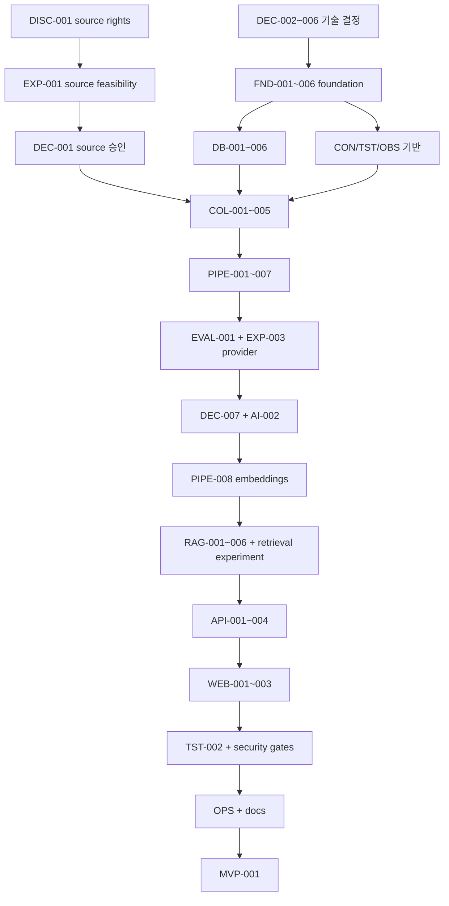

# Signal Archive MVP Task Breakdown

- 상태: Implementation backlog
- 작성일: 2026-09-01
- 현재 기준(2026-09-10): COV-001~009, COV-011, DISC-003, DEC-007, DEC-012~013, AI-002, PIPE-008, EXP-002와 RAG-001~006을 완료했다. COV-011은 scoped count 수정·격리 PostgreSQL exact-count 테스트·정적 검사·문서 동기화를 완료했다. EVAL-002는 offline 실행기/예산 보강만 검증됐으며 정식 평가와 사람 검토는 미완료다. 과거 embedding 최소 195회가 DEC-013 총 100회 한도를 초과해 추가 유료 실행은 신규/변경 승인 전 차단된다. COV-010과 MVP-001은 BLOCKED다. 승인된 GitHub Releases 5개 target 외 source 활성화나 운영 배포는 실행하지 않았다. 확장 실행 순서는 §12, 소유권·세션 지시서는 [COVERAGE_IMPLEMENTATION](./docs/COVERAGE_IMPLEMENTATION.md)을 따른다.
- 기준: [SSOT](./docs/SSOT.md), [PRD](./docs/PRD.md)

## 1. 사용 규칙

- 각 task는 한 사람이 대체로 0.5~2일 안에 완료·검증할 수 있는 크기를 목표로 한다.
- `Dependencies`가 모두 `DONE`일 때만 구현을 시작한다.
- `DEC-*`는 사용자의 승인이 필요한 decision gate다. 추천안을 적었다고 완료되지 않는다.
- `EXP-*`는 사전 정의된 실험 결과와 raw measurement가 있어야 완료다.
- 모든 구현 task의 공통 acceptance는 typecheck/lint, 영향 테스트, 관련 문서 동기화다.
- task를 추가·삭제·재정의하면 같은 변경에서 [TRACEABILITY.md](./docs/TRACEABILITY.md)를 갱신한다.
- 새 용어나 상태 값을 도입하면 [GLOSSARY.md](./docs/GLOSSARY.md)에 등록한다.
- production 구현이 승인됐다(2026-09-01). `READY` task를 dependency 순서로 실행하고 `BLOCKED`·`GATE` task를 앞질러 시작하지 않는다.

상태 값: `READY`(dependency가 모두 `DONE`이며 착수 가능), `BLOCKED`(선행 task 대기), `GATE`(명시적 승인 또는 사람의 준비 대기), `DONE`.

## 2. Decision and discovery

| ID | Task | Dependencies | Status | Acceptance criteria |
|---|---|---|---|---|
| DISC-001 | 초기 source matrix 작성 | - | DONE | 후보별 근거·인용·확인일이 기록됨; 채택 source key 11개(텍스트 7, 지표 4)와 제외·보류 10개가 결론과 함께 정리됨; Playwright 대상 확정; 사용자 확인 완료 2026-09-01 |
| DEC-001 | 초기 source set 승인 (권리 근거) | DISC-001 | DONE | ADR-0004가 Accepted(2026-09-01); Reddit 추가 전의 초기 set 근거를 기록; Reddit 변경은 ADR-0014로 별도 추적 |
| DEC-010 | Reddit 제한적 source set 추가 승인 | DISC-001 | DONE | ADR-0014 Accepted(2026-09-03); 포트폴리오·비상업·단기 범위와 미완료 live/corpus/evaluation gate가 문서화됨 |
| DISC-002 | source 자격증명 확보와 인증 rate 재측정 | EXP-001 | DONE | `.env.example` placeholder 등록·실제 값 비커밋 확인; 2026-09-02 인증 credential 주입 후 `github_releases`, `github_search`, `stack_exchange` 각 10회 반복 HTTP 200 성공; p50/max latency·rate/quota/backoff를 [`docs/experiments/disc-002/auth-rate-measurement.json`](./docs/experiments/disc-002/auth-rate-measurement.json)에 sanitized 기록 |
| EXP-001 | source feasibility 실험 실행 | DISC-001 | DONE | run 1·2 측정 완료(2026-09-01). raw measurement: `experiments/exp-001/result.json`, `experiments/exp-001/repeat-result.json`. 11개 source 도달, 10개 source 10회 반복 100% 성공, `github_search` 미인증 5/10로 **인증 필수** 판정. 결과가 [SOURCE_CATALOG §14](./docs/SOURCE_CATALOG.md)에 반영됨. 인증 상태 rate 재측정은 `DISC-002` acceptance로 이관 |
| DEC-002 | backend framework와 server runtime 승인 | EXP-005 | DONE | ADR-0001이 Accepted(2026-09-01); **Node runtime 위의 Elysia** 확정, Bun 미도입; 별도 schema library 없이 `t.*`가 단일 출처; 알 수 없는 필드 거부는 명시적 설정, 검증 실패는 400 매핑; SSOT §3.3·ARCHITECTURE §6 동기화 완료 |
| DEC-003 | AI orchestration 승인 | - | DONE | ADR-0002가 Accepted(2026-09-01); LangGraph.js deterministic workflow 확정, agent loop·장기 memory 미사용 명시; SSOT §3.3·RAG §3·§12 동기화 완료 |
| DEC-004 | queue/scheduler 승인 | EXP-005 | DONE | ADR-0003이 Accepted(2026-09-01); **Redis + BullMQ**를 전달·예약 계층으로 확정, business completion은 PostgreSQL에 기록; job은 멱등해야 하며 자연 키 unique + upsert로 확보; source별 상이한 주기·concurrency 요구 반영; SSOT §3.3·ARCHITECTURE §2·§6 동기화 완료 |
| DEC-005 | frontend 승인 | - | DONE | **SvelteKit 확정.** ADR-0005(Next.js)가 Accepted됐으나 같은 날 [ADR-0008](./docs/adr/0008-frontend-sveltekit.md)로 대체되어 `Superseded`; RAG·DB·수집 로직은 backend API에만 두고 server 기능은 UI 전달과 최소 BFF로 제한; SSOT §3.3·ARCHITECTURE §6 동기화 완료. frontend 코드가 없는 시점의 변경이라 마이그레이션 비용 0 |
| DEC-006 | repository layout/package manager/orchestration 승인 | - | DONE | [ADR-0010](./docs/adr/0010-turborepo-monorepo.md)이 Accepted(2026-09-01); pnpm workspaces + Turborepo와 승인 package 경계·의존 방향이 SSOT §3.3·ARCHITECTURE §6·§7에 반영됨. [ADR-0007](./docs/adr/0007-repository-layout.md)는 Superseded |
| DEC-008 | database hosting과 serverless connection 전략 승인 | - | DONE | 사용자가 Neon serverless PostgreSQL 전환을 명시 승인했고 [ADR-0011](./docs/adr/0011-neon-serverless-postgresql.md)이 Accepted(2026-09-02); Drizzle/Drizzle Kit·PostgreSQL/pgvector를 유지하면서 pooled runtime endpoint, direct migration endpoint, credential 분리, pooler session 제약과 local Docker fallback을 SSOT·ARCHITECTURE·DATABASE·SECURITY에 반영 |
| DEC-009 | production deployment adapter 승인 | - | DONE | 사용자가 [ADR-0013](./docs/adr/0013-production-deployment.md)의 Docker Compose + GHCR + SSH 방식을 승인(2026-09-03); GitHub production approval, pinned host key, host Caddy snippet validate/reload, loopback API/web, SHA rollback을 문서화 |
| EXP-005 | foundation stack spike 실행 | - | DONE | [EXP-005](./docs/experiments/EXP-005-foundation-spike.md) 5개 run 측정 완료(2026-09-01); Playwright는 Bun 실패·Node 통과, 계약 스키마 단일 소스·BullMQ 멱등성·pgvector·Vitest·Testcontainers·pnpm focused test 모두 통과; 미측정 항목이 구현 task로 이관됨; spike code 폐기 범위 명시 |

## 3. Project foundation

| ID | Task | Dependencies | Status | Acceptance criteria |
|---|---|---|---|---|
| FND-001 | 승인된 workspace/app/package skeleton 생성 | DEC-002, DEC-003, DEC-004, DEC-005, DEC-006 | DONE | pnpm workspace에 `apps/{web,api,worker}`와 `packages/{contracts,domain,database,collectors,rag,observability}` 생성; **`web`은 SvelteKit, `api`는 Elysia on Node, `worker`는 Node 진입점**; web이 contracts만 import하고 database/collectors/rag를 import하지 않음; 각 package의 focused build·test 명령이 성공; application feature는 없음 |
| FND-002 | 공통 TypeScript·format·lint·test 설정 | FND-001 | DONE | strict typecheck와 format/lint/test 명령이 workspace root 및 package filter에서 동작; intentional failing sample로 CI failure가 확인됨; merge `6967384`에서 검증 완료 |
| FND-003 | CI 기본 pipeline | FND-002 | DONE | clean checkout에서 install with lockfile → static → unit 순서가 성공; cache 없이도 재현 가능; branch protection용 필수 check 이름 `CI / install → static → unit` 문서화; merge `31ac743` 및 foundation gate 검증 완료 |
| FND-004 | 로컬 dependency Compose 구성 | FND-001, DEC-004 | DONE | PostgreSQL+pgvector와 승인 queue dependency가 healthcheck를 통과; persistent/ephemeral profile 구분; secret 기본값이 production에 안전하지 않음을 명시; merge `6967384`에 반영된 Compose 변경(`ebd1b5f`)에서 검증 완료 |
| FND-005 | runtime config와 secret validation | FND-001 | DONE | API/worker별 필요한 env schema가 startup에 검증됨; secret 값은 log/error에 없음; `.env.example`에는 placeholder만 있음; merge `2d82c74` 및 API/worker static·config test 검증 완료 |
| FND-006 | CI에 integration·contract·E2E·security 단계 확장 | FND-003, FND-004, DB-003 | DONE | [TESTING §11](./docs/TESTING.md)의 단계 순서(basic-ci → integration → contract → e2e → security)가 CI workflow에 구성되고 실패 시 merge 차단; live canary와 유료 LLM 평가는 non-blocking 및 별도 실행 조건으로 분리됨; 미구현 suite는 빈 통과가 아닌 미등록/조건부 실행으로 유지되며 해당 task 완료 시 추가하는 규칙 문서화 완료 |
| OBS-001 | 구조화 logging과 correlation contract | FND-001 | DONE | request/run/job/source/query ID가 공통 schema로 전달됨; redaction unit test가 token·cookie·payload를 가림 |
| CON-001 | API/job/domain contract package | FND-001 | DONE | answer request/response, error, collection job schema가 versioned runtime validation과 TS type을 한 source에서 제공; invalid fixture 거부 테스트 통과; **알 수 없는 요청 필드 거부가 명시적으로 설정됨**(framework 기본값이 아님, EXP-005 run 2); 검증 실패가 400으로 매핑됨; 미선언 응답 필드 제거가 회귀 테스트로 고정됨 |
| TST-001 | 공통 fixture·fake clock/ID/provider harness | FND-002, CON-001 | DONE | unit test가 network 없이 deterministic하게 실행; 승인된 runtime의 test runner에서 fake 주입이 성립; fixture provenance/redaction metadata schema가 검증됨 |

### FND-001 완료 증빙 (2026-09-01)

- 새 worktree에서 `pnpm install`을 실행해 `pnpm-lock.yaml`을 생성했다.
- `pnpm build`가 3개 app과 6개 shared package의 focused build를 통과했다.
- `pnpm test`가 각 workspace의 focused test와 web의 `@techpulse/contracts` 전용 import boundary check를 통과했다.
- `pnpm --filter @techpulse/worker start`가 Node entrypoint를 실행했고, SvelteKit은 `127.0.0.1:4173`, Elysia API는 `127.0.0.1:3000`에서 각각 기동을 확인했다.

### FND-002 완료 증빙 (2026-09-01; merge `6967384`)

- `pnpm install --frozen-lockfile`이 10개 workspace project에서 성공했다.
- `pnpm run static`이 workspace typecheck(9개 실행 project), ESLint, Prettier check를 모두 통과했다.
- `pnpm --filter @techpulse/domain run static`이 package-filter typecheck·lint·format을 통과했고, `pnpm --filter @techpulse/domain test`가 1개 테스트를 통과했다.
- `pnpm run verify:static-failure`가 의도적 `TS2322` 오류로 static 단계가 실패하는 것을 확인한 뒤 성공 종료했다.

### FND-003 완료 증빙 (2026-09-01; merge `31ac743`)

- `.github/workflows/ci.yml`의 필수 check `CI / install → static → unit`이 clean checkout에서 Node.js 22·pnpm 10.32.1로 `pnpm install --frozen-lockfile` → `pnpm run static` → `pnpm run test` 순서를 실행한다. cache action 없이 구성됐고 foundation gate에서 순서와 성공을 검증했다.

### FND-004 완료 증빙 (2026-09-01; merge `6967384`, Compose 변경 `ebd1b5f`)

- `docker compose --profile persistent up -d --wait`에서 `pgvector/pgvector:pg17` PostgreSQL과 `redis:7.4-alpine` Redis가 모두 `healthy`가 됐고, 확인 후 `down`으로 정리했다.
- `docker compose --profile ephemeral up -d --wait`에서 동일 두 dependency가 모두 `healthy`가 됐고, 확인 후 `down`으로 정리했다.
- Compose 정의에서 persistent profile은 PostgreSQL·Redis named volume을 사용하고 ephemeral profile은 PostgreSQL `tmpfs`와 Redis 비영속 설정을 사용한다. 기본 credential은 `unsafe-local-development-only`로 명시되어 production용이 아님을 알린다.

### FND-005 완료 증빙 (2026-09-01; merge `2d82c74`)

- `pnpm --filter @techpulse/api static`과 `pnpm --filter @techpulse/worker static`이 typecheck·lint·format을 모두 통과했다.
- `pnpm --filter @techpulse/api test`와 `pnpm --filter @techpulse/worker test`가 각각 2개 test file·4개 test를 통과했다. missing/invalid env, secret redaction, valid defaults를 검증하며 오류에 공급값을 노출하지 않는다.

### FND-006 완료 증빙 (2026-09-02)

- `.github/workflows/ci.yml`에 [TESTING §11](./docs/TESTING.md)에 정의된 blocking pipeline 순서(`basic-ci` [name: `install → static → unit`] → `integration` [name: `integration: Postgres/pgvector`] → `contract` [name: `API contract`] → `e2e` [name: `Playwright E2E`] → `security` [name: `security scans`])를 `needs` 체인으로 명시했다.
- Branch protection 필수 check 이름 `CI / install → static → unit` 및 clean checkout, Node.js 22, pnpm 10.32.1, frozen lockfile, static, unit 실행 순서를 그대로 유지했다.
- `live-canary` 및 `rag-evaluation`은 blocking pipeline 밖에서 `workflow_dispatch` 또는 전용 플래그(`TECHPULSE_CI_ENABLE_LIVE_CANARY`, `TECHPULSE_CI_ENABLE_RAG_EVAL`)로 실행되며 `continue-on-error: true`로 설정되어 PR merge를 차단하지 않는다.
- 아직 구현되지 않은 suite(`contract`, `e2e`, `security`) 및 자격증명이 필요한 `integration`은 항상 통과하는 빈 dummy step이 아니라 조건부 미등록(`if` guard)으로 정의되어 실패를 성공으로 위장하지 않으며, 각 task(`DB-003`, `API-004`, `TST-002`, `SEC-003`) 구현 완료 시 실제 테스트 스크립트로 활성화하는 규칙을 문서화했다.
- YAML 구조 검증 스크립트(`python -c "import yaml; ..."`)로 7개 job의 의존성, 순서, 조건부 가드, non-blocking 속성을 검증했다.
### CON-001 완료 증빙 (2026-09-01; merge `5c2045d`)

- 현재 main의 `pnpm run static` gate가 typecheck(9개 실행 project), ESLint, Prettier check를 모두 통과했다.
- `pnpm --filter @techpulse/contracts test`가 2개 test file·11개 test를 통과했다. versioned request/response/error/job validation, unknown field 거부, response sanitization, deterministic HTTP 400 매핑을 검증한다.

### OBS-001 완료 증빙 (2026-09-01; merge `1d59cb3`)

- 현재 main의 `pnpm run static` gate가 typecheck(9개 실행 project), ESLint, Prettier check를 모두 통과했다.
- `pnpm --filter @techpulse/observability test`가 2개 test file·10개 test를 통과했고, `pnpm --filter @techpulse/worker test`의 correlation test 3개가 통과했다. correlation ID precedence/fallback, UTC structured event, recursive token·cookie·authorization·secret·payload redaction을 검증한다.

### CON-001·OBS-001 통합 확인 (2026-09-01; current main `1d59cb3`)

- `@techpulse/api` test 2개 file·4개 test와 `@techpulse/worker` test 3개 file·7개 test가 통과했다. main gate와 병합된 API/worker runtime 경계에서 두 contract package의 연결을 확인했다.

### TST-001 완료 증빙 (2026-09-01; merge `845f5de`)

- `@techpulse/test-harness`에 `createTestHarness`, fake clock, deterministic ID/UUID generator, offline fake chat/embedding provider, fixture metadata validation 및 reset helper를 구현했다.
- `pnpm --filter @techpulse/test-harness test`가 1개 test file·12개 test를 통과했다. 유효하지 않은 calendar date 거부, inherited prompt prototype fallback 방어, createTestHarness reset, fractional advance 거부 및 결정적 fake provider 동작을 검증한다.

### Turborepo 루트 태스크 그래프 완료 증빙 (2026-09-01; merge `c5aa0b4`)

- root `turbo.json`에 `build`, `typecheck`, `lint`, `format`, `test`의 dependency-aware task graph(`^build`, `^typecheck` 등)와 cache 설정을 구성했다.
- root `package.json`의 `build`, `test`, `typecheck` 명령이 `turbo run`을 통해 10개 workspace package(tooling 포함)의 task dependency 순서대로 실행되며, `pnpm run static`과 `verify:static-failure`가 Turbo 하에서도 오류를 정확히 전파한다.

## 4. Database and persistence

| ID | Task | Dependencies | Status | Acceptance criteria |
|---|---|---|---|---|
| DB-001 | Drizzle migration과 pgvector bootstrap baseline | FND-004 | DONE | 아래 DB-001 완료 증빙의 기존 migration·실제 PostgreSQL 재현 기록을 참조. ADR-0015 추가 schema는 COV-002에서 별도 검증 |
| DB-002 | source, run, raw item schema | DB-001 | DONE | source/run/raw/pipeline event table과 FK/unique/check가 migration으로 생성됨; 동일 raw revision 2회 insert가 한 logical row를 유지; Neon integration test 통과 (2026-09-02) |
| DB-003 | document, revision, topic, chunk, embedding schema | DB-002 | DONE | revision 불변성, publish status, topic link, chunk ordinal, versioned embedding uniqueness가 실제 PostgreSQL integration test로 검증됨 (2026-09-02) |
| DB-004 | metric observation, query run, citation schema | DB-003 | DONE | metric 자연 키, query/citation FK와 query-run 내 citation key uniqueness가 검증됨; citation이 immutable revision/chunk를 가리킴 (2026-09-02) |
| DB-005 | repository ports/adapters 구현 | DB-004, CON-001 | DONE | domain port가 framework type에 의존하지 않음; transaction rollback, pagination, publish/read filter integration test 통과 (2026-09-02) |
| DB-006 | baseline FTS와 exact vector query | DB-003 | DONE | time/status filter를 강제한 FTS·cosine exact query가 seeded corpus에서 결정적 결과 반환; query plan/latency baseline 기록 (2026-09-02) |

| COL-001 | collector port와 source policy guard | DEC-001, EXP-001, DISC-002, CON-001, DB-002, TST-001 | DONE | collector 결과가 공통 raw contract를 만족; host/scheme/size/redirect guard가 SSRF corpus를 거부; cursor가 opaque하게 보존됨; source별 `verbatim_only`·license·개인정보 제거 규칙이 설정에서 강제됨 |
| COL-002 | GitHub Releases collector | COL-001 | DONE | 승인 repo의 pagination, conditional request, rate headers, release update fixture 통과; stable external ID/URL/date 저장; `published_at`과 `created_at` 구분; author 객체 제거; live canary 분리 |
| COL-003 | Stack Exchange collector | COL-001 | DONE | 게시물별 `content_license` 저장; `verbatim_only` 표시 전파; 응답 본문 `backoff` 준수; 부재 기반 삭제 감지가 rate limit·오류를 삭제로 오인하지 않음; owner 개인정보 제거 fixture 통과 |
| COL-004 | npm collector/metric adapter | COL-001 | DONE | 승인 endpoint의 package/version/metric 단위와 기간이 보존됨; 누락·rate/error 처리 fixture 통과; 불명확 지표를 0으로 저장하지 않음; maintainer email 제거 |
| COL-005 | 승인 source Playwright collector | COL-001 | DONE | semantic locator fixture test와 10회 canary gate 통과; 로그인/CAPTCHA 우회 없음; download/popup/host가 제한됨; trace artifact redacted; collector 실행 runtime이 EXP-005 측정 결과와 일치하고 runtime 전용 API 의존이 adapter 경계 안에 있음 |
| COL-006 | arXiv collector | COL-001 | DONE | 요청 간격 3초·단일 연결 준수; 동일 질의 1일 1회 캐싱; PDF·전문 미저장 검증; 버전 접미사(v1/v2)와 `published`·`updated` 구분 저장 |
| COL-007 | Discourse forum collector | COL-001 | DONE | 게시일 기준 라이선스 분리로 2020-07-17 이전 게시물 미저장; `deleted_at`·`user_deleted` 기반 tombstone; 429·`Retry-After` 준수; robots disallow 경로 미접근; username 제거 |
| COL-008 | 공통 article collector (RSS/HTTP) | COL-001 | DONE | Chrome release notes와 react.dev/blog를 동일 adapter로 처리; feed 발견과 본문 추출 분리; 이미지·상표 미저장; 라이선스·귀속 metadata 저장 |
| COL-009 | GitHub search 신호 collector | COL-001 | DONE | 질의 문자열과 수집 시각을 스냅샷 메타로 기록해 재현 가능; 1,000건 상한과 분당 30건 준수; `incomplete_results` 처리; 별 히스토리 소급 재구성을 시도하지 않음 |
| COL-010 | Hugging Face 지표 collector | COL-001 | DONE | 지표만 저장하고 model card 본문을 수집하지 않음; rate limit 계층과 429 처리; namespace 개인정보 미보관 |
| QUE-001 | scheduler와 versioned job delivery | DEC-004, FND-004, CON-001 | DONE | source/schedule window 중복 job 없음; UTC schedule, retry/backoff, concurrency cap과 job schema validation integration test 통과; **EXP-005 미측정 항목 검증**: SIGKILL 후 재시작 복구, 다중 worker 경합과 backpressure, DB commit 후 job 유실에 대한 outbox 필요성 판단 |
| PIPE-001 | collection run과 raw ingestion orchestration | COL-001, QUE-001, DB-002, OBS-001 | DONE | raw 저장 후에만 후속 단계가 생성됨; worker kill/동일 job 재전달에서 raw logical duplicate 0; run counts와 오류 상태 조회 가능 |
| PIPE-002 | deterministic normalization | PIPE-001, DB-003 | DONE | JSON/HTML fixture가 공통 document/metric으로 변환; 게시일 unknown은 null; sanitizer가 script/hidden instruction을 제거; normalizer version 기록 |
| PIPE-003 | exact dedup과 duplicate cluster | PIPE-002 | DONE | external ID/canonical URL/hash 우선 규칙 통과; cross-source 원본을 삭제하지 않고 cluster link 생성; 동일 재처리 결과 불변 |
| EXP-004 | deduplication 실험 실행 | PIPE-003, COL-002, COL-003 | DONE | [EXP-004](./docs/experiments/EXP-004-deduplication.md)의 240-pair labeled synthetic/redacted dataset(160 train/80 fixed holdout), 고정 normalization/boilerplate, blinded train threshold search, 4 variant confusion matrix 및 source/type error analysis가 기록됨; 추천 `v2_lexical_fingerprint` threshold 0.80의 holdout precision 1.0000·false-merge rate 0.0000 gate 통과; raw provenance·`verbatim_only` safeguard와 reclustering migration plan 포함 |
| PIPE-004 | near-duplicate 후보·versioned clustering | EXP-004 | DONE | 승인 lexical algorithm `exp004-dedup-v1.0.0`·threshold `0.80`·fixed boilerplate만 사용; candidate/link suggestion만 반환하고 low-confidence·threshold-near·`verbatim_only`는 manual review; versioned append-only membership가 immutable revision/raw provenance와 citation을 보존 |
| PIPE-005 | topic alias/classification과 chunking | PIPE-004, DB-003 | DONE | [TOPIC_TAXONOMY](./docs/TOPIC_TAXONOMY.md) `2026-09-01.1`의 deterministic alias가 대소문자·단어 경계·한국어 조사를 처리하고 ambiguous alias의 context/source 제약과 multiple topics를 unit test로 검증함; `deterministic-alias-2026-09-01.1`/confidence를 versioned `document_topics`에 멱등 저장; `heading-aware-v1.0.0` stable chunks가 heading path·code/table unit·SHA-256·ordinal/token count를 보존하고 valid chunk 전 publish를 차단함 |
| PIPE-006 | metric aggregation | COL-003, COL-004, COL-007, COL-009, COL-010, PIPE-003, DB-004 | DONE | 8개 지표가 각각 metric-specific 허용 unit으로 검증되고 서로 합산되지 않음; `community_mentions`는 accepted/exact duplicate cluster identity 기준으로 dedup하되 원본 observation/provenance를 보존; `repo_attention`은 collection start 이후 snapshot만 허용하고 pre-collection history를 합성하지 않음; `query_signature`와 `is_incomplete`를 전파하며 missing window를 0으로 오인하지 않음; failure/unit-separation/cluster-dedup/snapshot-boundary focused test 통과 |
| PIPE-007 | replay, dead-letter, source disable flow | PIPE-001, PIPE-005 | DONE | ID-based run/raw/stage replay is deterministic and idempotent; retryable, quarantine, and dead-letter dispositions are classified; disabled sources enqueue no jobs; redacted UTC audit events are recorded |

### DB-001 완료 증빙 (2026-09-01; merge `6033926`)

- `packages/database`에 Drizzle ORM, Neon serverless adapter, Drizzle Kit 설정, pgvector bootstrap migration(`0000_bootstrap_pgvector.sql`), migration runner 및 lazy client factory를 구현했다. import 시점에 DB 연결이나 credential 로깅을 하지 않는다.
- `pnpm --filter @techpulse/database test`가 4개 test file·15개 deterministic test를 통과했다(DB 미연결 시 자동 skip).
- 실제 Docker Compose PostgreSQL 17 + pgvector 환경에서 migration 2회 적용 멱등성(동일 migration hash 유지, 중복 실행 없음)과 vector distance 쿼리를 포함한 16개 테스트가 모두 통과했다.

### QUE-001 완료 증빙 (2026-09-01; merge `b7e1070`)

- `apps/worker`에 BullMQ versioned collection scheduler, natural-key deduplication, Redis/in-memory source concurrency limiter, TTL 이전 자동 lease renewal, safe error handling 및 PostgreSQL delivery boundary callback을 구현했다.
- `pnpm --filter @techpulse/worker test`가 5개 test file·19개 unit test를 통과했다(Redis 미연결 시 integration test skip).
- 실제 Docker Compose Redis 환경에서 `redis.integration.test.ts` 4개 테스트가 모두 통과했다: 첫 acquire, concurrency cap-1 경합, lease release, BullMQ 중복 억제, child-process SIGKILL 후 bounded lease 복구를 검증했다.

### DB-002 구현·검토 증빙 (2026-09-02; merge `bc2d449`)

- `packages/database`에 source/run/raw/pipeline event schema와 `0001_complete_puck.sql`, `0002_mature_post.sql` migration을 추가했다. source/run 관계, raw revision natural key, FK/check 제약과 raw/pipeline event 불변성 트리거를 반영했다.
- review fixes `9c5e4cb`, `f58fc94`가 raw/event immutability와 composite FK migration ordering을 보완했다. Neon PostgreSQL 환경에서 `pnpm --filter @techpulse/database test` 실행 결과 6개 test file·19개 test(마이그레이션 2회 적용 멱등성, vector 확장 확인, raw revision 중복 억제 integration test 포함)가 모두 성공적으로 통과했다.

### DEC-008 완료 증빙 (2026-09-02; merge `43cb706` 및 Neon 변경 통합)
### DB-003, DB-004, DB-005, DB-006 완료 증빙 (2026-09-02)

- **DB-003**: `documents`, `document_revisions`, `topics`, `document_topics`, `chunks`, `embeddings`, `licenses`, `duplicate_clusters` 테이블 정의 및 migration(`0003_amusing_stone_men.sql`) 적용 완료. revision uniqueness, chunk ordinal, pgvector embedding 제약 검증 통과.
- **DB-004**: `metric_observations`, `query_runs`, `answer_citations` 테이블 정의 및 migration(`0004_pale_ironclad.sql`) 적용 완료. metric 자연 키 uniqueness, query citation 관계 검증 통과.
- **DB-005**: `@techpulse/domain`에 `DocumentRepositoryPort`, `SourceRepositoryPort` 정의 및 `packages/database`에 Drizzle 기반 구현체 작성. transaction 기반 원자적 revision publish 및 pagination 검증 통과.
- **DB-006**: `@techpulse/domain`에 `SearchServicePort` 정의 및 `packages/database`에 PostgreSQL FTS(`tsvector`/`ts_rank`) 및 exact cosine vector(`<=>` 연산자) 쿼리 서비스 구현 완료.
- `pnpm run static` 및 `pnpm run test`(10개 workspace, 12개 database 테스트 파일·32개 테스트 전체) 모두 통과.
- `packages/database`의 runtime client, migration runner, vector schema helper가 `@neondatabase/serverless`와 `drizzle-orm/neon-serverless`를 사용하도록 전환됐다. `DATABASE_URL`은 runtime pooled endpoint, `DATABASE_URL_DIRECT`는 Drizzle Kit migration endpoint로 문서화했고 `.env.example`에는 placeholder만 둔다.
- Neon adapter focused test 3개 file·13개 test가 통과했고, adapter review는 API/lifecycle/credential redaction에 Critical/High/Medium/Low 이슈 없음으로 PASS했다.
- `pnpm install --frozen-lockfile`, `pnpm run static`(typecheck·ESLint·Prettier), `pnpm run test`(10개 workspace, 10개 성공)이 Neon 변경 통합 후 통과했다. database는 17개 테스트 통과·2개 PostgreSQL integration skip, worker는 19개 테스트 통과·4개 Redis integration skip이다.
- 현재 실행 환경에는 `DATABASE_URL`·`DATABASE_URL_DIRECT`가 없어 live Neon 연결 smoke는 실행하지 않았다. Docker PostgreSQL integration도 Docker Linux engine blocker로 실행하지 않았다.

### AI-001 완료 증빙 (2026-09-02; merge `cc20a66`)
- review fix `c5eb8ee`가 실제 async latency, mid-flight AbortSignal/timeout 처리와 typed `provider_error` metadata를 보완했다. `pnpm run test`에서 domain 7개 테스트가 통과했고, provider SDK/network/API key 참조는 없다.
## 6. Models, retrieval, and RAG

| ID | Task | Dependencies | Status | Acceptance criteria |
|---|---|---|---|---|
| AI-001 | provider-neutral chat/embedding ports와 fakes | FND-001, CON-001, TST-001 | DONE | domain/RAG가 provider SDK를 import하지 않음; timeout/usage/model metadata contract와 deterministic fake가 테스트됨; 구현·review 완료 |
| EVAL-001 | 골든 corpus와 질의 라벨 작성 | DEC-001, COL-002, COL-003 | DONE | [EVAL_GOLDEN_SET](./docs/EVAL_GOLDEN_SET.md)의 38개 질문과 5개 주입 항목에 relevance·allowed·forbidden claim 라벨이 채워짐; 검토자와 검토일 기록; `insufficient_evidence`·`unsupported_intent` 기대값이 6개 이상 |
| EXP-003 | model provider 평가 실행 | AI-001, EVAL-001, PIPE-005 | DONE | 2 chat/2 embedding 후보를 43개 전 항목으로 측정. Embedding gate 통과, chat gate 실패; [EXP-003](./docs/experiments/EXP-003-model-providers.md) scorecard와 sanitized raw measurement 기록 (2026-09-02) |
| DEC-007 | chat/embedding provider와 model 승인 | EXP-003 | DONE | 사용자 변경 승인(2026-09-10): RunInfra `nemotron-3-5-lightning-30b` + OpenRouter `perplexity/pplx-embed-v1-0.6b` 1024d. [ADR-0017](./docs/adr/0017-nemotron-chat-model.md) Accepted; chat 운영 출시는 기존 자동 gate와 blind review 통과 전 차단 |
| AI-002 | 선택 provider adapter 구현 | DEC-007, AI-001 | DONE | RunInfra `nemotron-3-5-lightning-30b`와 OpenRouter Perplexity embedding을 exact allowlist composition으로 연결. JSON object/output cap, timeout, typed 429/Retry-After, provider-reported usage, secret/error-body 비노출, dimension 검증 및 budget actual-usage settlement contract test 통과 |
| PIPE-008 | 승인 model의 versioned embedding 통합 | AI-002, PIPE-005, DB-003, COV-005, COV-008 | DONE | 완료 chunk/profile/input 재사용, 부분 실패·unknown outcome·차원/모델 불일치 fail-closed 검증. 연결 DB/Redis 통합과 승인 OpenRouter Perplexity live canary에서 1024차원·유한·비영 벡터 및 provider usage 확인 |
| RAG-001 | provider-neutral query intent/entity/time parser | DEC-003, CON-001, COV-001 | DONE | 결정적 parser가 4개 intent, canonical entity/original alias, 명시 기간 우선, rolling 상대 기간, UTC/IANA timezone, 언어와 모호한 단독 alias를 구조화하며 answer service 검색 범위와 coverage topic에 연결됨 |
| RAG-002 | metadata-filtered hybrid candidate retrieval | DB-006, COV-006, EVAL-001 | DONE | RAG 경로가 FTS/vector에 동일 status/time/topic/fail-closed rights filter를 적용하고 immutable provenance를 반환. vector는 provider/model/dimension/profile/input hash와 revision 전체 chunk 완료를 강제하며 연결된 PostgreSQL+pgvector 격리 DB에서 time violation 0·rights/tombstone/profile 격리 검증 통과 |
| EXP-002 | retrieval/index 실험 실행 | RAG-002, COV-009 | DONE | COV-009 고정 28 revisions/500 chunks에서 FTS/vector exact/chunk-level RRF 39문항 측정. Hybrid Recall@10 0.6936, nDCG@10 0.4823, DB p95 1,086ms로 DEC-013 gate 미달; 기간/provenance 위반 0, query embedding 39 calls/1,258 tokens/USD 0.000006. exact pgvector 유지와 RAG-003 revision/cluster/source-aware RRF 개선을 권고 |
| RAG-003 | fusion, recency, cluster/source diversity | EXP-002 | DONE | lexical/vector 각 30개 후보를 RRF(k=60), bounded 30일 recency, revision·duplicate cluster당 2개와 다중 source 60% cap으로 결합. exact pgvector와 immutable provenance를 유지하고 전용 regression 4개 및 RAG 72개 테스트 통과; score는 내부 순위에만 사용 |
| RAG-004 | evidence sufficiency와 context assembly | RAG-003 | DONE | intent별 독립 근거 최소치, 기본 4,000 token context budget, same-revision ordinal/heading 인접 chunk 병합, duplicate cluster·완전 중복 억제를 answer flow에 적용. budget/dedup 후 재판정하며 부족 시 기간 확장 없이 abstain; RAG 76개 테스트와 rag/database/domain typecheck 통과, 최소 질문 `최근 Playwright 릴리스의 주요 변경점을 알려줘.`가 answered+citation 회귀 통과 |
| RAG-005 | answer generation과 citation validation workflow | RAG-001, RAG-004, AI-002 | DONE | generate 후 citation allowlist·기간·`verbatim_only` 원문 포함을 결정적으로 후검증하고 실패 시 재생성은 최대 1회만 허용. fabricated/missing citation 회귀를 유지하며 전용 validator와 retry 테스트 포함 RAG 81개 테스트 및 typecheck 통과 |
| RAG-006 | comparison/trend computation | PIPE-006, RAG-001, RAG-004 | DONE | 동일 subject의 current/baseline을 같은 기간 길이와 metric+unit별로만 집계하고 absolute value를 보존. baseline 누락/0은 `change=null`, incomplete observation 제외, 서로 다른 metric/unit 미합산을 전용 테스트로 검증하고 bounded 기간의 compare/trend answer observation 경로에 연결 |
| EVAL-002 | RAG regression harness와 release gate | RAG-005, RAG-006, EVAL-001 | READY | 앱 내부 엄격 실행기·누적 예산·고정 corpus/라벨 membership과 DEC-014 추가 allowance를 구현·검증했다. ADR-0019 대표 8문항 live 자동 gate는 2026-09-11 통과: hybrid Recall@10 1.0, DB p95 282ms, answered 4/4, abstention 4/4, structured 100%, answer p95 4.92s, time/rights/profile/provenance violation 0. 43항목 전체 회귀는 진단 자산으로 보존. 실제 answer/evidence semantic review와 live label 사람 검토만 남아 READY 유지 |

## 7. API, security, and web

| ID | Task | Dependencies | Status | Acceptance criteria |
|---|---|---|---|---|
| API-001 | API shell, error model, health/readiness | DEC-002, CON-001, DB-005, FND-005, OBS-001 | DONE | versioned JSON/error contract와 request ID; liveness는 dependency와 무관, readiness는 DB 상태 반영; stack/provider error 비노출 |
| API-002 | source/topic endpoints | API-001, COL-001, DB-005 | DONE | source freshness를 secret 없이 반환; topic search cursor/limit validation; OpenAPI contract test 통과 |
| API-003 | synchronous answer endpoint baseline | API-001 | DONE | 기존 seeded/fake HTTP response·deadline/body cap 증빙 범위. 실제 RAG 품질은 RAG-005/RAG-006/EVAL-002, persistent budget/coverage runtime은 COV-008/010에서 검증. answer idempotency 구현 완료로 해석하지 않음 |
| SEC-001 | public API abuse controls baseline | API-003, FND-005 | DONE | 기존 CORS/header·프로세스 메모리 rate/concurrency/query-count 제한 증빙. 금액/token persistent budget 또는 재시작 안전 상한은 COV-005/COV-008에서 추가 검증 |
| API-004 | protected operations endpoints 또는 CLI | PIPE-007, API-001, SEC-001 | DONE | 선택 interface가 strong auth로 보호; bounded collect/replay와 idempotency; public route에서 접근 불가; audit event 생성 |
| SEC-002 | collector/browser hardening | COL-005, PIPE-002 | DONE | non-root/최소 capability, egress allowlist, private IP/redirect 차단, HTML output escaping, malicious fixture 회귀 통과 |
| SEC-003 | RAG prompt-injection/egress baseline | SEC-001 | DONE | 기존 fixture/seeded 경계 검증 기록만 의미. 신규 on-demand 취득·승인 provider 통합은 COV-007/COV-008 및 EVAL-002 release gate를 통과해야 함 |
| WEB-001 | web shell과 typed API client | DEC-005, FND-001, CON-001, API-001 | DONE | web이 DB/provider package를 import하지 않음; server 전용 코드가 `+page.server.ts`·`+server.ts`·`$lib/server/` 경계 안에만 있고 client bundle 산출물 검사에서 secret이 발견되지 않음; loading/error/empty layout 접근성 smoke; API contract type drift test 통과 |
| WEB-002 | 질문·답변·citation UI | WEB-001, API-003 | DONE | 질문/기간 입력, resolved range, answer, clickable citation/date/source, limitations/insufficient state 표시; keyboard/screen-reader labels 검증 |
| WEB-004 | 질문 중심 홈과 탐색 경로 | WEB-002, WEB-003 | DONE | `/` 질문 기본 화면, `/explore` 기존 탐색, 예시 4개와 세부 설정, URL/뒤로 가기·언어 유지·모바일 overflow 및 기존 답변 E2E 검증 |
| WEB-005 | 기술 리서치 도구 디자인 개편 | WEB-004 | DONE | 상단 질문/탐색 메뉴, 하단 시스템 상태, 짧은 예시 카드와 수집 현황 API 연결; 실패 상태·반응형·기존 질문 흐름 E2E 검증. 개별 최신 릴리스 목록은 API 미지원으로 제외 |
| WEB-003 | 비교 metric과 source freshness UI baseline | WEB-002, API-002 | DONE | 기존 seeded API의 metric unit/기간·freshness 표시 증빙. cohort/coverage 확장은 COV-008, 실제 비교 품질은 RAG-006/EVAL-002에서 검증 |
| TST-002 | Playwright UI E2E suite | WEB-002, WEB-003, TST-001 | DONE | seeded deterministic API/fake model contract에서 summary/comparison/no-data/citation 및 locale persistence 흐름 통과; collector suite와 분리; flaky retry 없이 Chromium PR smoke 성공 (2026-09-02) |

## 8. Operations and MVP acceptance

| ID | Task | Dependencies | Status | Acceptance criteria |
|---|---|---|---|---|
| OPS-001 | API/web/worker Docker images와 full Compose | API-004, WEB-003, FND-004 | DONE | non-root images, healthcheck, graceful shutdown; clean machine에서 documented one-command stack; browser binary/version pin 검증 |
| OPS-002 | metrics/dashboard와 failure alert baseline | OBS-001, PIPE-007, API-003 | DONE | registry/dashboard·alert fixture 기존 증빙. runtime provider usage·checkpoint·budget/unknown outcome 계측 연결은 COV-008에서 실제 관측 |
| OPS-003 | backup/restore, retention, tombstone runbook | DB-005, PIPE-007, SEC-002 | DONE | 빈 환경 restore drill 성공; source tombstone 후 search 제외; retention dry-run/count와 irreversible step 보호가 문서화됨 |

| DOC-001 | developer/operator README와 runbook | OPS-001, OPS-002, OPS-003 | DONE | setup, source policy, collect/replay, query, evaluation, rotate secret, backup/restore, known limits가 clean-reader test를 통과 (2026-09-02) |

| OPS-004 | GHCR SHA image와 SSH production deployment | OPS-001, DEC-009, API-001, DB-001 | DONE | production Compose는 Caddy 없이 API/web을 `127.0.0.1:3000`/`127.0.0.1:5173`에 publish하고, host-owned Caddy snippet이 `signal.jisung.lol` TLS와 routing을 정의; workflow/script가 production approval·concurrency·GHCR SHA push·pinned known_hosts SSH·Caddy validate/reload·migration-before-rollout·healthcheck·previous-SHA rollback을 수행; secret/.env 미커밋 |

| MVP-001 | end-to-end MVP acceptance | TST-002, EVAL-002, SEC-003, OPS-001, OPS-002, DOC-001, FND-006, COV-010 | BLOCKED | 승인 source 3개 이상 실제 예약 수집·backfill 재개; raw→lexical/vector→query 출처; 예시 4개와 확장 corpus의 품질·freshness·cost gate 통과. 권리/provider/지출/귀속 gate 및 Reddit 미증명 범위를 유지 |

## 9. Dependency graph

가독성을 위해 task 묶음의 critical path만 표시한다. 세부 dependency는 위 표가 기준이다.

## 10. 현재 상태와 다음 행동

**COV-008 runtime과 COV-009 제한된 live corpus는 완료됐으며 DEC-013도 승인됐다.** EXP-002 실험 완료는 품질 gate 통과가 아니다. EVAL-002의 정식 평가·사람 검토와 COV-010 최종 acceptance가 남아 MVP-001은 BLOCKED다. 과거 DEC-013 embedding 호출은 최소 195회로 승인 100회를 초과했으며, [누적 사용량 감사](./docs/experiments/eval-002/historical-usage-audit.json)에 근거를 남겼다. 추가 유료 호출은 신규/변경 승인 전 금지한다.

### 확정된 기술 스택

| 영역 | 결정 |
|---|---|
| Backend | Node runtime 위의 Elysia |
| Queue | Redis + BullMQ (전달·예약 계층 한정) |
| AI orchestration | LangGraph.js deterministic workflow |
| Frontend | SvelteKit |
| Repository | pnpm workspaces + Turborepo |
| Database | PostgreSQL + pgvector; Drizzle ORM + Drizzle Kit |

잔여 항목은 production corpus RAG gate(`EVAL-002`)와 secret manager의 구체 제품이다. production hosting과 배포 adapter는 `DEC-009`/`OPS-004`로 해소됐다.

### 구현 순서

새 작업은 `COV-001 → COV-002 → (COV-003, COV-004, COV-005, COV-006 병렬) → COV-007 → COV-008` 순서다. DISC-003은 COV-001 뒤 문서 조사로 병행 가능하나 권리 승인/외부 호출을 대신하지 않는다. 운영·provider gate 뒤 COV-009, 기존 RAG/평가 잔여 작업, COV-010을 진행한다. 과거 DB/QUE 완료 task를 다시 착수하라는 이전 메모는 이 순서로 대체한다.

### 아직 사람이 처리해야 할 것

| 항목 | 필요 시점 |
|---|---|
| 과거 사용량 정산과 추가 평가 allowance 명시 승인 | 추가 유료 EVAL-002 실행 전; 정산만으로 소진된 호출 한도를 복구하지 않음 |
| live 라벨 검토·reviewed digest와 의미적 인용/unsupported claim 검토 | EVAL-002/COV-010 최종 gate |
| 라이선스 귀속 설계 | 발췌 표시 기능 출시 |

### corpus가 필요한 작업

`EXP-002`는 고정 COV-009 corpus에서 완료했지만 당시 품질/지연 gate는 미달이었다. 새 live 라벨 초안은 39개 answerable retrieval + 6개 negative이며, 답변용 12개 subset과 구분한다. 추가 평가도 기존 corpus를 유지한다. `EXP-004`와 `EVAL-001`은 완료됐으며 재착수하지 않는다. release-only corpus로 입증할 수 없는 다중 출처·지표 질문은 coverage gap으로 남긴다.

### PIPE-004 완료 증빙 (2026-09-02)

- `@techpulse/domain`은 PIPE-003 exact identity → canonical URL → exact body hash 우선순위를 유지하면서 EXP-004 lexical Jaccard(`0.72 * body + 0.28 * title`)와 threshold `0.80`을 적용한다. `exp004-dedup-v1.0.0` 및 `exp004-boilerplate-v1`은 domain/worker 결과 metadata에 기록되며 provider/embedding 코드는 사용하지 않는다.
- near-duplicate 결과는 자동 merge하지 않는 candidate/link suggestion이며 confidence, algorithm version, threshold, manual-review 이유와 후보 revision/raw/canonical/license provenance를 포함한다. threshold 근처·`verbatim_only` 후보는 review 대상으로 유지되고 기존 source/raw/revision/citation row는 수정·삭제하지 않는다.
- `duplicate_cluster_memberships` append-only table과 migration `0005_gray_domino.sql`이 cluster/document/immutable revision/raw IDs, algorithm version, confidence, review status를 version namespace별로 보존한다. exact cluster linking은 기존 pointer 호환성을 유지하면서 membership evidence를 멱등 저장한다.
- 검증: domain deduplication 17개, worker deduplication 6개, database schema/migration 9개 테스트 통과(통합 DB 1개 skip); domain/worker/database typecheck 통과.

### PIPE-005 완료 증빙 (2026-09-02)

- `@techpulse/domain`에 taxonomy `2026-09-01.1` 기반 provider-neutral deterministic alias classifier를 구현했다. 대소문자 무시·영문 단어 경계·한국어 조사 결합을 처리하고, ambiguous alias는 문맥 또는 허용 source 제약 없이는 분류하지 않으며, 한 문서의 여러 topic과 `deterministic-alias-2026-09-01.1`/confidence를 반환한다.
- `@techpulse/database` adapter는 `(slug, taxonomy_version)` topic upsert, versioned `document_topics` append-only idempotent save/list와 `(revision, ordinal, chunker_version)` chunk idempotent save/list를 제공한다. 기존 evidence를 삭제하지 않고 같은 version의 내용 충돌은 거부한다.
- `heading-aware-v1.0.0` chunker는 heading path, stable ordinal, SHA-256 content hash, deterministic token count를 기록하고 code fence/table unit을 보존한다. valid chunk가 없거나 content/token/hash가 유효하지 않으면 revision publish를 거부한다.
- 검증: `packages/domain` PIPE-005 focused 2개 test file·5개 test 통과, domain/database typecheck 통과; PostgreSQL adapter/publish integration fixture는 `DATABASE_URL` 미설정 환경에서 skip된다. ADR-0006 Proposed 상태를 유지하며 provider SDK·LLM 구현은 추가하지 않았다.

### PIPE-006 완료 증빙 (2026-09-02)

- `@techpulse/domain`에 8개 metric type과 metric-specific 허용 unit을 검증하는 provider-neutral deterministic aggregation service를 구현했다. 서로 다른 type·unit은 합산하지 않고, UTC window·safe integer·invalid input을 검증하며 입력 observation은 변경·삭제하지 않는다.
- `community_mentions`는 accepted/exact duplicate-cluster identity별로만 dedup하고 raw/source provenance를 결과에 보존한다. `repo_attention`은 collection start 이전 window를 거부하는 snapshot metric이며, query-derived observation의 `query_signature`·`is_incomplete`를 전파하고 누락 window를 생성하지 않는다.
- worker normalization과 Drizzle metric repository에서 공통 unit/type validation을 적용하고 기존 natural-key upsert를 유지했다. provider SDK·LLM 구현은 추가하지 않았다.
- 검증: `packages/domain` PIPE-006 focused 6개 test 통과, worker normalization focused 4개 test 통과, domain/worker/database static checks 통과; DB integration은 `DATABASE_URL` 미설정 환경에서 skip됐다.

### PIPE-007 완료 증빙 (2026-09-02)

- `@techpulse/domain`과 `@techpulse/contracts`에 versioned run/raw/stage replay job contract를 추가했다. target ID와 stage를 검증하고 자연 키로 중복 replay를 멱등 억제한다.
- worker 경계는 disabled source enqueue 억제, retryable/quarantine/dead-letter disposition 분류, UTC audit event redaction callback을 제공한다. 원본·document revision·citation을 수정하지 않는다.
- 검증: `packages/domain` replay focused 3개 테스트와 contracts 11개 테스트 통과, worker/domain typecheck·lint·format 통과; concrete queue/database audit adapter 연결은 배포 adapter 바인딩 전 provider-neutral port로 유지한다.

### API-001 완료 증빙 (2026-09-02)

- Node runtime 위 Elysia 기반의 API shell(`apps/api`)을 구현했다. `@techpulse/contracts`와 `@techpulse/observability` 기반으로 versioned error model(`ErrorEnvelope`, `ContractError`)과 correlation context/request ID 처리를 구성했다.
- `GET /health/live`는 데이터베이스나 외부 의존성을 호출하지 않고 프로세스 가용 상태를 즉시 반환한다.
- `GET /health/ready`는 데이터베이스 연결 상태를 검사하여 정상 시 200, 비정상 또는 장애 시 503을 반환하며 연결 문자열, 인증 정보, SQL 에러 등의 내부 정보는 일체 노출하지 않는다.
- validation 오류(400), 경로 부재(404), unhandled 500 내부 에러는 일관되게 sanitized `ErrorEnvelope` 규격으로 응답하며 `X-Request-Id` 응답 헤더가 항상 포함된다.
- 검증: `apps/api` 4개 test file·11개 test 통과, `packages/contracts` 2개 test file·13개 test 통과, `apps/api` 및 `packages/contracts` static/typecheck/lint/format 통과.

### API-002 완료 증빙 (2026-09-02)

- Node runtime 위 Elysia API shell(`apps/api`)에 versioned source 목록/상세(`GET /api/v1/sources`, `GET /api/v1/sources/:key`) 및 topic 검색(`GET /api/v1/topics`) 엔드포인트를 구현했다.
- `@techpulse/contracts`에 `SourceSummary`, `SourceListResponse`, `SourceDetailResponse`, `TopicSummary`, `TopicListResponse`, `PageInfo`, `SourceListQuery`, `TopicSearchQuery` 스키마 및 runtime validation/sanitization을 추가하고 unknown field를 거부하도록 구성했다.
- source/topic 엔드포인트는 domain port(`SourceRepositoryPort`, `TopicRepositoryPort`)를 `AppOptions` 의존성 주입으로 연결하여 라우트 계약이 내부 DB 연결에 직접 결합되지 않도록 격리했다.
- opaque base64url cursor 기반 pagination 및 `limit` validation/clamping을 적용하고, 비정상 cursor 또는 알 수 없는 쿼리 파라미터는 400 `INVALID_REQUEST` `ErrorEnvelope`로 매핑했다. 존재하지 않는 source 키는 404 `NOT_FOUND`로 안전하게 반환된다.
- 공개 source 상태(`healthy`, `stale`, `degraded`, `disabled`)와 freshness 메타데이터는 데이터베이스 연결 문자열, 내부 자격증명, raw payload 노출 없이 안전하게 반환된다.
- 검증: `apps/api` 6개 test file·25개 test 통과, `packages/contracts` 2개 test file·22개 test 통과, `apps/api` 및 `packages/contracts` static checks(typecheck, ESLint, Prettier) 전체 통과.

### WEB-001 완료 증빙 (2026-09-02)

- SvelteKit 기반의 접근 가능한 웹 셸(`apps/web`)과 `@techpulse/contracts` 전용 typed API client(`ApiClient`)를 구현했다.
- `ApiClient`는 `/health/live`, `/health/ready`, `/api/v1/sources`, `/api/v1/sources/:key`, `/api/v1/topics` 엔드포인트를 계약 기반으로 호출하며, 구조화된 `ErrorEnvelope` 파싱, `ApiClientError` 및 네트워크/타임아웃 처리를 제공한다.
- 자연어 질의응답 기능(`POST /api/v1/answers`, `API-003`, `WEB-002`)은 LLM 공급자 승인 대기(`DEC-007`) 및 RAG 파이프라인 연동 전까지 클라이언트 및 UI에서 명시적으로 unavailable 상태로 안내하며, 허위 답변이나 미검증 데이터를 생성하지 않는다.
- 웹 셸 UI(`Header`, `StatusBanner`, `SourceList`, `TopicSearch`, `AnswerNotice`, `Footer`)는 ARIA 랜드마크(`role="tablist"`, `role="tabpanel"`, `role="search"`), `aria-busy`/`aria-live` 기반의 로딩 상태, `role="alert"` 기반의 에러 상태, 명확한 empty 상태, 키보드 네비게이션 및 스킵 링크를 갖추어 WCAG 접근성 기준을 충족한다.
- `apps/web`은 `@techpulse/contracts` 이외의 백엔드 패키지(`database`, `collectors`, `rag`, `domain`, `observability` 등)를 일체 참조하지 않으며, 프로덕션 빌드 산출물(`.svelte-kit/output/client`) 검사에서 DB/LLM 자격증명 및 시크릿 유출이 없음을 확인했다.
- 검증: `apps/web` 3개 test file·20개 test 통과, `apps/web` static 검사(svelte-check, ESLint, Prettier) 및 Vite 프로덕션 빌드 전체 통과.

### API-003 완료 증빙 (2026-09-02)

- Node runtime 위 Elysia API shell(`apps/api`)에 자연어 질의응답 엔드포인트 `POST /api/v1/answers`와 `@techpulse/rag`의 `AnswerService` 및 `@techpulse/domain`의 OpenAI 호환 HTTP 어댑터(`createOpenAiCompatibleChatPort`, `createOpenAiCompatibleEmbeddingPort`)를 구현했다.
- 요청 검증: 질문 길이(1~2000자, 공백 불가), 선택적 RFC 3339 timeRange, timezone, language(`ko` | `en`) 및 unknown field 엄격 거부를 Elysia/TypeBox 스키마로 강제하고 400 `INVALID_REQUEST` 또는 `INVALID_TIME_RANGE`(`to <= from`)로 매핑했다.
- 결정적 기간/의도 해석: `timeRange` 부재 시 요청 시각 기준 30일 rolling 윈도우를 결정적으로 계산(`resolvedTimeRange`)하고 질문 의도를 `trend_summary`, `recent_updates`, `compare_interest`, `emerging_topics`로 분류했다.
- 검색 및 근거 검증: 기존 `SearchServicePort`(FTS 및 ExactVector hybrid)를 통해 검색된 불변 청크 레코드만을 컨텍스트로 구성하고, 모델 출력이 인용한 식별자(`[C1]`, `[C2]`)를 검색 결과와 대조 검증했다. 허위/누락 인용 시 답변을 보류하고 `insufficient_evidence`로 안전하게 폴백한다.
- 에러 및 타임아웃 매핑: AI 공급자 타임아웃은 504 `ANSWER_TIMEOUT`, 공급자 장애는 502 `MODEL_PROVIDER_ERROR`, 서비스 미설정은 503 `DEPENDENCY_UNAVAILABLE`로 매핑하고, API 키 및 자격증명은 에러 응답 및 구조화 로그에서 완전히 마스킹(`[REDACTED]`)했다.
- 검증: `packages/domain` 11개 test file·94개 test 통과, `packages/rag` 3개 test file·20개 test 통과, `apps/api` 7개 test file·34개 test 통과, `packages/contracts` 2개 test file·22개 test 통과.

### WEB-002 완료 증빙 (2026-09-02)

- SvelteKit 웹 클라이언트(`apps/web`)에 자연어 질의응답 및 인용 인터페이스 `QuestionAnswer.svelte`(`POST /api/v1/answers` 연동)를 구현했다.
- `ApiClient`에 `POST /api/v1/answers` 호출 및 TypeBox 계약 기반 응답 파싱(`parseAnswerResponse`), 에러 매핑(`ApiClientError`), `createAnswer` 메서드를 추가하고, API-003 연동에 맞춰 엔드포인트 가용 상태(`getAnswerEndpointStatus`)를 operational로 업데이트했다.
- 질문 입력 및 기간 제어: 자연어 질의(1~2,000자 유효성 검사, 글자수 카운터), 기간 프리셋(자동 30일 롤링 윈도우, 7일, 30일, 90일, 커스텀 날짜 범위), 타임존 및 언어 선택기, 예시 질문 칩을 제공한다.
- 상태별 안전한 UI 렌더링:
  - `answered`: 서버 계산 `resolvedTimeRange` 및 의도(intent) 뱃지, XSS 방지를 위한 안전한 텍스트 렌더링, 인용 점프 앵커를 제공한다.
  - `insufficient_evidence`: 데이터 및 근거 부족 상태를 안내하고, `coverage.limitations` 목록과 검색 확장 가이드를 명확히 표시하며 허위 데이터(Hallucination)를 일체 생성하지 않는다.
  - `unsupported_intent`: 지원되지 않는 질문 의도에 대한 안내 카드를 표시한다.
- 검증된 Citation 및 Metric 관측치 렌더링:
  - `citations`: 불변 리비전 식별자, 원문 외부 링크(`rel="external noopener noreferrer"`), 출처 뱃지, 발행일, 발췌문(`excerptIsVerbatim` 태그), 라이선스 및 필수 귀속(attribution) 정보를 완전하게 렌더링한다.
  - `observations`: 단위 왜곡 방지를 위해 각 지표(Subject, Metric, Unit, Change)를 합산하지 않고 독립 카드로 표시한다.
  - `coverage`: 데이터 최신성(`dataFreshThrough`), 사용 소스 수, 검토 문서 수 및 제한사항을 표시한다.
- 접근성 및 안전성: ARIA 랜드마크, `aria-live="polite"` / `aria-busy` 로딩 상태, `role="alert"` 에러 컨테이너, 키보드 포커스 및 스크린 리더 라벨을 보장하며 원격 스크립트나 위험한 HTML을 삽입하지 않는다.
- 검증: `apps/web` 4개 test file·31개 test 통과(import boundary, contract drift, api-client, question-answer), static 검사(svelte-check, ESLint, Prettier) 및 Vite 프로덕션 빌드 전체 통과.

### WEB-003 완료 증빙 (2026-09-02)

- SvelteKit 웹 클라이언트(`apps/web`)에 비교 메트릭(Metric Comparison) 및 데이터 소스 최신성(Source Freshness) UI를 구현했다.
- 메트릭별 단위(Unit) 및 기간(Period) 분리 표시:
  - `QuestionAnswer.svelte`에서 관측치(`observations`)를 메트릭 유형별 그룹(`groupedObservations`)으로 분류하고, 메트릭별 독립 단위 뱃지(`deduplicated documents`, `downloads`, `stars`, `releases`, `interactions` 등)와 평가 기간(`Period: from → to UTC`)을 명시하여 서로 다른 단위를 결합하지 않는다.
  - 다중 대상(Multi-Subject) 비교 레이아웃: 동일 메트릭에 대해 복수 대상(예: Bun vs Node.js)을 나란히 비교하며 각 대상의 관측치, 단위, 기준 기간 대비 증감률(Trend vs Baseline: `↑ +35.5%`, `↓ -4.2%`, `→ 0.0%`, `Baseline N/A`)을 명확한 방향성 아이콘과 함께 렌더링한다.
  - **무복합 점수(No Composite Score) 원칙 엄격 준수**: 서로 다른 단위의 지표를 합산하거나 임의의 종합 인기/관심 점수(Composite Interest Score)를 생성하지 않으며, "No Composite Score (Unit-Separated)" 정책을 UI에 명시했다.
- API Coverage 연동 최신성 및 Stale/Partial 소스 경고:
  - 질의 응답 영역(`QuestionAnswer.svelte`): `coverage.dataFreshThrough`를 UTC 타임스탬프와 최신성 상태 뱃지로 표시하고, `coverage.limitations`가 존재하거나 소스 결측/지연이 보고될 경우 `Coverage Limitations & Freshness Warnings` 경고 영역(`role="region"`, 경고 아이콘 및 어드바이저리 뱃지)으로 명확히 안내한다.
  - 소스 목록 영역(`SourceList.svelte`): 상단에 전체/정상(Healthy)/지연(Stale)/저하(Degraded)/비활성(Disabled) 상태 요약 카운터 및 원클릭 상태 필터 바를 제공하고, `stale` 또는 `degraded` 소스 카드 내부에 데이터 수집 지연 및 메트릭 결측 가능성을 알리는 전용 경고 배너(`role="region"`)를 렌더링한다.
- 접근성 및 안전한 렌더링: WCAG 시맨틱 마크업(`role="region"`, `aria-label`, `aria-live="polite"`, `aria-pressed`), 고대비 시각 상태, 안전한 데이터 바인딩(XSS 방지)을 보장한다.
- 검증: `apps/web` 4개 test file·33개 test 통과(단위 분리 비교, composite score 부재, baseline change, stale/partial coverage 경고), svelte-check 0 errors, ESLint 통과, Prettier 검사 통과 및 Vite 프로덕션 빌드 성공.

### TST-002 완료 증빙 (2026-09-02)

- `apps/web/playwright.config.ts`에 Chromium 전용 UI project, SvelteKit production preview `webServer`, retry 0, 실패 시에만 trace/screenshot 보존을 구성했다.
- `apps/web/e2e/dashboard.spec.ts`는 결정적 API/fake-model 응답으로 한국어 기본값과 locale persistence, 토픽 결과·빈 상태, 비교 지표 단위 분리, 정상 답변과 외부 citation URL, `insufficient_evidence` abstention을 실제 브라우저에서 검증한다.
- `.github/workflows/ci.yml`의 Playwright job은 optional upstream contract job이 skipped여도 실행되며 Chromium OS dependency를 설치한 뒤 `pnpm --filter @techpulse/web test:e2e`를 수행한다.
- 검증: Chromium 단일 worker, retry 0에서 4개 E2E가 모두 통과했고 web unit 33개 및 static gate가 통과했다.

### OPS-002 완료 증빙 (2026-09-02)

- `@techpulse/observability` 패키지에 메트릭 수집 기본 단위(`Counter`, `Gauge`, `Histogram`), `MetricRegistry`, 대시보드 스냅샷(`createDashboardSnapshot`) 및 장애 알림 임계치 평가 엔진(`evaluateAlerts`, `DEFAULT_ALERT_RULES`, `createAlertStructuredEvent`, `createTestAlertEvent`)을 구현했다.
- 독립된 물리 단위와 차원 보존:
  - `techpulse_source_freshness_seconds` (Gauge, 소스별 지연시간)
  - `techpulse_pipeline_stage_total`, `techpulse_pipeline_stage_errors_total` (Counter, 파이프라인 단계별 처리 건수 및 에러 건수)
  - `techpulse_queue_lag_seconds`, `techpulse_queue_waiting_jobs`, `techpulse_queue_active_jobs` (Gauge, 대기열 지연 및 큐 작업 수)
  - `techpulse_db_query_duration_ms` (Histogram, p50/p95/p99 쿼리 지연시간), `techpulse_db_pool_active_connections`, `techpulse_db_pool_saturation_ratio` (Gauge, DB 커넥션 풀 포화도)
  - `techpulse_llm_request_duration_ms` (Histogram), `techpulse_llm_token_usage_total` (Counter, prompt/completion/total 토큰), `techpulse_llm_errors_total` (Counter, 공급자 에러 수)
  - `techpulse_api_requests_total` (Counter), `techpulse_api_request_duration_ms` (Histogram), `techpulse_api_rate_limit_rejections_total` (Counter)
  - 서로 다른 성격과 단위의 지표를 결합하는 임의의 복합 점수(Composite score) 생성을 배제하고 순수 물리 측정값으로 관리한다.
- 구조화 상관관계 식별자 전파 및 비밀정보 마스킹:
  - 메트릭 샘플 및 알림 이벤트 전반에 걸쳐 `requestId`, `runId`, `jobId`, `sourceId`, `queryId`를 일관되게 전파한다.
  - `redact()`를 통해 `token`, `cookie`, `authorization`, `secret`, `payload` 등 민감 속성을 `[REDACTED]`로 마스킹하고, 원문 본문이나 자격증명 유출을 원천 차단한다.
- 장애 알림 베이스라인: 소스 최신성 지연(24h 초과), 파이프라인 에러 버스트, 큐 지연(5m 초과), DB 쿼리 p95 지연(2s 초과), DB 풀 포화(90% 이상), LLM 지연(15s 초과) 및 에러 임계치 초과를 결정적으로 평가하는 기본 규칙을 제공하고, 상관관계가 유지되는 테스트 알림 이벤트 생성을 검증했다.
- 검증: `packages/observability` 3개 test file·22개 test 통과, static checks(typecheck, ESLint, Prettier) 전체 통과.

### API-004 완료 증빙 (2026-09-02)

- **보호된 운영 인터페이스 및 Strong Auth**:
  - `apps/api`에 운영 전용 엔드포인트(`GET /api/v1/ops/status`, `GET /api/v1/ops/collection-runs`, `GET /api/v1/ops/collection-runs/:id`, `POST /api/v1/ops/collection-runs`, `POST /api/v1/ops/pipeline-replays`, `POST /api/v1/ops/sources/:key/enable`, `POST /api/v1/ops/sources/:key/disable`, `PATCH /api/v1/ops/sources/:key`) 및 CLI 러너(`runOpsCli`, `apps/api/src/cli.ts`)를 구현했다.
  - `crypto.timingSafeEqual` 기반의 timing-safe 토큰 검증을 강제하고, 인증 헤더 부재 시 401 `UNAUTHENTICATED`, 토큰 불일치/미설정 시 403 `FORBIDDEN`을 일관되게 반환한다.
  - 공개 엔드포인트와 운영 엔드포인트의 라우팅을 완전 격리하여 public consumer는 ops 라우트에 접근할 수 없으며 내부 비밀정보나 스택 트레이스가 노출되지 않는다.
- **Bounded Collect & Replay**:
  - 수동 수집(`POST /api/v1/ops/collection-runs`): 대상 소스 유효성 및 활성화 상태 검증, 수집 상한(`1 <= limit <= 500`) 바운딩을 적용하며 비활성 소스 수집 요청은 400 `INVALID_REQUEST`로 거부한다.
  - 파이프라인 재처리(`POST /api/v1/ops/pipeline-replays`): `run` | `raw` | `stage` 스코프, 필수 stage 파라미터 및 대상 식별자를 검증하고 domain `ReplayService`와 연동하여 불변 아티팩트의 결정적 재처리를 큐잉한다.
- **Source Enable / Disable & Tombstone / Reindex 연동**:
  - 소스 비활성화(`POST /sources/:key/disable`): 소스 상태를 disabled로 갱신하고 `TombstoneService`를 호출하여 관련 리비전의 검색 제외(`tombstoned`)를 적용하며 감사 이력을 남긴다.
  - 소스 활성화(`POST /sources/:key/enable`): 소스 상태를 enabled로 복구하고 `reindex`를 호출하여 검색 가능한 상태(`searchable`)로 복원한다.
- **Idempotency 및 Redacted Audit Logging**:
  - 모든 변경 연산(POST/PATCH)에 `Idempotency-Key` 헤더를 강제(누락 시 400 `INVALID_REQUEST`)하고, SHA-256 canonical payload hash 기반으로 동일 키 중복 요청 시 캐시된 응답을 반환하며, 페이로드 불일치 시 409 `IDEMPOTENCY_CONFLICT`를 반환한다.
  - 모든 운영 연산(`ops.collection_run.triggered`, `ops.pipeline_replay.requested`, `ops.source.enabled`, `ops.source.disabled`)에 대해 UTC 타임스탬프, 요청 상관관계 ID(`requestId`), 실행자(`actor`)를 포함한 감사 이벤트를 기록하며, `token`, `password`, `cookie`, `secret`, `database_url` 등 민감 정보는 `[REDACTED]`로 마스킹한다.
- **검증**: `apps/api` 9개 test file·51개 test 전체 통과(`ops-routes.test.ts` 11개 결정적 테스트 포함), `@techpulse/domain`, `@techpulse/database`, `@techpulse/observability`, `@techpulse/worker`, `@techpulse/contracts` 패키지 단위 테스트 전체 통과.

### OPS-001 완료 증빙 (2026-09-02)

- **프로덕션 지향 Non-Root Dockerfile 구현**:
  - `apps/api/Dockerfile`, `apps/web/Dockerfile`, `apps/worker/Dockerfile`을 multi-stage build(base → builder → runner) 및 unprivileged `USER node`(UID 1000) 기반으로 구현했다.
  - ADR-0001에 따라 Node.js 22 LTS(`node:22-alpine`)와 `pnpm@10.32.1`로 버전을 고정하고, `pnpm install --frozen-lockfile`을 통해 재현 가능한 의존성 빌드를 보장한다.
  - 이미지 레이어 및 Dockerfile 내에 하드코딩된 비밀번호, API 키, 토큰 등 민감 정보를 일체 포함하지 않으며(`zero baked secrets`), 런타임 환경 변수 주입으로만 구성된다.
  - 컨테이너 종료 시 graceful shutdown을 위한 `STOPSIGNAL SIGTERM` 및 표준 헬스체크(`HEALTHCHECK`)를 정의했다.
- **풀 스택 Compose 프로파일 및 의존성 구성 (`compose.yaml`)**:
  - 프로파일 분리: 전체 스택(`stack`, `full`), 단독 서비스(`api`, `web`, `worker`), 로컬 의존성(`persistent`, `ephemeral`)을 명확히 지원한다.
  - 클린 머신 단일 명령 스택 기동: `docker compose --profile stack up -d --wait`로 인프라(`postgres`, `redis`) 및 전체 애플리케이션(`api`, `worker`, `web`)을 단번에 기동한다.
  - 헬스체크 및 의존 순서: `postgres`(`pg_isready` + pgvector 확장 확인), `redis`(`redis-cli ping`), `api`(`/health/live`), `web`(`/`), `worker` 헬스체크를 정의하고 `depends_on: { condition: service_healthy }`로 안전한 시작 순서를 강제했다.
  - Graceful shutdown 설정: 모든 서비스에 `stop_signal: SIGTERM` 및 `stop_grace_period: 15s`를 적용했다.
  - 네트워크 및 자격증명 경계: `postgres` 및 `redis` 네트워크 alias를 제공하며, 로컬 fallback 기본값은 `unsafe-local-development-only`로 명시되어 프로덕션 환경과의 혼용을 방지한다.
- **환경 변수 템플릿 (`.env.example`) 및 운영 런북 (`docs/RUNBOOK.md`)**:
  - 루트 `.env.example`을 생성하여 프로덕션 Neon Serverless Postgres(runtime pooled `DATABASE_URL` vs migration direct `DATABASE_URL_DIRECT`)와 로컬 Docker fallback URL의 분리 기준, Redis, AI Chat/Embedding, 소스 자격증명 및 서비스 포트 설정을 문서화했다.
  - `docs/RUNBOOK.md`에 단일 명령 스택 기동, 프로파일별 실행/종료 절차, 컨테이너 보안, Neon/Local 연결 분리, 브라우저 수집기 런타임 요건(Node 22 LTS 고정 및 Playwright 요구사항), 시크릿 로테이션 및 트러블슈팅 가이드를 작성했다.
- **결정적 정적/설정 검증**:
  - `tooling/test-harness/test/ops-config.test.ts`를 구현하여 Dockerfile multi-stage/non-root/SIGTERM/HEALTHCHECK/no-secret 검증, compose.yaml 프로파일/헬스체크/의존순서/graceful shutdown 검증, RUNBOOK.md 및 .env.example 계약 검증 8개 테스트를 작성하고 전체 통과를 확인했다.
  - 실행 환경의 Docker Linux engine 데몬 미가동 상태(`failed to connect to docker API at npipe:////./pipe/dockerDesktopLinuxEngine`)를 확인하였으며, 허위 컨테이너 실행 결과를 생성하지 않고 결정적 계약 검증 및 정적 검증으로 증빙을 확정했다.
  - 검증: `tooling/test-harness` 2개 test file·20개 test 전체 통과, static checks(typecheck, ESLint, Prettier) 통과.

### DOC-001 완료 증빙 (2026-09-02)

- `README.md`에 clean checkout 설치, full Compose, migration, 서비스 URL, static/unit/Playwright 검증 순서를 추가하고 live provider 검증과 deterministic fake 검증을 구분했다.
- `docs/RUNBOOK.md`에 bounded collect/replay/run inspection, public query smoke, RAG evaluation gate, secret rotation, `pg_dump`/격리 `pg_restore`, retention/tombstone/purge 보호, known limits를 실행 가능한 명령과 함께 문서화했다.
- `apps/api/src/ops-cli.ts`와 package `ops` script를 추가해 문서화된 운영 명령이 실제 CLI entrypoint를 실행한다.
- `tooling/test-harness/test/documentation.test.ts`의 clean-reader contract 3개를 포함해 test-harness 23개 테스트가 통과했다.

### EVAL-002 부분 증빙 및 차단 사유 (2026-09-02)

- `packages/rag/src/evaluation.ts`가 43개 고유 observation 완전성을 강제하고 Recall@10, nDCG@10, citation precision, unsupported claim rate, status accuracy, injection safety, p95 latency를 집계한다.
- `packages/rag/src/evaluate-cli.ts`가 dataset/commit/model/config/executedAt과 failed checks/items를 JSON artifact로 기록하며 gate 실패 시 non-zero로 종료한다.
- `packages/rag/test/evaluation.test.ts`의 pass/regression/partial-run 계약을 포함해 RAG 26개 테스트가 통과했다.
- `docs/experiments/exp-003/eval-report.json` provider-proxy baseline: Recall@10 0.9535, nDCG@10 0.9115, citation precision 0.7209, unsupported claim rate 0.4419, status accuracy 0.7209, injection safety 0.4, p95 10.16초. 실패 checks는 citation, unsupported claims, status, security다.
- 이 artifact는 synthetic corpus provider proxy이므로 production 수집 corpus의 end-to-end gate를 대체하지 않는다. Chat 재결정과 실제 corpus 평가 전까지 EVAL-002는 BLOCKED다.
### MVP-001 acceptance 관측 (2026-09-02, 실행 stack)

Docker Compose 전체 stack(api/web/worker/postgres/redis, 5 컨테이너 healthy)에서 실제 관측한 결과다. 이후 보안 픽스로 API/worker를 재빌드했으며 워크스페이스 정적 검증과 테스트가 통과했다.

- **예약 수집(3 source)**: 승인 source `github_releases`(itemsPersisted 0, 기존 30건 dedup skip), `github_search`(30 fetch, 27 persist, 3 dup skip), `stack_exchange`(30 persist, 30 stage job 발행) — collection→normalization 큐 발행까지 성공.
- **파이프라인 진행**: DB 관측 raw_items 170, document_revisions 10(7 searchable/3 pending), chunks 8, embeddings 4(openrouter pplx-embed 1024dim), duplicate_clusters 1. normalization pipeline_events 136(78 success/58 failed) → embedding 단계가 부분적으로만 완료.
- **query 흐름**: `/api/v1/answers`가 결정적으로 200 `insufficient_evidence`(documentsConsidered 0, citations [])를 반환 — RAG answer quality gate를 충족하는 grounded 답변은 아직 없음.
- **보안 픽스**: `.dockerignore` 추가(이미지 내 .env 번들링 차단), stack-exchange URL 오류 key 노출 제거, XFF 마지막 홉 신뢰 + ops 레이트 리밋 적용, abuse control env(`API_RATE_LIMIT_*`/`API_MAX_CONCURRENT_ANSWERS`/`API_MAX_DAILY_ANSWER_BUDGET`)를 createApp에 배선, 수집기 런타임에 `createHardenedFetch` 연결.
- **결론**: MVP-001은 **BLOCKED 유지**. DEC-007, DEC-012, AI-002와 COV-009는 완료됐지만 DEC-013/COV-010/EVAL-002 release gate가 남아 grounded 사용자 예시 4개와 freshness/cost 보고서 acceptance를 충족하지 못한다.

## 11. Baseline과 새 acceptance의 경계

2026-09-08 코드 분석에 따른 범위 정리다. 과거 측정값을 재실행하거나 바꾸지 않았다. 아래 gap 때문에 기존 DONE을 확장 기능의 완료로 해석하지 않는다.

| 기존 task | 기록된 baseline / 현재 gap | 새 acceptance 소유 |
|---|---|---|
| QUE-001, PIPE-001 | queue helper·raw ingest는 있으나 target별 due scheduler/timeWindow/page continuation runtime이 불충분 | COV-001, COV-003, COV-004, COV-008 |
| PIPE-007 | replay contract/service와 실행 consumer 연결은 별개 | COV-004, COV-008 |
| DB-003, PIPE-005, PIPE-008 | raw/chunk 존재와 lexical/vector readiness를 분리해야 함 | COV-002, COV-005, COV-006 |
| API-003, SEC-001 | answer idempotency 없음; daily budget은 in-memory query count | COV-005, COV-008; answer cache는 별도 결정 |
| OPS-002, OPS-003 | metric/retention adapter 존재가 runtime 자동 실행 증빙은 아님; DEC-012 retention 적용 검증 필요 | COV-008, DEC-012, COV-009 |
| AI-002, RAG-001~RAG-006, EVAL-002 | live adapter/RAG 코드가 있어도 provider 승인·quality gate 완료 아님 | 기존 gate 유지; COV-009 및 COV-010과 연결 |
| DEC-010 | TASKS의 ADR-0014 참조와 현재 문서 부재 대조 필요 | DISC-003에서 최신 결정·권리 근거 대조; 승인 추정 금지 |

## 12. Coverage redesign implementation (ADR-0015)

기준: [공통 계약](./docs/COLLECTION_CONTRACTS.md), [병렬 코딩 지시서](./docs/COVERAGE_IMPLEMENTATION.md). 후속 사용자 지시로 현재 세션의 코드 구현·테스트가 허용됐다. DEC-007/DEC-012 승인 범위 밖의 source/provider/지출 gate는 유지한다. `COV-*`는 FR-015~FR-018과 기존 요구의 확장 acceptance다.

| ID | Task | Dependencies | Status | Acceptance criteria |
|---|---|---|---|---|
| DEC-011 | A1–A6 수집·검색 설계 승인 | - | DONE | 2026-09-08 사용자 승인; ADR-0015 Accepted 및 SSOT 반영. 권리/provider/지출 gate·세션 미실행 유지 |
| COV-001 | 공통 domain/TypeBox 계약과 contract manifest | DEC-011, CON-001, AI-001 | DONE | COLLECTION_CONTRACTS typed ports, v2 ID-only delivery, COVERAGE_CONTRACT_MANIFEST 및 ops schemas 완료; domain/contracts focused tests 통과 |
| COV-002 | DB schema와 원자적 persistence primitives | COV-001, DB-005 | DONE | 0007~0011 forward migrations, PostgreSQL+pgvector 실제 integration, page/checkpoint/outbox 원자성·fencing·budget/work state·기존 citation 보존 검증 완료; 공통 persistence adapter exports 동결 |
| COV-003 | 단일 target 역사 수집과 발견/search adapter | COV-002, COL-001 | DONE | 기존 adapter를 target/page/timeWindow 계약으로 전환; 설정만 추가한 두 target 독립 cursor; pagination·빈 filtered page·API cap/history unsupported partial 검증; approved source-search/discovery 실제 HTTP adapter를 fixture transport로 검증, 신규 권리/live 호출 승인 없음 |
| COV-004 | partition planner·scheduler·outbox·replay 실행 서비스 | COV-002, QUE-001, PIPE-001 | DONE | durable due planning, checkpoint/continuation, source disable, normalization/replay delivery, Redis 손실/중복 dispatcher/worker kill 후 DB pending 복구; backfill/incremental starvation 방지; entrypoint 연결은 COV-008 |
| COV-005 | provider-neutral embedding work와 예산 서비스 | COV-002, AI-001 | DONE | 완료 결과 재사용·동시 worker 호출 소유권·calling timeout/commit 전 crash unknown 보류; UTC 경계/재시작에도 reservation 유지; 승인/price/token cap 미설정 시 fail closed; 실제 신규 provider 선택·호출 없이 fake로 검증 |
| COV-006 | lexical/vector readiness·coverage·cohort 조회 | COV-002, DB-006, PIPE-006 | DONE | lexical 준비 문서가 embedding 없이 FTS 검색; profile vector·rights/time/tombstone 필터; 네 부족 원인/unknown 구분; on-demand 추가만으로 cohort 값 불변·공통 분모·partial 표시 검증 |

| COV-007 | bounded acquisition과 RAG 서비스 연결 | COV-003, COV-004, COV-005, COV-006 | DONE | 기존 live fallback을 승인 source port·공통 ingest로 교체; local sufficient 외부 0, 1/2/3/8/10초 상한·bytes/token/budget·악성 URL·권리·citation 검증; provider-neutral fake/injected transport로 실제 workflow 검증; 기존 model gate 유지 |
| COV-008 | runtime·API/web·운영 cutover와 통합 검증 | COV-007 | DONE | v2 worker scheduler/outbox/stage/embedding, API coverage/answer/ops, web 준비성·한계 표시와 health 연결 완료. 격리된 실제 PG+pgvector/Redis에 fixture source/fake provider를 주입해 checkpoint 중단·worker 재시작·incremental 우선·backfill 재개·embedding 재사용·grounded citation/coverage·v2 outbox 복구·실제 브라우저 UI를 검증하고 static/unit/관련 integration을 통과함 |
| DISC-003 | target별 권리·capability·활성화 후보 조사 | COV-001 | DONE | seed/후보 전체 inventory의 최신 공식 근거, fetch/store/model-input/embed/display/retention 범위·history capability·unknown 기록; ADR-0014 참조 불일치 대조. 조사 완료가 새로운 권리 승인이나 enable은 아님 |
| DEC-012 | 확장 source·운영 계획·예산 활성화 승인 | DISC-003, COV-008 | DONE | 사용자 승인(2026-09-10): [ADR-0016](./docs/adr/0016-low-cost-live-activation.md) Accepted. GitHub Releases 5개 target, 6시간 cadence, API/byte/token/retention 및 COV-009 USD 2 hard cap |
| COV-009 | 승인 범위 live backfill·재개·baseline 측정 | COV-008, DISC-003, DEC-007, DEC-012, AI-002 | DONE | 승인된 실제 API 낮은 rate canary 후 GitHub Releases 5개 target의 90일 backfill·incremental을 concurrency 1로 완료. on-demand 비활성, partition partial/failed 0, target별 독립 partition, `pgvector/pgvector` retained release 0건 coverage gap, 재시작 후 outbox 복구를 관측했고 실제 source/provider usage와 dataset hash를 `docs/experiments/cov-009/`에 기록 |
| DEC-013 | 확장 corpus 품질·성능 acceptance 승인 | COV-009 | DONE | 사용자 승인(2026-09-10): [ADR-0018](./docs/adr/0018-expanded-corpus-quality-acceptance.md) Accepted. baseline dataset·질문·model/config, 기존 43개 회귀와 live 평가 분리, Recall/nDCG·abstention/citation·latency 및 USD 0.25 일회성 평가 한도 고정; 기존 hard security/time/provenance invariant 완화 없음 |
| DEC-014 | 추가 EVAL-002 allowance 승인 | DEC-013 | DONE | 사용자 확정(2026-09-11): [ADR-0020](./docs/adr/0020-additional-evaluation-allowance.md) Accepted. 과거 사용량/미정산 상태를 보존하고 별도 USD 0.25, embedding 100 calls/100k input, chat 60 calls/300k input/30k output, concurrency 1, retry/fallback 0 tranche를 `dec-014-*` manifest/ledger로 추적 |
| COV-010 | 확장 corpus 품질과 최종 acceptance | COV-009, DEC-013, EVAL-002, COV-011 | BLOCKED | 고정 baseline/expanded corpus·별도 라벨 확장 비교, 필수 예시 4개·43항목 baseline·신규 부족 사례·비용/coverage 보고서; 최종 thresholds·source/provider/운영 gate 충족; 미충족이면 MVP BLOCKED 유지 |
| COV-011 | coverage target/profile count 누출 수정 | COV-006 | DONE | raw/lexical/vector와 partition의 동일 target/topic/scope 집계, canonical target 식별, disabled/미검토 source·target/raw 권리·publication window·approved profile/input hash 분리 완료. 격리 PostgreSQL 검색/coverage 9 tests와 전체 static 통과, 문서 동기화 완료. 0건·두 target·on-demand/반복 membership·labeled miss 범위를 exact count로 검증. COV-010 live·사람 검토 gate를 대체하지 않음 |
### DISC-003 완료 증빙 (2026-09-09)

- 전체 seed·후보 inventory 73개 target을 공식 공개 정책/capability 문서로 조사한 별도 보고서 [`docs/experiments/DISC-003-source-rights-and-capability-investigation.md`](./docs/experiments/DISC-003-source-rights-and-capability-investigation.md)에 source/target별 URL·조회일·권리 적용 단위·fetch/store/model-input/embed/display/retention·history/pagination/rate/auth·unknown·enable 상태를 기록했다.
- `docs/adr/`에 `0014-*.md`가 존재하지 않음을 확인했다. Reddit은 `enabled=false`/BLOCKED로 유지했다. DEC-007과 DEC-012는 2026-09-10 승인됐다.
### COV-008 이전 잔여 검증 기록 (2026-09-09, 아래 최종 증빙으로 해소)

- `pnpm run static`: 10/10 workspace typecheck, ESLint, Prettier 모두 통과했다.
- `pnpm run test`를 disposable PostgreSQL database와 Redis 환경변수로 실행했으나 `packages/database/test/search.integration.test.ts`가 FTS 결과 `0 !== 1`로 실패해 전체 acceptance는 미완료다. 환경변수 없이 실행하면 readiness integration이 필수 PostgreSQL 설정 누락을 오류로 보고한다.
- 이 시점의 FTS 실패와 end-to-end 미완료는 아래 COV-008 최종 통합 증빙에서 해소했다.
### COV-003~006 완료 증빙 (2026-09-09)

- COV-003: `packages/collectors/test/coverage-targets.test.ts` 포함 collectors focused run에서 14 files·177 tests passed(1 skipped); fixture HTTP로 target isolation, pagination, filtered empty page, cap/history partial, URL guard, search/discovery를 검증했다.
- COV-004: `apps/worker/test/partition-runtime.test.ts` 8 tests와 worker focused suite 12 files·53 tests passed(4 Redis integration skipped); duplicate dispatch, sent-only outbox recovery, kill/restart, disable, stale lease, downstream recovery, lane fairness를 검증했다.
- COV-005: domain focused suite 19 files·164 tests passed; completed replay, concurrency, unknown outcome, UTC budget, duplicate reservation, missing usage/overspend, fail-closed fake provider를 검증했다.
- COV-006: domain focused suite에 coverage-service 11 tests, database readiness integration test는 환경상 0 tests로 skip됐다. 실제 PostgreSQL+pgvector/Redis runtime은 Compose persistent profile health, PostgreSQL vector extension `0.8.6`, Redis `PONG`으로 별도 확인했다.
- 당시 통합 static은 통과했다. COV-007/008은 이후 완료됐으며 live/provider/운영 gate는 유지한다.
### COV-007 완료 증빙 (2026-09-09)

- `packages/rag/src/acquisition.ts`에 `BoundedAcquisitionService`/`createBoundedAcquisitionService`를 구현해 `BoundedAcquisitionPort.acquire`를 소비한다. hard ceilings는 1 round, 2 searches, 3 fetches, 8 HTTP attempts(redirect 포함), 외부 10초 및 남은 deadline이며 byte/context/output budget·abort·source policy·persistent budget gate를 fail closed로 적용한다.
- 기존 `packages/rag/src/live-search.ts`의 npm/GitHub/Wikipedia 임의 fallback을 제거하고 acquisition port + persisted lexical re-search 경로로 교체했다. `answer-service.ts`는 local sufficient일 때 acquisition을 호출하지 않고, verified insufficient일 때만 호출한 뒤 정확히 한 번 재검색한다.
- 검증: `pnpm --filter @techpulse/rag exec vitest run test/acquisition.test.ts test/answer-service.test.ts test/live-search.test.ts test/prompt-injection.test.ts` — 4 files, 48 tests passed. acquisition suite는 local-first, caps/no-retry, SSRF/redirect/prompt injection/rights, immutable persistence/citation eligibility를 fake transport로 검증했다.
- 당시 미수행이던 COV-008 runtime cutover는 아래 최종 증빙에서 완료했다. `DEC-007`, `AI-002`, live corpus/운영 budget gate는 유지한다.

### COV-008 통합 증빙 (2026-09-09)

- 구현: worker v2 runtime/health/embedding fail-closed wiring, API coverage and protected ops routes, web readiness/limitation rendering, shared domain/database exports and web TypeBox dependency.
- API 원인 수정: `apps/api/test/security-abuse.test.ts` fixture가 `SearchHit.headingPath`를 누락해 AnswerService가 500을 내던 문제였다. 유효 fixture와 200/200/429 행동 회귀 검증을 추가했고 `pnpm --filter @techpulse/api exec vitest run test/security-abuse.test.ts`는 6 tests PASS.
- DB 원인 수정: persistent DB 자체를 변경하지 않고 migration/readiness integration fixture를 UUID 기반 disposable database로 격리했다. journal을 조작하거나 적용 migration을 재작성하지 않았으며, 빈 DB forward migration·baseline→forward citation 보존·pgvector readiness를 별도 검증한다.
- DB 검증: `pnpm --filter @techpulse/database exec vitest run test/migration.test.ts test/coverage-migration.integration.test.ts test/coverage-readiness.integration.test.ts`는 3 files/12 tests PASS(실제 PostgreSQL+pgvector).
- 최신 이미지: `docker compose --profile stack build --no-cache api web worker` 성공 후 `docker compose --profile stack up -d --wait`로 재기동했다. persistent PostgreSQL/Redis 데이터와 volume은 보존됐다. API/web/worker/postgres/redis 모두 healthy.
- 실제 최신 컨테이너 smoke: `/health/live` 200, `/health/ready` 200, `/api/v1/coverage` 200, `/api/v1/answers` 503(승인되지 않은 chat provider가 fail-closed인 정상 결과), 보호 ops `/api/v1/ops/status` 401, web `/` 200. 브라우저에서 최신 web dashboard를 시각 확인했다.
- 전체 static: `pnpm run static`의 typecheck 10/10, lint, Prettier check PASS. 전체 `pnpm run test`는 기존 `tooling/test-harness/test/ops-config.test.ts` OPS-004 assertion이 production compose의 quoted port 표현을 기대해 1 test 실패했으며, 이번 API/DB 수정 원인과 무관하다.
- 최종 runtime proof: `tooling/smoke-runner-cov008.ts`를 빈 `cov008_*` PostgreSQL database와 전용 Redis logical DB에서 실행했다. target 등록/활성화, page 0 checkpoint, 강제 deferred와 worker 재시작, incremental 우선 완료, 저장 cursor 기반 backfill page 1 재개, lexical/vector readiness, `/coverage`, fake chat 기반 grounded citation과 원 source URL·license, 완료 embedding 무호출 재사용, pending v2 outbox 복구가 모두 PASS했다. 스크립트는 기존 DB/Redis가 비어 있지 않으면 실행을 거부한다.
- 실제 UI proof: 같은 실행 중 SvelteKit preview를 기동하고 mock route 없이 API에 연결한 Chromium 테스트가 persisted citation link와 lexical/vector coverage 표시를 확인했다(1 test PASS). 기존 fixture UI suite도 4 tests PASS했다.
- 관련 PostgreSQL+pgvector integration은 coverage/search/readiness 14 tests PASS, database 전체 55 tests PASS(환경 조건 1 skip)로 확인했다. API 전체 60 tests와 worker runtime 관련 29 tests도 PASS했다.
- 당시 최종 검증: `pnpm run static`은 typecheck 10/10, ESLint, 전체 Prettier check를 통과했고 `pnpm test`도 10/10 workspace task가 성공했다. COV-008은 DONE이며 이후 DEC-007, DEC-012, AI-002와 COV-009가 완료됐다. 운영 배포 gate는 유지한다.

### AI-002 완료 증빙 (2026-09-10)

- `packages/domain/src/ai.ts`: JSON object와 output cap, timeout/abort, typed 429와 `Retry-After`, provider-reported chat/embedding usage, dimension 및 safe HTTP error contract를 구현했다.
- `apps/api/src/approved-models.ts`: 승인된 RunInfra/OpenRouter endpoint와 두 model이 모두 정확히 일치할 때만 binding을 만들며 보수적 micro-USD price와 DEC-012 scope를 고정한다.
- worker는 승인된 Perplexity profile에만 1024 dimensions, DEC reference, price version과 scope defaults를 적용하고 OpenRouter endpoint 불일치 시 비활성화한다.
- 검증: domain AI/budget/embedding 47 tests, API config/binding/runtime 12 tests, worker config/runtime 23 tests 통과. workspace typecheck 10/10 통과. 실제 network/model 호출 없음.

### PIPE-008 완료 증빙 (2026-09-10)

- embedding service는 동일 chunk/input/profile 완료 결과를 재사용하고, batch 부분 실패와 provider/commit 결과 불명확 상태를 `outcome_unknown`으로 고정해 자동 재호출·환불을 막는다. 승인 profile과 다른 provider metadata model/dimensions도 budget hold와 함께 fail closed하도록 보완했다.
- worker runtime은 승인된 Perplexity 1024-dimension profile, price/scope/approval reference가 모두 일치할 때만 adapter를 구성한다. 연결된 Redis에서 고유 queue/key prefix로 v2 중복 억제, v1 거부, concurrency lease와 SIGKILL 후 복구 4 tests를 통과했으며 test key는 정리한다.
- RAG-002의 연결 PostgreSQL+pgvector 검증에서 lexical readiness는 embedding 없이 유지되고 vector readiness는 동일 profile의 revision 전체 chunk 완료에만 성립함을 확인했다.
- 사용자가 실제 외부 모델 canary 제한을 해제한 뒤 `tooling/live-model-canary.ts`를 승인 endpoint/model로 실행했다. OpenRouter Perplexity는 입력 5 tokens, 1024차원·유한·비영 벡터를 반환했다. provider가 응답하는 축약 모델명 `pplx-embed-v1-0.6b`는 명시적 alias allowlist로만 승인 모델명에 정규화하고 다른 응답 모델은 거부한다. domain 170 tests와 typecheck가 통과했다.
- 이전 RunInfra `deepseek-v4-flash`는 `/models` 인증 성공 후에도 최소 chat completion이 두 번 HTTP 503이었다. ADR-0017로 변경한 `nemotron-3-5-lightning-30b`는 최소 JSON canary에서 837ms, input 28/output 6 tokens로 성공했다. 이는 연결 증빙이며 골든셋 품질 gate나 COV-009 실행을 대체하지 않는다.

### RAG-001 완료 증빙 (2026-09-10)

- `packages/rag/src/query-parser.ts`에 provider 호출이 없는 구조화 parser를 추가했다. 네 intent, taxonomy 기반 canonical entity와 원문 alias, `ko`/`en`, 명시 기간 우선, rolling 시간·일·주·30일 월 기간, UTC/IANA timezone을 결정적으로 반환한다.
- taxonomy에서 단독 사용을 금지한 alias는 entity로 승격하지 않고 후보 ID가 포함된 `ambiguous_entity`로 반환한다. 부분 기간, offset 없는 timestamp, 역전 구간과 잘못된 IANA timezone은 fail closed 한다.
- answer service는 같은 parser 결과를 검색 시간 filter, coverage window와 acquisition topic ID에 사용한다. focused parser/answer 검증 28 tests와 package typecheck를 통과했으며 실제 network/model 호출은 없었다.

### RAG-002 완료 증빙 (2026-09-10)

- `SearchFilter.requireApprovedRights`를 RAG의 lexical/vector/re-search 모든 경로에서 활성화했다. 양쪽 SQL은 활성·정책 검토 source와 raw의 approved/store/modelInput/displayExcerpt를 요구하고 vector는 embed 권리도 요구한다.
- vector 검색은 승인 provider/model/dimensions/profile hash, embedding input hash와 현재 chunk content hash 일치뿐 아니라 revision의 모든 chunk에 같은 profile의 유효 embedding이 있는지 확인한다. 검색 결과는 immutable revision/chunk와 raw canonical URL, source, license provenance를 유지한다.
- 연결된 PostgreSQL+pgvector에서 매 실행 고유 격리 DB를 생성해 FTS/exact vector, lexical readiness, 전체 chunk vector readiness, 권리 거부, tombstone과 잘못된 profile 제외를 검증했다(3 tests PASS). SQL 계약 5 tests와 RAG parser/answer 28 tests도 통과했다. 외부 source/model 호출은 없었다.

### COV-009 완료 증빙 (2026-09-10)

- Docker를 사용하지 않고 연결된 PostgreSQL+pgvector와 Redis에서 승인된 GitHub Releases 5개 target을 각각 독립 backfill/incremental partition으로 실행했다. 10/10 partition과 11 checkpoints가 완료됐고 partial/failed/cancelled 및 on-demand partition은 0이었다. `pgvector/pgvector`는 정상 완료됐지만 90일 구간 retained release가 0개여서 coverage gap으로 기록했다.
- 최초 인증 설정 오류로 명시적 HTTP 401이 난 28개 work/reservation만 실제 사용량 0임을 확인해 복구했다. 비재시도 provider 오류는 `failed`와 `released`로 종료하도록 보완해 결과 불명확 상태와 구분했다.
- worker 중단·재시작 후 DB outbox에서 이어서 처리했으며 최종 raw item/revision 28개, chunks/embeddings 500/500, pending delivery 0, unknown reservation 0을 확인했다. 기존 완료 work는 재사용했고 재실행 중 GitHub 호출은 0이었다.
- 실제 source usage는 11 requests와 1,274,586 bytes, embedding usage는 188,073 tokens와 USD 0.000912였다. dataset SHA-256은 `0cb1435f0629039f5189008ac189013c85d8766e8d7507328409355eb80f655f`이며 raw measurement는 [`docs/experiments/cov-009/live-measurement.json`](./docs/experiments/cov-009/live-measurement.json)에 있다.
- 최종 static은 typecheck 10/10, ESLint, Prettier를 통과했다. API 63, worker 60(연결 Redis integration 4 포함), test-harness 26 tests와 domain 171 tests가 통과했다. 연결 DB URL로 실행한 database suite는 48 tests가 통과했지만 원격 URL에서 로컬 격리 DB 생성을 의도적으로 거부한 3 tests, 공유 DB의 5초 timeout 3건과 기존 fixture policy 충돌 1건 때문에 workspace 전체 `pnpm test`는 통과로 표시하지 않는다. COV-009 live runtime의 연결 DB 검증은 위 측정으로 완료됐다.
- DEC-013 검토를 위해 [`docs/experiments/cov-009/live-eval-set.proposed.json`](./docs/experiments/cov-009/live-eval-set.proposed.json)을 생성했다. 실제 evidence가 있는 4개 target의 12개 retrieval 질문은 28 revisions/500 chunks를 모두 참조하고, `pgvector/pgvector` 0건과 범위 밖 질문을 포함한 coverage-negative 6개는 `insufficient_evidence`로 고정했다. 기존 43개 골든셋 라벨은 변경하지 않았다.

### COV-011 완료 및 EVAL-002 offline 검증 증빙 (2026-09-10)

- COV-011의 count는 같은 target/topic/scope와 acquisition membership을 공유하며 승인 embedding profile의 모든 chunk/input hash가 준비된 revision만 vector-ready로 센다. scope 밖·0건 target을 다른 target의 count로 채우지 않는다. 미검토/disabled source, target/raw 권리, publication window, labeled miss의 정확한 범위를 fixture PostgreSQL에서 검증했다.
- 마지막 COV-011 코드/fixture 변경 후 `pnpm --filter @techpulse/database exec vitest run test/search.integration.test.ts test/coverage-readiness.integration.test.ts --fileParallelism=false`는 고유 격리 DB에서 2 files/9 tests PASS. 원래 fixed Neon DB에는 쓰지 않았다.
- EVAL-002의 동기 abort·non-cooperative timeout·불완전 journal LF·unknown reservation 보존·모델/output cap·foreign evidence membership·43항목 분모 보존을 보강했다. 중첩 runtime budget에서 요청 output 12가 2000으로 확대되는 실패를 먼저 재현했으며, provider budget이 두 상한의 최솟값을 예약/전달하도록 수정한 뒤 회귀가 PASS했다.
- 최종 focused 검증: API release/binding/runtime 4 files/41 tests, domain budget/coverage 2 files/28 tests, RAG 14 files/89 tests PASS. 위 PG 9개와 합쳐 167개이며, workspace 전체 unit/E2E 또는 실제 43개 모델 회귀를 실행했다는 뜻은 아니다.
- `fnm exec --using=26.5.0 -- pnpm run static` 최종 PASS: 10/10 workspace typecheck, root ESLint, root Prettier. 기존 미커밋 변경을 유지하며 남은 포맷만 정리했고 migration JSON 값의 동일성을 검사했다. 새 runtime 설치·SQL migration 변경·배포·provider 호출·corpus 재임베딩은 없었다.
- 43개 골든 라벨과 live draft의 SHA-256이 이전 preflight 기록과 동일했다. 실제 CLI의 credential-free plan과 `release_budget_exhausted` 차단 결과는 [EVAL-002 실행 기록](./docs/experiments/eval-002/README.md), 검증 요약은 [offline-validation-2026-09-10.json](./docs/experiments/eval-002/offline-validation-2026-09-10.json)에 기록한다. 새 예산 ledger를 만들거나 과거 unknown을 환불하지 않았다.
- EVAL-002는 READY(offline 구현만 가능), COV-010/MVP-001은 BLOCKED를 유지한다. 추가 유료 평가 allowance의 영속 반영, 대표 8문항 live 평가와 최소 semantic review가 남아 있다. 43개 전체 회귀는 MVP blocker가 아니다.

### 의존성과 검증 운영

- COV-001/002의 공통 mutable 경계는 직렬이다. COV-002 완료 후 COV-003~006만 동시에 편집한다. COV-007은 그 결과를 소비하고 COV-008은 단일 integration owner다.
- DISC-003은 문서 조사로 병행 가능하다. 운영 권리·지출 승인이 없으면 fixture/fake 검증만 가능하며 live 실행은 금지한다.
- RAG-001~002는 완료됐다. EXP-002→RAG-003/004→RAG-005/006→EVAL-002는 COV-009 corpus와 기존 provider gate 이후 별도 품질 closure로 진행한다.
- 편집 중 formatter/linter/project-wide suite는 실행하지 않는다. 공유 checkout의 병렬 편집 중 build/test도 생략하고, 완료 후 validation window 또는 격리 환경에서 focused 검증한다. COV-008이 전체 검증을 한 번 수행한다.
- acceptance 증거 없는 task는 DONE 금지다. common 계약 변경은 해당 소유자의 manifest 수정 후 소비자를 일괄 이행한다.

### EVAL-002 L-001 단일 resume 검증 (2026-09-11 03:25 UTC)

- 최신 자동 후보는 `docs/experiments/eval-002/eval002-2026-09-11T03-25-45-334Z-live/report.json`이다. 원본 `02-31-29-990Z` 보고서, retrieval 결과와 나머지 7개 answer row를 보존하고 L-001만 재평가했다. `automatedMvpGatePassed=true`, 남은 blocker는 live label 및 semantic answer 사람 검토 2개다.
- DEC-014 추가 사용은 embedding 1회와 chat 1회이며 누적 97/100·32/60, unknown reservation 0이다. 원장 기존 prefix와 과거 사용량은 보존했다. 전체 live 재실행, budget 증액, commit, 운영 배포는 하지 않았다.
- RAG 103/103, API 177/177 tests, 두 package typecheck·ESLint·Prettier와 `git diff --check`를 통과했다. 해시·개수·지표 증빙은 `docs/experiments/eval-002/resume-validation-2026-09-11T03-25-45-334Z.json`에 기록했다.
- 8개 label과 6개 citation 근거의 해시를 대조하고 터미널에서 표시했다. 새 L-001 답변은 확인 가능하지만 재사용한 L-007/L-014/L-017 원문은 현재 연결된 세션 기록에 없어 원래 터미널 출력 복구가 필요하다. 원문 확보와 명시적 사람 승인 전에는 human-review JSON/attestation을 만들지 않는다. EVAL-002 READY, COV-010/MVP-001 BLOCKED를 유지한다.

### WEB-004 검증 (2026-09-11)

- 질문 홈과 독립 탐색 경로를 구현했다. 웹 static, unit 57개, Playwright 5개가 통과했다. 별도 runtime 연결 E2E 1개는 환경 미설정으로 skip됐다.
- 로컬 브라우저에서 질문 입력·예시·설정·탐색 진입 배치를 확인했다. 실제 provider 호출은 없었다.

### WEB-005 검증 (2026-09-11)

- 웹 static과 unit 57개, Playwright 6개 PASS. 별도 runtime 연결 E2E 1개는 환경 미설정으로 skip. 상단 경로 이동·예시 선택·모바일 overflow·coverage 정상/503·답변 인용 흐름을 검증했다.
- 로컬 브라우저에서 상단 메뉴와 질문 카드의 시각 배치를 확인했다. 신규 API/수집/provider 호출은 추가하지 않았다.
