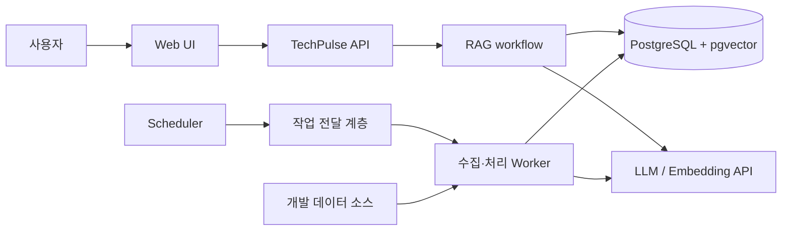
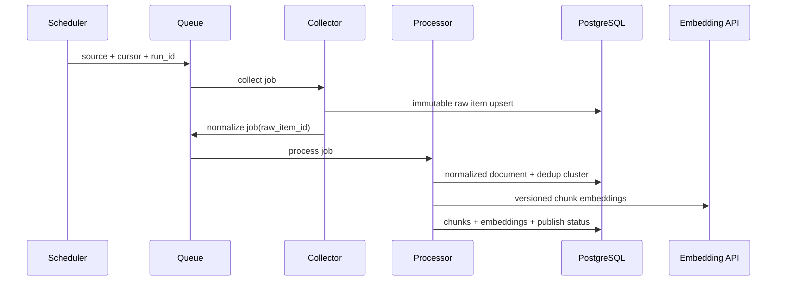
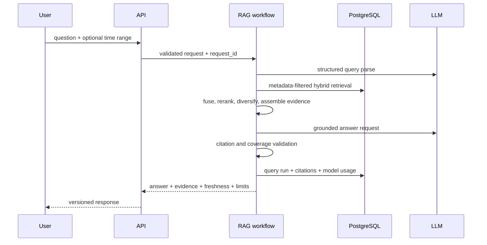

# TechPulse Architecture

- 상태: Draft
- 작성일: 2026-09-01
- 결정 기준: [SSOT.md](./SSOT.md)

## 1. 설계 목표

- 데이터 수집과 사용자 질의를 서로 독립적으로 실패·확장시킨다.
- 모든 정규화 문서와 답변을 원본, 수집 실행, 모델 버전까지 추적한다.
- 기간 필터를 벡터 유사도보다 먼저 고려하는 time-aware retrieval을 제공한다.
- 외부 API, HTML, LLM을 신뢰 경계 밖의 입력으로 취급한다.
- 포트폴리오 MVP에 필요한 복잡도만 도입하되, 재처리와 평가 경로는 처음부터 둔다.

## 2. 시스템 컨텍스트



`작업 전달 계층`은 Redis + BullMQ다([ADR-0003](./adr/0003-queue-and-scheduling.md), 2026-09-01 승인). business completion은 PostgreSQL에 기록하고 queue 상태만으로 완료를 판단하지 않는다.

## 3. 논리 컨테이너

| 컨테이너 | 책임 | 금지되는 책임 |
|---|---|---|
| Web | 질문 입력, 기간·주제 보조 입력, 답변·출처·freshness 표시 | 직접 DB 접근, LLM key 보유 |
| API | 입력 검증, 요청 제한, RAG 호출, 응답 계약, 운영 상태 | 직접 크롤링, 장기 배치 실행 |
| RAG workflow | 질의 해석, 검색, 재정렬, 근거 조립, 답변, 검증 | 원문을 임의로 수정, 출처 없는 사실 생성 |
| Scheduler | 소스별 실행 시점과 중복 없는 작업 생성 | 수집 비즈니스 로직 |
| Collector worker | 소스 호출, rate limit, 원본 저장, cursor 관리 | 정규화 이후 결과를 원본 대신 덮어쓰기 |
| Processing worker | 정규화, 중복 clustering, 토픽, 청킹, 임베딩, publish | 외부 페이지 탐색 정책 우회 |
| PostgreSQL + pgvector | 트랜잭션, provenance, 전문·벡터 검색, 지표 | 원본 외부 secret 저장 |
| Redis/Queue 후보 | 예약·재시도·backpressure·단기 job 상태 | authoritative business record |
| LLM/Embedding adapter | 공급자 차이 격리, timeout, 사용량·모델 버전 기록 | 공급자 응답을 무검증으로 API에 노출 |

## 4. 핵심 실행 흐름

### 4.1 수집 흐름



각 단계는 식별자만 전달하고 큰 원문 payload는 PostgreSQL에서 읽는다. 단계 완료는 DB의 authoritative 상태로 기록하며, 큐 상태만으로 완료를 판단하지 않는다.

### 4.2 질의 흐름



## 5. 권장 배포 토폴로지

MVP 로컬 환경의 추천은 Docker Compose에서 `web`, `api`, `worker`, `postgres`, `redis`를 분리하는 것이다. API와 worker는 동일한 도메인 패키지를 재사용하되 프로세스는 분리한다. 운영 배포 대상과 관리형 서비스 사용 여부는 아직 결정하지 않는다.

## 6. 기술 선택 상태

| 영역 | Alternatives | 결정 또는 Recommendation | 상태 |
|---|---|---|---|
| Frontend | SvelteKit, Svelte+Vite SPA, Next.js | SvelteKit | **Accepted** — [ADR-0008](./adr/0008-frontend-sveltekit.md) |
| Backend | Elysia(Node), Elysia(Bun), Fastify, NestJS, FastAPI | Node runtime 위의 Elysia | **Accepted** — [ADR-0001](./adr/0001-backend-framework.md) |
| Queue | Redis + BullMQ, PostgreSQL job table, MVP cron | Redis + BullMQ | **Accepted** — [ADR-0003](./adr/0003-queue-and-scheduling.md) |
| AI workflow | LangChain.js, LangGraph.js | LangGraph.js deterministic workflow | **Accepted** — [ADR-0002](./adr/0002-ai-orchestration.md) |
| Repository and orchestration | pnpm workspaces만 사용, npm workspaces, Nx | pnpm workspaces + Turborepo | **Accepted** — [ADR-0010](./adr/0010-turborepo-monorepo.md); [ADR-0007](./adr/0007-repository-layout.md)는 Superseded |
| Database access and migrations | Drizzle ORM + Drizzle Kit, Prisma + Prisma Migrate, Kysely + 수동 SQL | Drizzle ORM + Drizzle Kit, 검토·커밋된 forward-only SQL migration | **Accepted** — [ADR-0009](./adr/0009-drizzle-orm-migrations.md) |
| LLM/Embedding | 복수 상용 API, 로컬 모델 | provider-neutral adapter 후 실험으로 선정 | Proposed — [ADR-0006](./adr/0006-model-providers.md) |

`작업 전달 계층`은 Redis + BullMQ로 확정됐다. §2의 다이어그램에서 그 계층이 이에 해당한다.

Elysia 추천 이유는 하나의 스키마 정의에서 runtime validation, TypeScript 타입, OpenAPI가 함께 나와 API·worker·RAG의 계약을 한 출처로 유지하기 쉽기 때문이다. `EXP-005` run 2에서 package 3개로 성립함을 확인했다. 단 알 수 없는 요청 필드 거부는 기본값이 아니므로 명시적 설정이 필요하고, 검증 실패 코드를 400으로 매핑해야 한다.

**runtime은 Node를 사용한다.** 당초 추천은 Bun이었으나 `EXP-005` run 1에서 **Bun runtime의 Playwright가 local launch와 ws connect 두 transport 모두 실패**했다. 동일 Chromium 바이너리로 Node는 206ms에 launch하고 전 항목을 통과했다. browser server 원격 접속 우회도 Bun에서 막혔으므로, Bun을 유지하려면 browser collector를 완전한 별도 Node 애플리케이션으로 두어야 한다. 그 비용을 감수할 근거가 없어 runtime을 Node로 되돌렸다.

이 결정으로 browser collector는 다른 worker와 같은 runtime에 둔다. Vitest와 Testcontainers도 Node에서 동작이 확인됐다. Fastify는 대체안으로 남기며, NestJS는 강한 구조와 DI가 필요할 때, FastAPI는 Python AI 생태계가 TypeScript 일관성보다 중요하다는 증거가 있을 때 유리하다. **DEC-002에서 Node runtime 위의 Elysia가 이미 Accepted됐으므로 backend framework 결정은 완료됐다.**

## 7. 승인된 저장소 구조

[ADR-0010](./adr/0010-turborepo-monorepo.md)이 package 경계와 monorepo orchestration을 승인했다. [ADR-0007](./adr/0007-repository-layout.md)는 당시의 초기 orchestration 판단으로 Superseded다. 아래는 승인된 repository tree이며, 현재 존재하는 foundation 경로와 아직 생성하지 않은 계획 경로를 구분한다. 실제 Turborepo task wiring은 이 문서 변경만으로 구현됐다고 주장하지 않는다.

현재 존재 — `FND-001`에서 생성된 foundation 경로:

```text
apps/
  web/          # SvelteKit UI (ADR-0008)
  api/          # Elysia on Node HTTP API (ADR-0001)
  worker/       # collection and processing entrypoints, BullMQ worker (ADR-0003)
packages/
  contracts/    # API/job/event schemas. TypeBox 단일 출처
  domain/       # source-neutral domain rules
  database/     # Drizzle schema, migrations, repositories (ADR-0009)
  collectors/   # source adapters (11개 source, ADR-0004)
  rag/          # LangGraph.js retrieval and answer workflow (ADR-0002)
  observability/
```

계획됨 — 현재 생성하지 않은 테스트 경로:

```text
tests/
  fixtures/     # planned; TST-001 fixture harness
  e2e/          # planned; TST-002 Playwright UI E2E
```

의존 방향은 `apps → packages`, adapter → domain port다. `domain`은 HTTP, queue, LLM 공급자 SDK에 직접 의존하지 않는다.

pnpm은 package 설치·workspace linking을 담당하고 Turborepo는 task graph와 cache를 담당한다. 어느 쪽도 PostgreSQL business state나 runtime queue를 대체하지 않는다.

framework별 경계 규칙은 다음과 같다.

- `apps/web`은 `packages/contracts`만 import한다. `database`, `collectors`, `rag`, provider SDK를 import하지 않는다. server 전용 코드는 `+page.server.ts`, `+server.ts`, `$lib/server/` 안에만 둔다.
- `apps/api`는 Elysia handler에서 검증된 평범한 객체를 `domain`에 넘긴다. `domain`이 Elysia type을 알지 못한다.
- `apps/worker`는 BullMQ job handler를 두고 business 완료는 `database`를 통해 PostgreSQL에 기록한다.
- `packages/contracts`는 TypeBox에 의존하되 Elysia와 SvelteKit에는 의존하지 않는다.

## 8. 신뢰성과 일관성

- 수집·처리 job은 at-least-once 실행을 전제로 멱등 키를 가진다.
- DB 변경과 후속 job 생성 사이에는 transactional outbox 패턴을 추천한다. 실제 도입은 큐 ADR 승인 후 결정한다.
- 외부 호출은 timeout, bounded retry, exponential backoff, jitter, circuit/open 상태를 가진다.
- 영구 실패는 삭제하지 않고 원인, attempt, next action을 남긴다.
- API 응답의 citation은 저장된 query run과 immutable document revision을 가리킨다.
- 원 게시 시각을 알 수 없으면 `published_at = null`로 두고 수집 시각을 대신 표시하되 서로 혼동하지 않는다.

## 9. 관측성

필수 correlation key는 `request_id`, `query_run_id`, `collection_run_id`, `job_id`, `source_id`, `document_id`다.

로그는 구조화하고 secret, 전체 프롬프트, 전체 원문을 기본 기록하지 않는다. 최소 메트릭은 다음과 같다.

- API: latency, status, rate-limit rejection
- Retrieval: candidate 수, source diversity, 문서 최신성, 단계별 latency
- LLM: provider, model, token/usage, latency, error(본문 제외)
- Pipeline: lag, fetched/normalized/deduplicated/embedded/published count, retry, dead-letter count
- Database: pool saturation, query latency, index hit/scan 지표

## 10. 확장 시점

다음 조건이 관찰되기 전에는 서비스를 더 쪼개지 않는다.

- 수집이 API의 자원 또는 배포 주기를 실제로 방해함
- 특정 worker 유형이 독립적으로 확장되어야 함
- 단일 PostgreSQL에서 검색과 write workload 충돌이 측정됨
- 데이터 보존량 때문에 raw payload를 object storage로 옮길 필요가 있음

위 조건과 별개로, 런타임 호환 때문에 특정 collector를 다른 runtime의 프로세스로 분리하는 것은 예외로 허용한다. 이 예외는 성능이나 확장이 아니라 필수 기술의 지원 범위를 근거로 하며, 근거와 측정 결과를 [ADR-0001](./adr/0001-backend-framework.md)과 `EXP-005`에 남긴다.

## 11. 공식 참고 자료

- [Elysia: Integration with Node.js](https://elysiajs.com/integrations/node)
- [Fastify TypeScript](https://fastify.dev/docs/latest/Reference/TypeScript/)
- [FastAPI Features](https://fastapi.tiangolo.com/features/)
- [LangGraph.js overview](https://docs.langchain.com/oss/javascript/langgraph/overview)
- [BullMQ Job Schedulers](https://docs.bullmq.io/guide/job-schedulers/)
- [pgvector](https://github.com/pgvector/pgvector)
- [Playwright auto-waiting](https://playwright.dev/docs/actionability)
