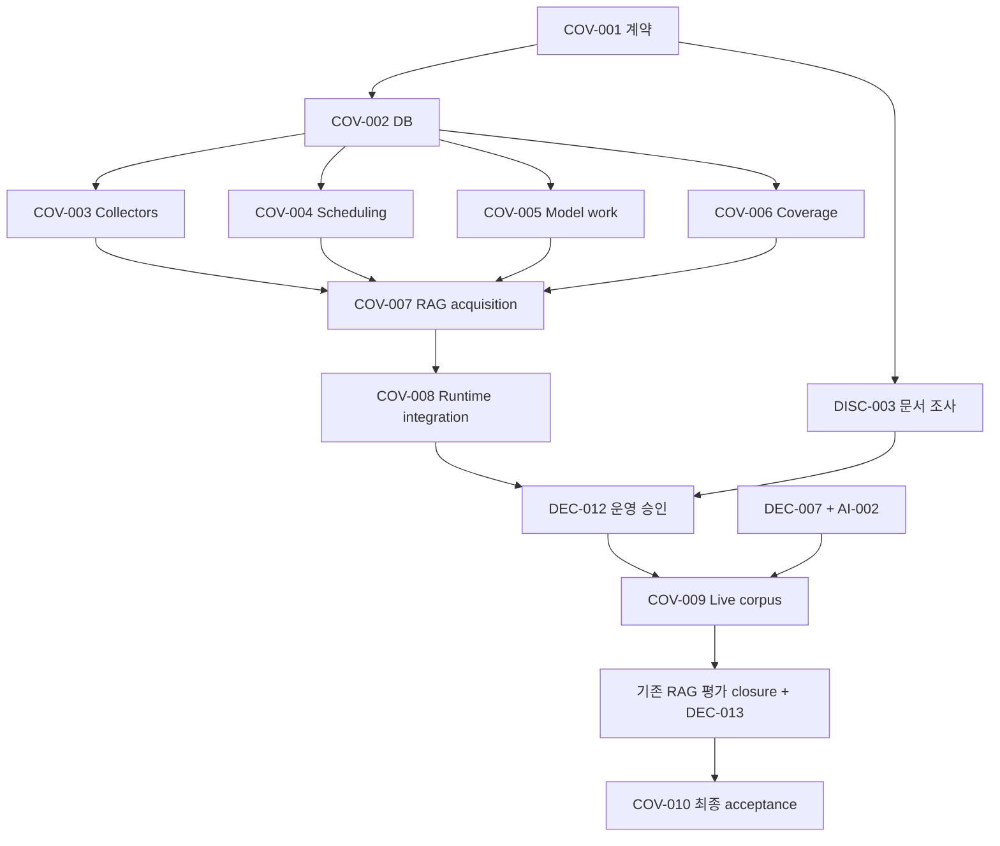

# Coverage Implementation Handoff

- 기준일: 2026-09-09
- 설계: [ADR-0015](./adr/0015-coverage-driven-collection-retrieval.md) Accepted, A1–A6
- 공통 계약: [COLLECTION_CONTRACTS](./COLLECTION_CONTRACTS.md)
- 작업/상태: [TASKS §12](../TASKS.md), [TRACEABILITY](./TRACEABILITY.md)
- COV-007 구현·통합은 2026-09-09 승인된 새 세션에서 수행하며, 이 문서의 이전 “현재 세션은 지시·조정만 담당” 문구는 해당 task에 대해 대체된다. COV-008은 여전히 별도 통합 담당이다.

## 공통 실행 규칙

각 지시서를 받은 세션은 SSOT, ADR-0015, COLLECTION_CONTRACTS, 본 문서, 해당 TASKS acceptance를 먼저 읽는다. task dependency가 DONE인 코드/산출물을 확보한 뒤 실행한다. source/provider/지출/retention/cadence의 별도 gate는 절대 우회하지 않는다. secrets·실제 env·raw prompt를 문서/로그/fixture에 넣지 않는다.

편집 중 formatter/linter/project-wide suite는 실행하지 않는다. 공유 checkout의 병렬 편집 중 build/test도 생략한다. 편집 완료 후 통합 담당이 검증 창을 배정하거나 isolated worktree에서 focused 검증한다. 테스트 skip은 통과가 아니다. 정상 동작뿐 아니라 아래 실패 경계의 실제 관측이 있어야 DONE이다. 불필요한 테스트 대신 observable contract/오류를 방어한다.

기존 파일을 먼저 재사용하고 새 파일은 아래 명시된 소유 범위에서 필요한 경우에만 만든다. 기존 exported symbol은 LSP references로 caller를 확인한다. shared contract/schema/index/package.json/lockfile는 소유자만 수정한다. 필요한 계약 변경은 먼저 통합 담당에게 요청하고 독자 shim/alias를 만들지 않는다. 설명만 있는 scaffold나 production fake/no-op는 완료가 아니다.

결과 양식: task ID / 변경 파일 / 실제 exports·signature / 선행 코드 reference / 수행한 명령·관측 결과 / 미수행 검증과 blocker / 남은 승인 gate. 전체 raw payload·credential은 첨부하지 않는다.

### 동결된 실제 상태 (COV-001 & COV-002 완료)

- **COV-001 / COV-002 구현 및 검증 완료**: 공통 계약과 DB 영속성 프리미티브가 검증되어 동결되었다. COV-003~006 병렬 착수 가능하다.
- **검증 결과**:
  - `packages/domain/test/collection-state.test.ts` (3 tests PASS)
  - `packages/contracts/test/coverage.test.ts` (3 tests PASS)
  - `packages/database/test/coverage.integration.test.ts` (6 tests PASS on real PostgreSQL+pgvector)
  - `packages/database/test/coverage-migration.integration.test.ts` (1 test PASS: baseline 0000~0006 상태에서 seeded immutable citation 보존하며 0007~0011 forward migration 완수)
  - `packages/database/test/raw.integration.test.ts` (1 test PASS: raw immutability 보존)
  - `packages/database/test/metric-citation.integration.test.ts` (1 test PASS: metric/citation 무결성)
  - `drizzle-kit check` (Everything's fine, schema와 migration drift 0)
  - 3개 패키지 typecheck PASS
- **적용된 Forward Migration**:
  - `0007_coverage_state.sql`: targets, target revisions, partitions, checkpoints, acquisition memberships, delivery outbox, cohorts, budget scopes/reservations, embedding work items, discovery candidates
  - `0008_provider_admission.sql`: provider budget lane limits, embedding work reservation uniqueness and state check
  - `0009_outbox_fencing.sql`: outbox lease epoch and lease until fencing
  - `0010_coverage_review_metadata.sql`: target revision taxonomy version, budget scope approved model profile hashes
  - `0011_collection_page_attempts.sql`: run-level attempt history FK to collection_runs and partitions
- **동결된 공통 파일 목록 (병렬 세션 수정 금지)**:
  - `packages/contracts/src/coverage.ts`, `packages/contracts/src/coverage-manifest.ts`, `packages/contracts/src/index.ts`
  - `packages/domain/src/collection-state.ts`, `packages/domain/src/model-work.ts`, `packages/domain/src/coverage.ts`, `packages/domain/src/acquisition.ts`, `packages/domain/src/index.ts`
  - `packages/database/src/schema/index.ts`, `packages/database/src/collection-state.ts`, `packages/database/src/provider-budget.ts`, `packages/database/src/embedding-work.ts`, `packages/database/src/cohort-state.ts`, `packages/database/src/discovery-state.ts`, `packages/database/src/index.ts`
  - `packages/database/drizzle/**`
- **소비 가능한 실제 Adapter 및 Repository Exports**:
  - `createCollectionStateRepository(db: DatabaseClient['db']): CollectionStatePort`
  - `createProviderBudgetRepository(db: DatabaseClient['db']): ProviderBudgetPort`
  - `createEmbeddingWorkRepository(db: DatabaseClient['db']): EmbeddingWorkPort`
  - `createCohortPersistenceRepository(db: DatabaseClient['db']): CohortPersistencePort`
  - `createDiscoveryStateRepository(db: DatabaseClient['db']): DiscoveryStatePort`
  - Domain helpers: `partitionNaturalKey`, `assertCollectableTarget`, `encodePageCursor`, `decodePageCursor`, `validatePageResult`, `collectionHash`

## 실행 순서와 소유권

| 소유자 | task | 독점 수정 범위 |
|---|---|---|
| Contract | COV-001 | `packages/domain/src/collector.ts`, `repository.ts`, 신규 `coverage.ts`, `collection-state.ts`, `model-work.ts`; `packages/contracts/src/**` 및 관련 contract/domain tests; 공통 export/manifest 초기 등록 |
| Persistence | COV-002 | `packages/database/src/schema/index.ts`, `repositories.ts`, 신규 `collection-state.ts`, `model-work.ts`; `packages/database/drizzle/**`, 해당 integration tests; DB public export 초기 등록 |
| Collectors | COV-003 | `packages/collectors/src/**`(index 제외), 해당 tests; target resolver용 `packages/collectors/src/targets.ts`, `source-search.ts` 신규 가능 |
| Scheduling | COV-004 | `apps/worker/src/{scheduler,jobs,ingestion,replay,normalization}.ts`, `packages/domain/src/ingestion.ts`, 해당 tests; 필요시 worker `partition-runtime.ts` 신규 |
| ModelWork | COV-005 | `packages/domain/src/ai.ts`, 신규 `embedding-service.ts`, `provider-budget.ts`, domain 해당 tests; DB/entrypoint는 수정 금지 |
| Coverage | COV-006 | `packages/database/src/search.ts`, 신규 `coverage.ts`; `packages/domain/src/metrics.ts`, 신규 `coverage-service.ts`; 해당 tests |
| Acquisition | COV-007 | `packages/rag/src/{answer-service,live-search}.ts`, 신규 `acquisition.ts`, 해당 RAG tests; 공통 adapter/persistence는 소비만 |
| Integration | COV-008 | `apps/worker/src/index.ts`, `apps/api/src/**`, `apps/web/src/**`, 관측성 runtime, `.env.example`, Compose/Docker/config, 모든 package index/package.json/lockfile 최종 cutover, 관련 app tests/E2E, TASKS/docs 최종 증빙 |

Contract/Persistence 완료 후 공통 파일은 병렬 묶음 동안 동결한다. integration owner는 다른 소유자의 파일을 편집 중에 덮어쓰지 않는다. sibling 결과에 문제가 있으면 해당 소유자에게 수정 요청하거나 소유권 종료 후 직접 통합한다. 단일 현재 세션에서도 이 직렬/병렬 경계를 의미적으로 유지한다.

## 지시서 1 — COV-001 공통 계약

### Target
Contract 소유 파일. production provider 선정/실호출, DB migration 실행, app entrypoint는 비대상.

### Change
COLLECTION_CONTRACTS의 typed target revision/capability/partition/page disposition/acquisition/cohort/readiness/work/budget port를 구현한다. TypeBox를 runtime schema와 TS type의 단일 출처로 유지한다. v2 queue는 schemaVersion와 deliveryId만 받으며 unknown field를 거부한다. public CoverageReport와 bounded GET query, ops target/plan/resume/reconcile schema 및 route/CLI 이름을 manifest에 고정한다. 기존 v1 runtime 제거는 integration 시점이며 조기 파손을 만들지 않는다.

### Acceptance
동일 source·기간에서 target/config/mode가 다르면 identity가 다르고 같은 입력이면 동일하다. invalid UTC 범위·cursor version/target mismatch·잘못된 상태 전환·미선언 필드가 거부된다. domain이 framework/DB/provider SDK type을 import하지 않는다. exports·함수 입력/출력·테이블 요구·ops manifest를 보고해 다음 세션이 추측하지 않게 한다. 편집 중 validation 생략; 완료 후 contract/domain focused 검증.

## 지시서 2 — COV-002 DB 원자성

### Target
Persistence 소유 파일. COV-001 DONE 필수. applied migration 수정, production DB, collector/API entrypoint는 금지.

### Change
공통 테이블·FK/unique/check·fencing/lease·lexical timestamp를 forward migration으로 구현한다. CollectionStatePort·EmbeddingWorkPort·ProviderBudgetPort·cohort acquisition persistence를 실제 Drizzle transaction으로 구현한다. page raw+memberships+checkpoint+stage/continuation outbox가 원자적이어야 한다. delivery sent와 business completion을 분리한다. scope row를 잠가 budget reservation 합산 경쟁을 막는다. 기존 raw/citation을 보존하고 legacy cursor/provenance를 검증할 수 없으면 자동 복제/소급 cohort 생성 금지.

### Acceptance
빈 실제 PG+pgvector migration, 재적용, 기존 DB forward, transaction rollback, stale epoch 거부, 서로 다른 target 경쟁, raw 중복에도 누락 stage 복구, budget 동시 예약/UTC/unknown 보존 검증. 적용 SQL과 test command/output을 보고한다. schema/index 동결 후 sibling에게 실제 adapters를 넘긴다. 편집 중 project-wide 검증 생략.

## 지시서 3 — COV-003 Target별 collector

### Target
Collectors 소유 파일. COV-002 DONE. source enum 추가·권리 완화·새 provider·worker index 수정 금지.

### Change
기존 multi-target cursor를 단일 target/page 호출로 전환한다. GitHub Releases/Stack Exchange/arXiv의 timeWindow·pagination·filtered empty page를 보완하고 모든 기존 source에 정확한 history capability와 unsupported/partial 의미를 제공한다. HTTP/RSS/Playwright의 기존 guard·rate·PII 규칙을 유지한다. 등록 가능한 target resolver 및 approved source의 검색/후보 발견 adapter를 구현한다. 후보 발견은 본문 승인/enable이 아니다.

### Acceptance
같은 adapter의 두 target을 설정만 바꿔 수집하고 cursor/외부 ID가 섞이지 않는다. 페이지를 넘어 기대 고유 ID 집합과 일치, feed 종료/결과 cap/history unsupported 구분. API backoff·source-specific timeBasis 경계·악성 URL 검증. live 호출은 권리/운영 gate 후 별도 canary; 지금은 실제 HTTP adapter에 fixture transport를 주입해 검증. 편집 중 validation 생략.

## 지시서 4 — COV-004 Planner와 전달

### Target
Scheduling 소유 파일. COV-002 DONE. DB schema·collector 구현·worker/API entrypoint 수정 금지.

### Change
target revision별 due partition을 DB 자연 키로 계획하고 backfill/incremental 예산을 분리한다. claimPage→collectPage→commitPage, deferred/partial continuation, normalization/replay outbox 소비를 구현한다. 기존 source-only key와 queue 상태를 business completion으로 쓰지 않는다. Redis 손실·sent-only delivery를 DB pending으로 복구한다. runtime lifecycle start/stop 함수를 제공하되 index 조립은 COV-008이 소유한다.

### Acceptance
실제 Redis+PG와 fake collector에서 duplicate scheduler/consumer·Redis delivery 유실·page commit 전후 kill·source disable·stale lease를 검증한다. 완료 raw인데 후속 stage가 빠진 경우도 복구한다. 최신 lane starvation을 막고 snapshot-only gap을 합성하지 않는다. exports/lifecycle·환경 요구를 integration에 보고한다. 편집 중 validation 생략.

## 지시서 5 — COV-005 모델 작업과 비용

### Target
ModelWork 소유 파일. COV-002 DONE. 선택 provider SDK/모델 변경·live 호출·DB schema/API limiter/entrypoint 수정 금지.

### Change
기존 ChatPort/EmbeddingPort 위에 provider-neutral 실행 서비스를 구현한다. chunk/input/model profile 완료 조회→work claim→budget reserve→calling→결과 commit 순서를 강제한다. claimed/calling lease 만료 의미를 구분하고 remote outcome 불명 시 unknown hold. chat/query embedding도 같은 budget 상한을 소비하도록 호출 wrapper 제공. input/context/output cap과 승인/price/tokenizer 설정이 없으면 fail closed.

### Acceptance
완료 replay의 외부 호출 0, 두 worker 같은 input의 단일 호출 소유, 부분 실패 재개, remote 성공/local commit 전 kill의 자동 재과금 금지, UTC/restart/double reserve/usage missing/overspend 처리 검증. 외부 exactly-once 보장을 주장하지 않는다. fake provider call count와 실제 PG state를 증거로 남긴다. 편집 중 validation 생략.

## 지시서 6 — COV-006 Coverage와 관측 집합

### Target
Coverage 소유 파일. COV-002 DONE. schema·공통 계약·API/web·RAG answer-service 수정 금지.

### Change
FTS lexical readiness와 profile-specific vector readiness를 분리하고 동일 rights/time/tombstone 필터를 적용한다. target/partition/stage로 CoverageReport를 조회한다. raw_shortage/processing_pending/period_gap/retrieval_miss/unknown 증거 규칙을 구현한다. cohort 공통 target revision·metric/unit·coverage만 비교하고 on-demand membership을 자동 합산하지 않는다.

### Acceptance
embedding 없는 유효 문서의 FTS 검색, 다른 model vector 제외, tombstone 양쪽 제외, 알려진 관련 문서 miss와 원문 부재 구분, 증거 없을 때 unknown. on-demand 문서만 추가하면 기존 cohort 값 불변이며 cohort 변경/누락 분모가 출력된다. 실제 PG query plan·기간 조건과 deterministic metrics test를 남긴다. 편집 중 validation 생략.

## 지시서 7 — COV-007 제한적 RAG 보완

### Target
Acquisition 소유 파일. COV-003/004/005/006 DONE. 새 source/provider 선정, API entrypoint·shared persistence 수정 금지.

### Change
기존 hardcoded live fallback을 공통 ports 기반 bounded 취득으로 대체한다. local evidence/coverage→충분 여부→허용 시 source search→guarded fetch→공통 raw/chunk commit→한 번 재검색→citation 검증 흐름을 구현한다. 1 round/2 search/3 documents/8 HTTP attempts/10초·전체 deadline, byte/token/spend와 source backoff를 함께 제한한다. snippet/비보존 URL은 claim 근거가 아니다. unknown rights·model gate는 보류한다.

### Acceptance
로컬 충분 외부 0, 모든 cap 경계, redirect/private IP·prompt injection·정책 변경, 취득 실패/중단 후 제한 명시. citation이 실제 저장 revision/chunk·원 URL로 resolve되어야 한다. fake/injected HTTP로 완전한 workflow를 실행하며 production no-op adapter는 금지한다. 기존 43항목 deterministic 비교를 기록하되 live quality gate라고 하지 않는다. 편집 중 validation 생략.

## 지시서 8 — COV-008 통합 담당

### Target
Integration 소유 파일과 종료된 sibling 소유권. COV-007 DONE. production 배포·유료 호출·권리 승인 자동 처리는 금지.

### Change
DB/collector/scheduler/outbox/normalization/replay/model work 서비스를 실제 worker 진입점에 조립한다. API answer/coverage/ops와 web의 typed 상태·한계 표시, usage·health 관측, 예제 env와 Compose를 연결한다. 모델 미승인 환경에서도 정규화·lexical 준비·coverage는 동작하고 유료 단계는 닫혀 있어야 한다. v2 job cutover 후 v1 producer/consumer·schema/export·obsolete tests를 제거한다. shared package export/package manifest/lockfile는 이 담당이 정리한다.

### Acceptance
실제 PG+Redis와 실제 API/web/worker 프로세스에 fixture source/fake provider를 명시 주입하여 target 등록→backfill 중단/재개→incremental→lexical/vector→질문→citation/coverage UI를 관측한다. mock echo 또는 소스 문자열 검사로 대체하지 않는다. worker health는 실제 loop/consumer를 반영한다. 최종 static/unit/영향 integration·Playwright collector/UI suite를 분리 실행하고 실제 브라우저 화면도 확인한다. live gate가 남으면 그 사실을 별도로 기록한다.

## 지시서 9 — DISC-003 / COV-009 운영 전후 조사

### Target
DISC-003은 COV-001 뒤 SOURCE_CATALOG·권리 검토 자료만 소유한다. COV-009는 COV-008·DISC-003·DEC-007·DEC-012·AI-002 완료 뒤 운영/측정 산출물만 소유한다. 병렬 코드 편집과 겹치는 파일은 수정하지 않는다.

### Change
DISC-003: seed 및 후보의 최신 공식 권리/capability 근거를 정리하고 unknown은 보류한다. ADR-0014 참조 부재를 최신 사용자 결정과 대조하되 문서를 꾸며 만들지 않는다. COV-009: 승인 범위의 낮은 rate canary 후 backfill·증분·질문 보완을 실행하고 dataset/model/config/cost/coverage를 기록한다.

### Acceptance
조사 완료와 활성화 승인을 분리한다. 실제 API/provider 호출은 명시된 scope·예산에만 한정한다. 역사 미지원/누락/unknown outcome은 그대로 기록하며 합성 corpus로 live 성공을 대체하지 않는다. live 결과와 offline proof를 분리 보고한다.

## 지시서 10 — 기존 RAG gate closure와 COV-010

### Target
COV-009 corpus 뒤 기존 RAG/평가 담당. COV-007의 파일 소유권 종료 후 `packages/rag/src/**`, 해당 tests/평가 산출물·EVAL_GOLDEN_SET/TESTING만 수정한다. production 인프라나 source 권리 변경 금지.

### Change
TASKS의 RAG-001/002→EXP-002→RAG-003/004→RAG-005/006→EVAL-002 dependency 순서대로 아직 미충족인 acceptance를 끝낸다. 완료 코드를 중복 구현하지 말고 각 증거를 기존 task에 연결한다. provider/weight/index 결정은 승인 근거가 필요하다. DEC-013 기준 승인 후 COV-010의 baseline/expanded 평가를 수행한다.

### Acceptance
43항목 baseline과 별도 검토된 부족 사례 라벨을 보존하고 비교한다. Recall/nDCG·abstention·citation·보안·시간·비용·cohort coverage의 실제 측정과 필수 예시 4개 출처를 제출한다. threshold를 낮추거나 missing 결과를 건너뛰어 통과시키지 않는다. EVAL-002/COV-010 미충족이면 MVP-001을 DONE으로 바꾸지 않는다.
