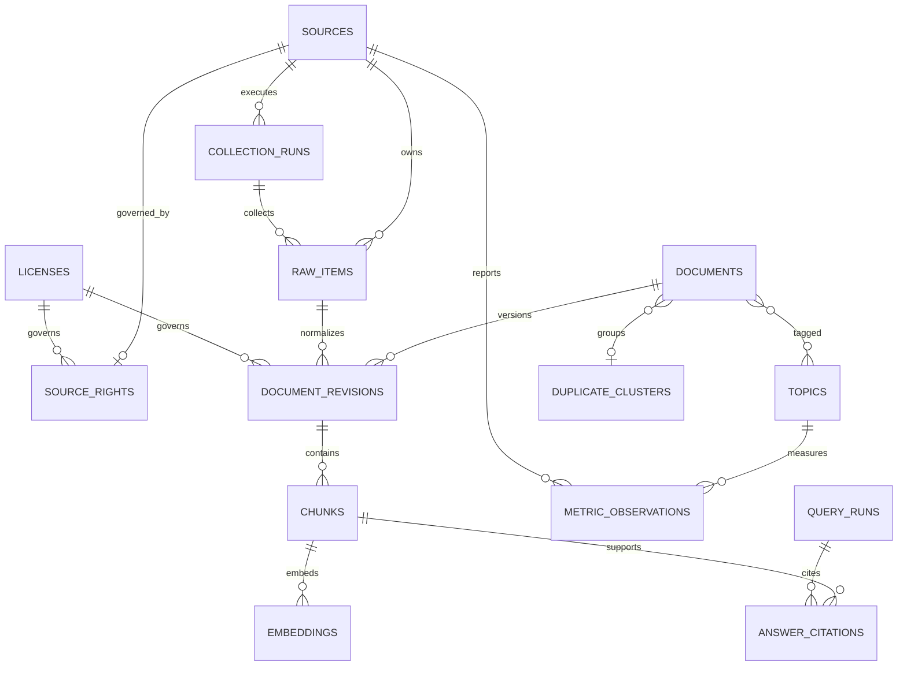

# TechPulse Database Design

- 상태: Draft (conceptual schema)
- 작성일: 2026-09-01
- 데이터베이스: PostgreSQL + pgvector (확정)

## 1. 설계 원칙

- raw input, normalized artifact, searchable revision을 분리한다.
- 외부 식별자와 canonical URL을 보존하고 내부 surrogate ID에만 의존하지 않는다.
- 모든 파생 데이터에 생성 규칙·모델 버전을 기록한다.
- logical document를 수정해 과거 답변의 근거를 바꾸지 않고 revision을 추가한다.
- UTC `timestamptz`를 사용하고 원 source timezone이 있으면 별도 metadata로 보존한다.
- metric observation과 text document를 한 테이블에 억지로 합치지 않는다.

## 2. 개념 ERD

`duplicate_cluster_id`는 nullable이다. cluster에 속하지 않은 단독 문서가 정상 상태이므로 문서 발행이 cluster 생성에 의존하지 않는다.

## 3. 테이블 카탈로그

### 3.1 수집과 provenance

| 테이블 | 핵심 필드 | 핵심 제약 |
|---|---|---|
| `licenses` | id, spdx_id, name, url, requires_attribution, is_share_alike, allows_commercial, notes | `id`는 안정적 slug(`cc-by-4.0`, `cc-by-sa-4.0`, `cc0-1.0`, `mit`, `apache-2.0`, `psf-2.0`) |
| `sources` | id, key, name, kind, base_url, enabled, schedule_config, policy_reviewed_at | `key` unique |
| `source_rights` | source_id, allowed_to_fetch, allowed_to_store, allowed_to_embed, allowed_to_display_excerpt, verbatim_only, license_id, attribution_template, raw_retention_days, excerpt_max_chars, reviewed_at, reviewed_by, review_note_ref | source당 최신 1행, 값은 명시적 boolean으로 unknown을 허용으로 처리하지 않음 |
| `collection_runs` | id, source_id, scheduled_at, started_at, ended_at, status, cursor_before/after, counts, error_summary | source/window 활성 run 중복 금지 |
| `raw_items` | id, source_id, run_id, external_id, canonical_url, payload, payload_hash, published_at, collected_at, http_metadata, rights_metadata | `(source_id, external_id, payload_hash)` unique |
| `pipeline_events` | id, raw_item_id, stage, processor_version, status, attempt, error_code, occurred_at | append-only event 또는 동등한 이력 보존 |

`source_rights`는 [SOURCE_RIGHTS.md](./SOURCE_RIGHTS.md)의 검토 결과를 실행 시점에 강제하기 위한 테이블이다. 문서와 DB 값이 다르면 수집을 진행하지 않고 검토를 다시 한다. `allowed_to_fetch`가 false이거나 `reviewed_at`이 없으면 collector는 job을 생성하지 않는다.

raw payload column type과 압축·외부 object storage 전환 시점은 데이터 크기 실험 후 결정한다. MVP 추천은 작은 JSON/허용 text를 `jsonb`/`text`로 PostgreSQL에 보존하는 것이다.

### 3.2 정규화 문서

| 테이블 | 핵심 필드 | 핵심 제약 |
|---|---|---|
| `documents` | id, artifact_type, canonical_url, duplicate_cluster_id, current_revision_id, created_at | canonical URL은 nullable, 단독 global unique로 가정하지 않음 |
| `document_revisions` | id, document_id, raw_item_id, title, body_text, author, language, published_at, license_id, normalized_hash, normalizer_version, status, searchable_at | `(document_id, normalized_hash)` unique |
| `duplicate_clusters` | id, representative_document_id, algorithm_version, confidence, created_at | 원본 문서는 삭제하지 않음 |
| `duplicate_cluster_memberships` | id, cluster_id, document_id, revision_id, raw_item_id, algorithm_version, confidence, status, created_at | append-only; `(cluster, document, revision, algorithm_version)` unique; revision/raw FK는 restrict |
| `topics` | id, slug, display_name, parent_id, aliases, taxonomy_version | `(slug, taxonomy_version)` unique |
| `document_topics` | document_id, topic_id, method, confidence, classifier_version, created_at | `(document_id, topic_id, classifier_version)` unique; taxonomy/classifier versions are append-only |

`current_revision_id`는 편의 포인터이며 citation은 항상 `document_revision_id`를 가리킨다.

`document_revisions.license_id`가 필요한 이유는 라이선스가 source 단위로 고정되지 않는 경우가 있기 때문이다. Stack Exchange는 게시일에 따라 CC BY-SA 2.5·3.0·4.0이 갈리고 API가 게시물별 `content_license`를 제공한다. Rust 포럼은 2020-07-17을 기준으로 MIT/Apache-2.0과 CC BY-NC-SA 3.0이 갈린다. 따라서 `source_rights.license_id`는 기본값이고, 게시물이 다른 값을 제시하면 revision의 값이 우선한다. 발췌 표시와 embedding 허용 판단은 revision의 값으로 한다.

### 3.3 검색

| 테이블 | 핵심 필드 | 핵심 제약 |
|---|---|---|
| `chunks` | id, document_revision_id, ordinal, heading_path, content, token_count, content_hash, chunker_version, search_vector | `(document_revision_id, ordinal, chunker_version)` unique; content hash is SHA-256 |
| `embeddings` | id, chunk_id, provider, model, dimensions, embedding, input_hash, created_at | `(chunk_id, provider, model, input_hash)` unique |

embedding column은 모델 dimensions가 결정된 후 `vector(n)`으로 정의한다. 서로 다른 dimensions를 한 column에 섞지 않는다. 모델 교체 기간에는 row/table/partition 전략을 migration ADR로 정한다.

PIPE-005 adapter는 topic을 `(slug, taxonomy_version)`으로 upsert하고 document topic evidence를 on-conflict-do-nothing으로 append한다. taxonomy/classifier version이 바뀌면 이전 `document_topics` 행을 삭제하지 않는다. chunk는 `(document_revision_id, ordinal, chunker_version)`으로 멱등 저장하며 내용 충돌은 거부한다. revision publish는 유효한 chunk가 존재할 때만 허용한다.

### 3.4 시계열과 답변 감사

| 테이블 | 핵심 필드 | 핵심 제약 |
|---|---|---|
| `metric_observations` | id, source_id, topic_id, subject_key, metric_type, window_start, window_end, value, unit, collected_at, raw_item_id, query_signature, is_incomplete | 자연 키 `(source, subject, metric, window, raw revision)` unique |
| `query_runs` | id, request_id, question_hash, parsed_query, retrieval_config, workflow_version, model_metadata, status, started_at, ended_at, coverage, usage | request_id indexed |
| `answer_citations` | query_run_id, citation_key, chunk_id, document_revision_id, claim_index, excerpt | citation key는 query run 내 unique |

원문 질문·답변 저장 여부는 개인정보·평가 요구가 충돌할 수 있으므로 [SECURITY.md](./SECURITY.md)의 보존 결정을 따른다. 기본 추천은 원문 대신 hash와 구조화 metadata를 저장하고, 평가 동의가 있는 환경만 제한 보존하는 것이다.

`metric_type`은 [GLOSSARY §3](./GLOSSARY.md)의 8개 값으로 제한한다. `unit`은 metric마다 허용 값이 정해져 있으므로 check 제약 또는 참조 테이블로 강제한다. 같은 metric에 서로 다른 unit의 값을 섞어 저장하면 비교 계산이 무의미해진다.

`query_signature`와 `is_incomplete`는 검색 기반 관측값의 재현을 위한 필드다. GitHub search처럼 우리가 만든 질의가 값을 결정하는 source는 질의 문자열과 파라미터의 정규화된 서명을 함께 저장하고, 응답이 `incomplete_results`를 보고하면 `is_incomplete`를 true로 둔다. 이 두 필드가 없으면 관측값이 어떤 조건에서 나왔는지 사후에 알 수 없다.

PIPE-006 aggregation은 source observation row를 삭제하거나 덮어쓰지 않는 deterministic 파생 연산이다. `metric_type`별 허용 unit을 검증하고 metric type 또는 unit이 다른 값은 합산하지 않는다. `community_mentions`의 accepted duplicate-cluster identity만 중복 제거 키로 사용하며, `repo_attention`의 수집 시작 이전 window와 입력이 없는 window는 생성하지 않는다.

### 3.5 삭제, 감사, 멱등성

다른 문서가 요구하지만 위 카탈로그에 없던 상태를 명시한다.

| 테이블 | 핵심 필드 | 핵심 제약 |
|---|---|---|
| `tombstones` | id, scope, target_key, reason, requested_by, effective_at, purge_after, created_at | `scope`는 `source`/`document`/`document_revision`/`raw_item` enum, `(scope, target_key)` 활성 1행 |
| `audit_events` | id, actor_type, actor_ref, action, target_scope, target_key, correlation_ids, result, occurred_at | append-only, 수정·삭제 불가 |
| `idempotency_keys` | key, endpoint, request_hash, response_ref, status, created_at, expires_at | `(endpoint, key)` unique, 같은 key에 다른 `request_hash`는 충돌 |
| `quarantined_items` | id, raw_item_id, stage, parser_version, error_code, redacted_sample, occurred_at, retry_allowed | redacted sample만 저장하며 원문 전체를 복제하지 않음 |

규칙은 다음과 같다.

- tombstone은 검색·citation 제외를 즉시 적용하고, 물리 삭제는 `purge_after` 이후 retention job이 수행한다.
- tombstone된 revision을 가리키는 과거 citation은 삭제하지 않고 “원 출처가 회수됨” 상태로 표시한다.
- `audit_events`는 수동 수집, replay, source enable/disable, migration, retention purge, tombstone 생성을 남긴다.
- `idempotency_keys`는 [API.md](./API.md)의 `Idempotency-Key`와 `409 IDEMPOTENCY_CONFLICT`를 지원하며 만료 기간을 둔다.
- `quarantined_items`는 dead-letter 상태의 조사 근거이고 재처리 여부는 운영 판단으로 남긴다.

`audit_events`와 `pipeline_events`를 한 테이블로 합치지 않는다. 전자는 사람·운영 행위, 후자는 자동 처리 단계 이력이다.

## 4. 인덱스 전략

### 즉시 필요한 일반 인덱스

- `raw_items(source_id, external_id)`와 `raw_items(payload_hash)`
- `document_revisions(status, published_at desc)`
- `documents(duplicate_cluster_id)`
- `document_topics(topic_id, document_id)`
- `metric_observations(subject_key, metric_type, window_start)`
- `collection_runs(source_id, scheduled_at desc)`
- `tombstones(scope, target_key)`와 `tombstones(purge_after)`
- `audit_events(occurred_at desc)`와 `audit_events(target_scope, target_key)`
- `idempotency_keys(expires_at)`
- `chunks`의 PostgreSQL full-text GIN index

### 벡터 인덱스

초기에는 exact nearest-neighbor scan으로 평가 기준을 만든다. 데이터량과 p95 latency가 목표를 넘을 때 HNSW를 우선 평가한다. HNSW는 IVFFlat보다 speed/recall trade-off가 좋은 대신 build time과 memory 비용이 크다. IVFFlat은 충분한 학습 데이터와 lists/probes 튜닝이 필요하다.

시간·topic filter와 approximate vector index를 함께 쓸 때 recall 감소를 측정한다. 필요하면 filter column B-tree, partial index, partition, iterative scan을 비교한다. index 도입은 [EXP-002](./experiments/EXP-002-retrieval.md)의 결과를 ADR로 승격한 뒤 시행한다.

### PIPE-007 replay persistence

Replay uses immutable source/document artifacts and deterministic natural keys; operational events retain UTC occurrence time and redacted error summaries.

## 5. 전문 검색

- title과 body에 서로 다른 weight를 줄 수 있는 `tsvector`를 사용한다.
- 검색 단위는 `chunks`이지만 title은 `document_revisions`에 있다. `chunks.search_vector`는 revision title과 `heading_path`를 높은 weight로, chunk content를 기본 weight로 포함해 생성한다. weight 조합과 `chunker_version`을 함께 기록해 재생성 조건을 명확히 한다.
- 한국어 형태소 검색을 PostgreSQL 기본 FTS만으로 충분하다고 가정하지 않는다.
- MVP에서는 기술명·영문 토큰·alias exact match와 vector search를 함께 사용한다.
- 한국어 lexical 품질이 부족하면 별도 tokenizer/검색 엔진 도입 전, 측정 결과를 ADR에 기록한다.

## 6. 일관성과 트랜잭션

- raw item upsert와 collection count는 한 transaction 또는 재계산 가능한 방식으로 처리한다.
- document revision, chunks, embeddings가 모두 유효해진 뒤 searchable status를 전환한다.
- queue를 도입하면 DB commit 이후 job 유실을 막기 위해 transactional outbox를 추천한다.
- `current_revision_id` 변경과 publish는 원자적으로 처리한다.
- 삭제는 즉시 hard delete보다 tombstone → 검색 제외 → 보존 정책에 따른 purge 순서를 따른다.

Neon runtime의 일반 단일 쿼리는 pooled endpoint를 사용하고, 위 원자적 작업은 Node 호환 WebSocket `Pool`/`Client`의 짧은 transaction에서 처리한다. transaction 안에서 queue·외부 API·LLM을 기다리지 않으며 session 변수, temporary table, advisory lock, named prepared statement 같은 connection-local state를 기본 경로의 불변 조건으로 삼지 않는다. commit 결과가 불명확한 transaction은 무조건 재시도하지 않고 자연 키·idempotency로 중복을 방지한다([ADR-0011](./adr/0011-neon-serverless-postgresql.md)).

## 7. 마이그레이션과 데이터 버전

[ADR-0009](./adr/0009-drizzle-orm-migrations.md)와 [ADR-0011](./adr/0011-neon-serverless-postgresql.md)에 따라 `packages/database`가 Drizzle ORM schema, repository adapter와 Drizzle Kit migration 설정을 소유한다. 공유·운영 Neon에서는 일반 runtime query에 pooled endpoint를 사용하되 migration은 `DATABASE_URL_DIRECT`로 direct endpoint에 연결한다. schema 선언을 변경하면 `drizzle-kit generate`로 SQL migration을 만들고, 생성 SQL과 필요한 custom SQL을 검토·커밋한 뒤 `drizzle-kit migrate`로 적용한다. `drizzle-kit push`는 disposable local exploration에만 한정하고 공유·운영 환경의 migration history를 대체하지 않는다.

첫 migration은 PostgreSQL `vector` extension을 bootstrap한다. Drizzle Kit이 직접 표현하지 못하는 extension, pgvector operator class, expression/partial index는 명시적인 custom SQL로 관리한다. Neon migration role에 extension 설치 권한을 부여하고 runtime role에는 DDL 권한을 부여하지 않는다. migration metadata와 커밋된 SQL은 적용 이력을 추적할 수 있어야 한다.

적용된 migration은 immutable로 취급한다. 이미 적용된 파일을 수정·삭제하지 않고, 오류는 backward-compatible forward-fix migration으로 수정한다. rollback을 자동 역변환으로 가정하지 않으며, 장애 복구는 백업/PITR 또는 forward-fix 절차를 따른다.

database adapter 밖으로 Drizzle type과 PostgreSQL client를 노출하지 않는다. domain port는 ORM에 의존하지 않으며, schema migration은 immutable document revision과 citation provenance를 덮어쓰지 않는다.

schema, normalizer, chunker, taxonomy, embedding, prompt, workflow 버전은 독립적으로 기록한다. 파생 데이터 재처리는 새 버전을 만들고 기존 citation이 가리키는 revision을 파괴하지 않는다.

## 8. 보존·삭제·백업 런북 (Runbooks)

### 8.1 보존 정책과 Dry-run / 확인 보호 (Retention Runbook)

보존 정책은 [DATA_PIPELINE.md](./DATA_PIPELINE.md §9)의 승인된 기준을 따른다.
- **Raw Items**: 90일(`github_releases`, `users_rust_lang`, `arxiv`, `chrome_release_notes`, `chrome_origin_trials`, `react_blog`), 30일(`stack_exchange`, `npm_registry`, `npm_downloads`, `github_search`, `huggingface_hub`).
- **Pipeline Events (실패/격리)**: 30일.
- **Query Runs & Citations**: 30일.
- **불변 보존 항목**: 정규화된 문서(`documents`, `document_revisions`), `chunks`, `embeddings`, `duplicate_clusters`, `metric_observations`, `audit_events`는 보존 작업으로 삭제되지 않으며 감사/출처 계보를 유지한다.

#### 실행 절차 및 안전 가드
1. **Dry-Run (기본 모드)**:
   - `dryRun: true`로 실행하여 기준 시점(`referenceDate`) 이전 대상 건수(`totalCandidates`, source별/범주별 건수, cutoff 시각)를 조회한다.
   - 실제 DB 데이터는 변경되거나 삭제되지 않는다.
   - 실행 기록은 `audit_events`에 `retention_dry_run`으로 기록된다.
2. **Destructive Purge (비가역 삭제 실행)**:
   - 실제 삭제(`dryRun: false`) 시 명시적인 확인 토큰(`CONFIRM_IRREVERSIBLE_RETENTION_PURGE`)이 반드시 전달되어야 한다.
   - 토큰이 없거나 불일치하면 `IrreversibleActionRefusalError`가 발생하고 실행이 거부된다.
   - 삭제는 트랜잭션 내에서 만료된 raw payload 및 임시 로그에 한해 수행되며, `retention_purge` 감사 이벤트를 기록한다.

### 8.2 Tombstone 및 재색인 (Tombstone & Reindex Runbook)

원 출처의 삭제 요청(DMCA, 사용자 삭제 등)이나 오염 source 발견 시, 데이터를 즉시 물리 삭제하지 않고 tombstone 처리하여 검색 노출을 차단하면서 과거 인용과 감사 이력을 보존한다.

#### Tombstone 생성 및 검색 제외 절차
1. **대상 식별**: scope(`source`, `document`, `document_revision`, `raw_item`) 및 `targetKey`를 지정한다.
2. **Tombstone 적용**:
   - `source` scope 지정 시 `sources.enabled = false`로 변경하고, 연결된 모든 `document_revisions.status`를 `'tombstoned'`로 갱신한다.
   - 전문 검색(FTS) 및 벡터 검색은 `WHERE dr.status = 'searchable'` 조건을 강제하므로, tombstone 즉시 모든 검색 결과에서 제외된다.
   - 원문 레코드(`raw_items`), 리비전 본문, 청크, 임베딩, 감사 이력은 물리적으로 삭제되지 않고 데이터베이스에 보존된다(`onDelete: set null` / append-only).
   - `tombstone_create` 감사 이벤트가 actor, target, reason과 함께 기록된다.

#### Reindex / 복구 절차
1. 오염이 해소되거나 삭제 요청이 철회된 경우 `reindex(scope, targetKey)`를 호출한다.
2. 유효한 청크가 존재하는 리비전의 `status`를 다시 `'searchable'`로 전환하고 `sources.enabled = true`로 복구한다.
3. 복구 즉시 검색 결과에 재반영되며 `tombstone_reindex` 감사 이벤트가 기록된다.

### 8.3 백업 및 복구 훈련 (Backup & Restore Runbook)

PostgreSQL 및 pgvector 데이터베이스의 일관성과 백업 무결성을 보장하기 위한 절차이다.

#### 백업 매니페스트 및 무결성 검증
- 백업 아카이브는 스키마 버전(`formatVersion`), 백업 식별자(`backupId`), pgvector 차원(`vectorDimensions`), 테이블별 행 수와 SHA-256 체크섬을 포함하는 `BackupManifest`를 생성한다.
- `validateBackupManifest`를 통해 테이블 manifest 누락, 체크섬 불일치, 행 수 음수/불일치, vector 차원 오류를 복구 전에 정적으로 검증한다.

#### 빈 환경 복구 훈련 (Empty Environment Restore Drill)
1. **환경 초기화 검증**: 타깃 DB가 깨끗한 빈 상태(0개 테이블 또는 0개 데이터 행)인지 확인한다.
2. **안전 가드 (비가역 덮어쓰기 차단)**: 타깃 환경에 기존 데이터가 존재하는 경우, 명시적 확인 토큰(`CONFIRM_RESTORE_OVERWRITE`)이 제공되지 않으면 `UnsafeRestoreRefusalError`로 즉시 거부된다.
3. **스키마 및 pgvector 부트스트랩**: PostgreSQL `vector` 확장을 활성화하고 Drizzle Kit 마이그레이션을 0000부터 최신까지 적용한다.
4. **의존성 순서 데이터 복원**:
   `sources` → `collection_runs` → `raw_items` → `pipeline_events` → `licenses` → `duplicate_clusters` → `documents` → `document_revisions` → `duplicate_cluster_memberships` → `topics` → `document_topics` → `chunks` → `embeddings` → `metric_observations` → `query_runs` → `answer_citations`
5. **복구 후 무결성 검증 (Post-Restore Integrity Check)**:
   - 외래 키 제약 조건 및 행 수 일치 확인
   - `status = 'searchable'`과 `status = 'tombstoned'` 문서 분리 확인 (tombstone된 데이터의 검색 제외 유지 확인)
   - 코사인 거리 pgvector 검색 쿼리 sanity 검증
   - 복구 훈련 실행 이력 `restore_drill_execution` 감사 이벤트 기록
## 9. 미결정 사항

- PostgreSQL 최소 버전과 pgvector 버전 pin
- embedding provider/model/dimensions
- HNSW 도입 임계 데이터량과 파라미터
- raw payload retention과 object storage 전환
- 한국어 FTS 전략
- query 원문·answer 보존 정책

## 10. 공식 참고 자료

- [pgvector: indexing, filtering, hybrid search](https://github.com/pgvector/pgvector)
- [PostgreSQL Full Text Search](https://www.postgresql.org/docs/current/textsearch.html)
