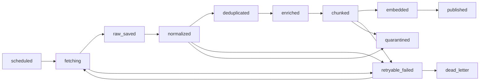

# TechPulse Data Pipeline

- 상태: Draft
- 작성일: 2026-09-01
- 관련 문서: [DATABASE.md](./DATABASE.md), [SECURITY.md](./SECURITY.md)

## 1. 목적

외부 개발 기술 신호를 재현 가능하게 가져와 원본을 보존하고, 검색 가능한 문서와 비교 가능한 시계열 관측값으로 발행한다. 파이프라인의 최종 산출물은 “요약문”이 아니라 provenance가 있는 `document/chunk`와 `metric observation`이다.

## 2. 소스 선택 원칙

1. 공식 API 또는 RSS/Atom을 브라우저 자동화보다 우선한다.
2. 공개 접근 가능 여부만으로 수집을 허용하지 않는다. 이용약관, robots, 저작권, 재배포 범위를 검토하고 결과를 [SOURCE_RIGHTS.md](./SOURCE_RIGHTS.md)에 기록한다.
3. 게시 시각, 안정적 외부 ID, canonical URL 중 두 가지 이상을 확보할 수 있는 소스를 우선한다.
4. 소스별 rate limit과 conditional request를 지킨다.
5. Playwright는 공개 데이터에 안정된 API/피드가 없고 수집 승인을 받은 경우에만 사용한다.

## 3. 초기 소스 후보

모든 항목은 아직 Proposed이며 [ADR-0004](./adr/0004-initial-data-sources.md)와 [EXP-001](./experiments/EXP-001-source-feasibility.md)을 통과해야 한다. 권리 검토 결과는 [SOURCE_RIGHTS.md](./SOURCE_RIGHTS.md)에 있고, 아래 표의 확인 사항은 그 결과를 반영한다.

| 후보 | 신호 | 방식 | 장점 | 주요 확인 사항 |
|---|---|---|---|---|
| GitHub Releases | 프로젝트 업데이트 | GitHub REST API | 안정적 ID·URL·게시 시각, ETag conditional request가 rate limit에 계산되지 않음 | repository별 license가 본문 embedding을 허용하는지, author 개인정보 제거, `created_at`을 게시 시각으로 오해하지 않기 |
| Stack Exchange | 커뮤니티 언급 | REST API | 게시물별 CC BY-SA 라이선스가 명시되고 `content_license`로 기계 확인 가능 | **원문 발췌만 사용하고 재서술 금지.** 귀속 표시 필수, 삭제는 부재로 감지, 응답 본문 `backoff` 준수 |
| users.rust-lang.org | 공식 포럼 논의 | Discourse JSON API | 2020-07-17 이후 게시물이 MIT/Apache-2.0 | 게시일로 라이선스 분리, 이전 게시물 미수집, `deleted_at`로 삭제 반영, 429·`Retry-After` 준수 |
| arXiv | AI 연구 동향 | Atom API | metadata가 CC0 1.0, 저장·변형·공유가 명시 허용 | 요청 간격 3초·단일 연결, PDF·전문 미저장, 동일 질의 1일 1회 캐싱 |
| Chrome release notes | 브라우저 업데이트 | HTTP + HTML parse | 본문이 서버 렌더링, stable release date 제공 | 이미지·상표는 라이선스 제외, 귀속 문구 필요 |
| react.dev/blog | 프레임워크 공지 | RSS + HTTP | CC BY-4.0 명시, robots 전면 허용 | 귀속 문구 필요 |
| Chrome origin trials | 실험 기능 상태 | Playwright | 서버 HTML에 내용이 없어 렌더링 필요, feed·문서화 API 없음 | 게시 시각이 없어 `published_at`이 null, 본문이 짧은 구조화 레코드 |
| npm registry/downloads | 패키지 출시·다운로드 | 공개 registry/API | metadata 전체 복제가 명시적으로 허용됨 | maintainer email 필수 제거, downloads는 방향성 지표, 18개월·128 package 제한 |
| GitHub search | 관심·논의 신호 | REST API | 질의를 우리가 기록하므로 재현 가능 | 검색당 1,000건 상한, 분당 30건, 별 히스토리 소급 재구성 불가 |
| Hugging Face Hub | AI 생태계 활동 | REST API | 문서화 API, rate limit 공개 | **지표 전용.** model card 본문 미수집 |

신호 유형이 릴리스, 커뮤니티 언급, 포럼 논의, 논문, 패키지, 저장소 활동, AI 모델 활동으로 나뉘어 `FR-001`을 충족한다. Hacker News, Reddit, GitHub Trending 페이지, Lobsters, dev.to는 권리 검토에서 제외됐다. 근거는 [SOURCE_RIGHTS.md](./SOURCE_RIGHTS.md)에 있다.

수집 방식은 source마다 가장 단순하고 정책에 맞는 것을 고른다. 같은 사이트라도 서버 렌더링 페이지는 HTTP로, 렌더링이 필요한 페이지만 Playwright로 처리한다.

## 4. 공통 수집 계약

각 collector는 다음 값을 만든다.

| 필드 | 의미 |
|---|---|
| `source_key` | 설정에서 관리하는 안정적 소스 키 |
| `external_id` | 소스가 제공한 안정적 ID, 없으면 결정적 대체 ID |
| `canonical_url` | 추적 파라미터를 제거한 원문 URL |
| `published_at` | 원문 게시 시각, 모르면 null |
| `updated_at` | 원문 수정 시각, 모르면 null |
| `collected_at` | UTC 수집 시각 |
| `cursor` | 다음 incremental fetch를 위한 opaque 값 |
| `http_metadata` | status, ETag, Last-Modified, content type, rate-limit 상태 |
| `payload` | 원본 JSON 또는 허용된 HTML/text snapshot |
| `payload_hash` | canonical bytes의 SHA-256 |
| `rights_metadata` | 이용 조건 검토 버전과 저장·표시 허용 범위 |

collector는 source-neutral document를 직접 만들지 않는다. 원본 저장 성공 후 별도 processor가 변환한다.

## 5. 단계와 상태 전이

`retryable_failed`는 재시도 가능한 일시 오류, `quarantined`는 재시도로 해결되지 않는 입력 오류, `dead_letter`는 재시도 한도를 소진한 상태다. 세 상태를 하나로 합치면 운영자가 재처리 가능 여부를 판단할 수 없다.

### 5.1 Schedule

- source 설정에는 주기, timezone(기본 UTC), overlap window, page limit, enabled 상태를 둔다.
- 같은 source/schedule window에는 하나의 활성 run만 허용한다.
- 이전 run이 지연되면 무제한 backlog를 만들지 않고 coalescing 정책을 적용한다.

### 5.2 Fetch

- incremental cursor와 overlap window를 함께 사용해 경계 누락을 방지한다.
- ETag/Last-Modified가 있으면 conditional GET을 사용한다.
- timeout과 최대 page/item 수를 둔다.
- `429`와 일시적 `5xx`만 bounded retry 대상으로 분류한다. 인증·정책 오류는 즉시 운영 확인 대상으로 보낸다.

### 5.3 Raw persistence

- `(source_id, external_id, payload_hash)`는 동일 revision의 멱등 키다.
- 원본 revision은 불변이다. 새 payload hash는 새 revision으로 보존한다.
- raw 저장 전에는 후속 job을 발행하지 않는다.

### 5.4 Normalize

텍스트 artifact와 숫자 관측값을 분리한다.

- `document`: title, body_text, author, language, published_at, canonical_url, artifact_type
- `metric_observation`: subject, metric_type, window_start/end, value, unit, source

HTML은 script/style/navigation을 제거한 안전한 text로 변환한다. 원문에서 추출하지 못한 값을 LLM이 사실처럼 보완하지 않는다.

### 5.5 Deduplicate

우선순위는 다음과 같다.

1. 동일 `(source, external_id, revision)`
2. 정규화 canonical URL
3. 정규화 본문 exact hash
4. 제목·본문 fingerprint 기반 near-duplicate 후보
5. embedding similarity는 후보 cluster 제안에만 사용

cross-source 문서는 삭제·병합하지 않고 `duplicate_cluster`로 묶는다. 대표 문서를 선택해도 모든 provenance와 URL을 보존한다. near-duplicate threshold는 [EXP-004](./experiments/EXP-004-deduplication.md) 전에는 확정하지 않는다.

### 5.6 Enrich and classify

- deterministic alias dictionary로 기술 entity를 먼저 식별한다. dictionary는 [TOPIC_TAXONOMY.md](./TOPIC_TAXONOMY.md)이며 alias 매칭은 단어 경계를 지키고 `ambiguous` topic의 단독 토큰 매칭을 금지한다.
- LLM topic extraction은 structured output과 허용 taxonomy를 사용한다.
- 토픽 결과에는 방식, 모델/규칙 버전, confidence를 기록한다.
- 낮은 confidence는 검색 필터의 hard truth로 사용하지 않는다.

### 5.7 Chunk and embed

- 제목, section path, 게시 시각, source를 chunk metadata에 유지한다.
- 문장·heading 경계를 우선하고 표와 코드 블록을 의미 없이 절단하지 않는다.
- chunk 크기·overlap은 모델 token limit과 [EXP-002](./experiments/EXP-002-retrieval.md) 결과로 결정한다.
- embedding에는 provider, model, dimensions, input hash, created_at을 기록한다.
- 같은 `(chunk, model, input_hash)`는 재호출하지 않는다.

### 5.8 Publish

document revision의 필수 chunk와 embedding이 모두 준비된 트랜잭션에서만 `published`로 바꾼다. 질의 경로는 `published` revision만 검색한다.

## 6. Playwright collector 규칙

- 격리된 worker/container에서 최소 권한으로 실행한다.
- 인증 우회, CAPTCHA 우회, 무한 스크롤 남용, 숨겨진 endpoint 역공학을 하지 않는다.
- download, popup, 임의 navigation을 기본 차단하고 허용 host를 제한한다.
- role/text 등 의미 기반 locator를 우선하고 DOM 구조 selector 의존을 줄인다.
- fixture 기반 parser contract test와 낮은 빈도의 live canary를 분리한다.
- 페이지 변경은 해당 source만 실패시키며 전체 파이프라인을 막지 않는다.
- 원문 HTML 전체 저장은 허용 범위와 필요성이 확인된 경우에만 한다.

## 7. 재시도와 복구

| 오류 유형 | 예 | 처리 |
|---|---|---|
| transient | timeout, 429, 일부 5xx | exponential backoff + jitter, 최대 시도 후 dead letter |
| permanent input | 필수 ID/URL 없음, 파싱 불가 | quarantine, parser version과 sample 보존 |
| policy/auth | 401/403, robots/약관 변경 | 자동 재시도 중단, source disable 검토 |
| downstream | DB/embedding API 장애 | 단계 멱등 키로 재개, 이미 완료한 외부 호출 반복 방지 |

운영자는 `run_id`, source, 단계, 기간으로 실패를 찾아 안전하게 replay할 수 있어야 한다. replay는 원본을 덮어쓰지 않고 processor version을 새로 기록한다.

## 8. 데이터 품질과 모니터링

- freshness lag: `published_at → searchable_at`과 `scheduled_at → completed_at`을 분리
- completeness: 필수 필드 충족률, 게시일 unknown 비율
- uniqueness: exact duplicate 차단, cluster 크기 분포
- validity: language, URL, timestamp, metric unit 검증 실패율
- drift: source별 item 수·본문 길이·selector 성공률 변화
- cost: item/chunk/answer당 LLM·embedding 사용량

## 9. 보존 제안

아직 확정되지 않은 초기 정책이다.

- normalized document, provenance, metric: MVP 기간 동안 보존
- raw payload: 기본 90일 후 정책에 따라 삭제 또는 축약
- 실패 payload: 민감정보를 제거하고 30일
- job/log: 30일
- query prompt/answer: 평가 동의 범위에서 30일 또는 익명화

source별 raw 보존 제안은 다음과 같다. `source_rights.raw_retention_days`에 기록한다.

| source | raw 보존 | 근거 |
|---|---|---|
| `github_releases` | 90일 | 공개 데이터이고 재수집이 저렴하다 |
| `stack_exchange` | 30일 | CC BY-SA 4.0 §4(b)가 상당 부분을 담은 데이터베이스를 Adapted Material로 보므로 저장 범위를 최소화한다 |
| `users_rust_lang` | 90일 | 2020-07-17 이후 게시물만 저장하며 라이선스가 permissive다 |
| `arxiv` | 90일 | TOU가 metadata 저장을 명시 허용하고 캐싱을 권고한다. PDF·전문은 애초에 저장하지 않는다 |
| `chrome_release_notes`, `chrome_origin_trials`, `react_blog` | 90일 | CC BY 계열이며 텍스트만 저장한다 |
| `npm_registry`, `npm_downloads` | 30일 | raw는 재수집 가능하고 값은 `metric_observation`으로 남는다 |
| `github_search` | 30일 | raw 응답보다 스냅샷 관측값과 `query_signature`가 중요하다 |
| `huggingface_hub` | 30일 | 지표만 저장하므로 raw 장기 보존이 불필요하다 |

normalized document와 metric observation은 위 값과 무관하게 MVP 기간 동안 보존한다. raw를 지워도 citation이 가리키는 revision은 유지된다.

원 출처의 삭제·수정 요청을 반영할 수 있도록 URL/source 기반 tombstone과 재색인 절차를 둔다.

삭제 감지 방식은 source마다 다르므로 collector 설정에 명시한다.

| 방식 | 대상 | 처리 |
|---|---|---|
| 명시적 flag | `users_rust_lang`의 `deleted_at`·`user_deleted` | flag를 보면 즉시 tombstone |
| 부재 감지 | `stack_exchange` | API에 삭제 flag가 없다. 재조회 대상 목록에서 사라진 항목을 삭제로 간주한다. 일시적 오류와 구분하기 위해 연속 확인 횟수 기준을 두고, rate limit·오류로 조회하지 못한 경우를 삭제로 오인하지 않는다 |
| 상태 필드 | `stack_exchange`의 `closed_date`·`locked_date` | 삭제가 아니므로 tombstone 대상이 아니다. 상태만 기록한다 |
| 갱신 감지 | 나머지 | 새 payload hash를 새 revision으로 보존한다 |

## 10. 공식 참고 자료

- [GitHub REST API: releases](https://docs.github.com/en/rest/releases/releases)
- [GitHub REST API rate limits](https://docs.github.com/en/rest/using-the-rest-api/rate-limits-for-the-rest-api)
- [Official Hacker News API](https://github.com/HackerNews/API)
- [npm Registry API](https://github.com/npm/registry/blob/main/docs/REGISTRY-API.md)
- [Playwright locators](https://playwright.dev/docs/locators)

