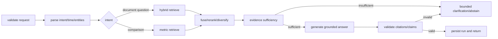

# Signal Archive RAG Design

- 상태: Draft
- 작성일: 2026-09-01
- 관련 문서: [PRD.md](./PRD.md), [DATABASE.md](./DATABASE.md)

## 1. 목표와 비목표

RAG의 목표는 최신 기간에 해당하는 근거를 검색해, 주장마다 검증 가능한 출처가 있는 답변을 만드는 것이다. 자율 웹 탐색 agent, 일반 지식 챗봇, 근거 없는 예측은 MVP 목표가 아니다.

## 2. 지원 질의 유형

| intent | 예 | 필요한 처리 |
|---|---|---|
| `trend_summary` | 최근 7일 TypeScript 백엔드 트렌드 | 기간 내 cluster·topic 집계 + 대표 근거 |
| `recent_updates` | Playwright 최근 업데이트 | 공식 release/changelog 우선 검색 |
| `compare_interest` | 한 달 Bun과 Node.js 관심 변화 | 같은 기간·단위의 시계열을 각각 계산 |
| `emerging_topics` | 최근 RAG에서 많이 언급되는 기술 | entity mention 변화 + source diversity |

지원하지 않는 의도는 명확히 알리고, 일반 LLM 지식으로 우회 답변하지 않는다. 외부 표현은 [API.md](./API.md)의 `status = unsupported_intent`이며 오류 응답이 아니다.

## 3. 워크플로

LangGraph.js의 명시적 workflow를 사용한다([ADR-0002](./adr/0002-ai-orchestration.md), 2026-09-01 승인). autonomous agent loop와 장기 memory는 사용하지 않는다.

LLM이 필요한 단계와 결정적 코드 단계를 구분한다. 날짜 계산, SQL 필터, 점수 집계, citation ID 검증은 LLM에 맡기지 않는다.

## 4. 질의 해석 계약

구조화 결과는 다음 개념을 포함한다.

- `intent`: 지원 intent enum
- `entities`: canonical topic/entity ID와 원문 표현
- `time_range`: inclusive start, exclusive end의 UTC timestamp
- `timezone`: 상대 기간 해석에 사용한 IANA timezone
- `language`: 답변 언어
- `source_types`: 질문이 요구한 경우의 제한
- `metrics`: 비교할 개별 지표
- `ambiguities`: 답변 가능 여부에 영향을 주는 모호성

API가 별도 기간을 받으면 자연어에서 추정한 기간보다 우선한다. “최근 7일”은 요청 시각을 포함한 rolling 7×24시간으로 해석하는 것을 추천하며, 달력 기준이 필요하면 응답에 범위를 명시한다.

## 5. 검색 전략

### 5.1 Candidate generation

동일한 metadata filter를 적용한 두 검색을 병렬로 수행한다.

- lexical: PostgreSQL full-text search, 제목·entity exact match에 강점
- semantic: pgvector cosine similarity, 표현이 다른 관련 문서에 강점

필수 filter는 `published`, time range, rights visibility다. source/topic filter는 요청과 confidence에 따라 적용한다.

`published_at`이 없는 문서의 규칙은 다음과 같다.

1. `trend_summary`, `recent_updates`, `compare_interest`의 기본 후보에서 제외한다.
2. `collected_at`을 게시 시각처럼 사용해 기간 필터를 통과시키지 않는다.
3. 해당 기간에 제외된 문서가 있으면 응답 `coverage.limitations`에 건수를 표시한다.
4. source 전체의 게시 시각 확보율이 [EXP-001](./experiments/EXP-001-source-feasibility.md) gate 미달이면 그 source를 시간 기반 집계에서 제외하고 그 사실을 source status에 남긴다.

MVP 초기 데이터가 작을 때는 exact vector search를 우선한다. HNSW/IVFFlat 도입은 latency·recall 측정 후 결정한다. pgvector의 approximate index는 filter가 index scan 뒤 적용되어 결과 수가 줄 수 있으므로 시간 필터 recall을 반드시 평가한다.

### 5.2 Fusion and ranking

추천 순서는 다음과 같다.

1. lexical rank와 vector rank를 Reciprocal Rank Fusion으로 결합
2. 질문과 문서 시각 차이에 따른 bounded recency boost
3. 공식 release 등 source authority signal 적용
4. duplicate cluster당 대표 결과 수 제한
5. source와 날짜 diversity 확보
6. 필요할 때만 bounded reranker 적용

가중치, 후보 수, decay half-life는 [EXP-002](./experiments/EXP-002-retrieval.md)에서 결정한다. 최종 score는 사용자에게 “관심도”로 표시하지 않는다.

### 5.3 Context assembly

- chunk별 stable citation ID를 부여한다.
- 같은 document의 인접 chunk는 token budget 안에서 합친다.
- title, source, published_at, canonical URL, excerpt를 모델 context와 분리된 metadata로 전달한다.
- 여러 출처가 같은 upstream 발표를 복제하면 하나의 독립 근거로 과대계산하지 않는다.
- context 예산의 일부를 상충 근거와 데이터 한계에 확보한다.

## 6. 답변 계약

응답은 다음 의미 구조를 가진다.

1. 직접 답변 또는 핵심 요약
2. 근거가 있는 주요 관찰
3. 비교 질문이면 지표별 변화와 기간
4. 데이터 커버리지·한계
5. citation 목록과 데이터 최신 시각

모델은 제공된 evidence ID만 인용할 수 있다. 후처리기는 다음을 검증한다.

- 존재하지 않는 citation ID가 없음
- 핵심 사실 문장에 citation이 있음
- citation 문서가 요청 기간 안에 있음
- URL은 DB metadata에서 주입하며 모델이 생성하지 않음
- 비교 수치는 조회된 관측값과 일치함

검증 실패 시 1회의 제한된 재생성 또는 답변 축소 후 보류한다. 무한 self-correction loop는 허용하지 않는다.

### 6.1 원문 보존이 필요한 source

일부 source는 라이선스가 재서술을 제약한다. 이 경우 모델이 근거를 요약하거나 다시 쓰지 못하게 한다.

- source에 `verbatim_only` 표시가 있으면 해당 근거는 **원문 발췌를 그대로 제시하고 재서술하지 않는다.** 요약, 번역, 문장 재구성, 여러 근거의 병합 서술을 금지한다.
- 답변은 그 근거를 인용 블록으로 인용하고, 주변 서술은 모델 자신의 문장으로 쓰되 원문 의미를 다시 표현하지 않는다.
- 후처리기는 `verbatim_only` source의 citation에 대해 답변 텍스트가 원문 발췌를 변형 없이 포함하는지 검사한다.
- 귀속 정보(작성자, 라이선스, 원문 링크)는 모델 출력이 아니라 저장된 metadata에서 주입한다.

Stack Exchange가 이 규칙의 적용 대상이다. 근거는 [SOURCE_RIGHTS.md](./SOURCE_RIGHTS.md) §10.1에 있다.

## 7. 비교와 트렌드 계산

“관심”은 단일 진실값이 아니다. MVP는 아래 시리즈를 별도로 보여준다.

- community mentions: dedup cluster 기준 entity 언급 수. source는 Stack Exchange와 공식 프로젝트 포럼
- issue discussion: GitHub issue의 comment·reaction·interaction 수
- repo attention: GitHub search 스냅샷 기준 별 수와 신규 등록. **수집 시작 이후 구간만 존재하며 과거 backfill이 불가능하다**
- source diversity: 같은 entity를 언급한 독립 source 수
- release activity: 공개 release 수
- paper activity: 기간별 arXiv 제출 수
- model activity: Hugging Face 모델·데이터셋 생성 수와 다운로드 수
- package downloads: 동일 단위·기간에서 가용한 경우의 다운로드 수. npm 공식 설명에 따르면 이 값은 tarball HTTP 200 응답 수이며 mirror, CI build server, 전수 분석 robot의 다운로드를 포함한다. 사용자 수가 아니고 절대값으로 쓰지 않으며 방향성 지표로만 제시한다. 하루 50건 미만 구간은 추세 판단에 사용하지 않고, publish 직후 spike는 별도로 표시한다. 근거는 [SOURCE_RIGHTS.md](./SOURCE_RIGHTS.md) §6에 있다

변화율에는 기준값, 절대값, 기간을 함께 표시한다. 기준값이 너무 작거나 관측이 누락되면 백분율을 숨긴다. 서로 다른 metric을 정규화해 하나의 composite score로 만드는 것은 MVP에서 제외한다.

## 8. 근거 부족과 충돌

- 최소 독립 근거 수는 query intent별로 설정하고 평가로 확정한다.
- 공식 업데이트 질문은 공식 source 하나만으로도 답할 수 있으나 그 성격을 표시한다.
- 트렌드 일반화는 source diversity가 부족하면 “관찰된 소스 내”로 범위를 제한한다.
- 상충하는 버전·날짜는 한쪽을 임의 선택하지 않고 양쪽을 인용한다.
- 최근 데이터가 없으면 검색 기간을 몰래 넓히지 않는다. 제안은 할 수 있지만 사용한 기간을 명시한다.

## 9. 안전 설계

수집 문서는 신뢰할 수 없는 데이터이며 문서 안의 지시문은 실행하지 않는다.

- system/developer instruction과 retrieved content를 명확히 구분한다.
- 문서가 요구하는 tool call, secret 공개, 정책 변경을 무시한다.
- RAG workflow에 임의 URL fetch나 shell tool을 제공하지 않는다.
- HTML을 text로 정제하고 hidden content를 제거한다.
- 사용자 입력, retrieved text, 모델 출력 길이를 제한한다.
- citation URL은 저장된 allowlisted `http/https` URL만 사용한다.

상세 위협과 통제는 [SECURITY.md](./SECURITY.md)에 있다.

## 10. 모델·프롬프트 버전 관리

각 query run은 다음을 기록한다.

- query parser/generator/reranker provider와 model ID
- prompt template version과 workflow version
- embedding model/version
- retrieval parameters와 filter
- 선택된 document revision/chunk/citation
- token usage, latency, 결과 상태

원문 프롬프트와 답변의 보존은 개인정보·비용 정책 승인 후 정한다. 테스트에서는 fake provider와 고정 fixture를 기본으로 한다.

## 11. 평가

### Retrieval

- Recall@k, MRR/nDCG@k
- time-filter violation rate
- duplicate cluster redundancy
- source diversity@k

### Generation

- claim-level citation precision와 coverage
- 날짜·수치 일치율
- 질문 의도 충족률
- unsupported claim rate
- 올바른 abstention rate

### Regression set

질문 목록과 라벨 규칙은 [EVAL_GOLDEN_SET.md](./EVAL_GOLDEN_SET.md)에 있다. 사용자 예시 4개를 포함해 한국어·영어, 기간 경계, 별칭, 데이터 없음, 상충 출처, prompt injection 문서, 라이선스 제약 source를 포함한다. 상세 프로토콜은 [EXP-002](./experiments/EXP-002-retrieval.md)와 [EXP-003](./experiments/EXP-003-model-providers.md)에 있다.

## 12. Alternatives와 Recommendation

| 선택 | Alternatives | Recommendation | 상태 |
|---|---|---|---|
| orchestration | LangChain runnable/agent, LangGraph workflow | deterministic LangGraph workflow | **Accepted** ([ADR-0002](./adr/0002-ai-orchestration.md)) |
| retrieval | vector only, FTS only, hybrid | metadata-filtered hybrid | Proposed, 실험 필요 |
| vector index | exact, HNSW, IVFFlat | exact로 시작 후 HNSW 평가 | Proposed |
| reranking | 없음, LLM, cross-encoder | MVP는 RRF 우선, 품질 부족 때 bounded reranker | Proposed |
| answer delivery | JSON, SSE | JSON 우선, UX 측정 후 SSE | Proposed |

## 13. 공식 참고 자료

- [LangGraph.js overview](https://docs.langchain.com/oss/javascript/langgraph/overview)
- [LangGraph workflows and agents](https://docs.langchain.com/oss/javascript/langgraph/workflows-agents)
- [pgvector hybrid search and indexing](https://github.com/pgvector/pgvector)
