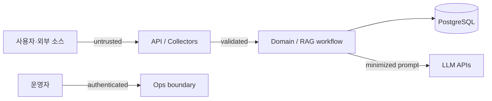

# Signal Archive Security Design

- 상태: Draft threat model
- 작성일: 2026-09-01
- 범위: 수집기, 처리 파이프라인, RAG, API, 데이터베이스, 로컬/배포 컨테이너

## 1. 보호 대상

- LLM, embedding, source API credential
- PostgreSQL의 raw payload, query metadata, provenance
- 답변과 citation의 무결성
- 수집 대상 정책과 rate-limit 준수 상태
- API·worker·브라우저 실행 환경의 가용성
- 공급자 사용량과 비용 한도

## 2. 신뢰 경계

사용자 질문, API 응답, HTML/JSON 원문, retrieved document, 모델 출력은 모두 신뢰하지 않는다. DB에 저장되었다는 이유로 신뢰 수준이 올라가지 않는다.

## 3. 주요 위협과 필수 통제

위협 ID는 `THR-*`를 사용한다. `SEC-*`는 [TASKS.md](../TASKS.md)의 구현 task ID이므로 위협 ID로 재사용하지 않는다. 위협과 task/test의 연결은 [TRACEABILITY.md](./TRACEABILITY.md)에 있다.

| ID | 위협 | 필수 통제 | 검증 |
|---|---|---|---|
| THR-001 | 수집 URL을 이용한 SSRF | source별 host allowlist, redirect 재검증, `http/https`만 허용, loopback/private/link-local/metadata IP 차단, DNS rebinding 방어 | malicious URL integration test |
| THR-002 | 악성 HTML과 browser escape | 격리 container, non-root, 최소 capability, download/popup 차단, browser 최신 pin, host 제한 | Playwright security test/canary |
| THR-003 | retrieved prompt injection | 문서를 data로 구분, RAG에 shell/browser/secret tool 미제공, hidden content 제거, output 검증 | injection corpus eval |
| THR-004 | LLM의 허위 URL·citation | citation ID allowlist, URL DB 주입, claim/citation 후검증 | generation contract test |
| THR-005 | secret 유출 | secret manager/env injection, `.env` 미커밋, log redaction, frontend bundle 금지 | secret scan + built asset scan |
| THR-006 | API 비용·DoS | body/field 상한, timeout, concurrency cap, rate limit, provider budget/circuit breaker | load/abuse test |
| THR-007 | SQL/검색 입력 공격 | parameterized query, schema validation, 사용자 제공 schema/SQL 금지 | SAST + integration test |
| THR-008 | 운영 endpoint 오용 | public과 분리, 강한 인증, least privilege, idempotency, audit log | authz test |
| THR-009 | 공급망 공격 | lockfile, pinned base image digest 추천, dependency/container scan, 최소 install script 정책 | CI scan |
| THR-010 | 과도한 원문·개인정보 보존 | 수집 최소화, rights metadata, retention, 삭제/tombstone 절차 | retention test/audit |
| THR-011 | queue job 변조·중복 | job schema 검증, DB authoritative state, 멱등 키, queue 비공개 | duplicate/tamper test |
| THR-012 | 모델 공급자 데이터 노출 | 필요한 excerpt만 전송, PII/secret pattern 차단, provider retention 검토 | provider review + redaction test |

## 4. Collector 보안

### 4.1 Network egress

- 운영자가 승인한 source base URL에서 생성한 URL만 요청한다.
- redirect의 매 hop마다 scheme, host, resolved IP를 검증한다.
- user question이나 retrieved 문서에서 collector URL을 만들지 않는다.
- proxy credential과 source token은 source adapter에만 주입한다.
- 응답 byte 수, decompressed 크기, 페이지 수, 처리 시간을 제한한다.

### 4.2 Playwright

- persistent personal browser profile을 사용하지 않는다.
- 로그인 cookie, password manager, host filesystem mount를 제공하지 않는다.
- 불필요한 camera, microphone, geolocation, clipboard permission을 거부한다.
- service worker와 third-party request 차단은 대상 사이트 기능과 측정 후 적용한다.
- screenshot/HTML fixture에 token이나 개인정보가 포함되지 않도록 redaction한다.

### 4.3 Content handling

- HTML sanitizer와 text extractor는 parser version을 기록한다.
- executable script, inline event handler, data URL을 사용자 UI에 전달하지 않는다.
- excerpt는 plain text로 출력하고 UI도 escape한다.
- archive, binary, download는 MVP에서 처리하지 않는다.

### PIPE-007 replay audit

Replay events contain IDs, disposition, UTC time, and bounded redacted summaries only; raw payloads, credentials, cookies, and provider error bodies are excluded. Disabled source state prevents new replay delivery.

## 5. RAG와 LLM 보안

- prompt template은 code review 대상이며 버전 관리한다.
- system instruction과 evidence를 명확한 delimiter/structured message로 분리한다.
- 모델이 선택할 수 있는 source, SQL, URL, tool을 열어두지 않는다.
- structured output을 schema로 검증하고 실패 시 bounded retry만 허용한다.
- provider error body는 sanitize 후 기록한다.
- token·요금 상한을 request와 일 단위로 둔다.
- 모델·embedding provider의 학습 사용, 보존, 지역, 삭제 조건을 결정 전에 검토한다.

## 6. API 보안

- production은 TLS를 강제하고 trusted proxy 설정을 명시한다.
- production 배포는 [ADR-0013](./adr/0013-production-deployment.md)의 GitHub `production` Environment 승인 뒤에만 실행한다. GHCR 이미지는 commit SHA로 고정하고, SSH는 저장소에 커밋하지 않은 private key와 pinned `PRODUCTION_KNOWN_HOSTS`를 사용한다.
- server-owned systemd Caddy는 `signal.jisung.lol` snippet을 설치하기 전에 전체 설정을 validate하고 reload한다. `/api/*`와 `/health/*`만 API로 전달하고 나머지는 web으로 전달하며, Compose는 API/web을 loopback에만 publish해 기존 Discord routing을 보존한다.
- CORS는 실제 web origin allowlist만 허용한다.
- public answer API는 인증이 없더라도 rate limit과 abuse monitoring을 적용한다.
- operations endpoint는 public routing에서 분리하는 것을 우선 추천한다.
- cookie 인증을 선택하면 CSRF 방어를 포함한다. bearer token이면 localStorage 장기 보관을 피한다.
- validation error에는 원문 전체를 반사하지 않는다.
- security header: CSP, `frame-ancestors`, `nosniff`, Referrer-Policy를 web layer에서 설정한다. SvelteKit에서는 `hooks.server.ts`의 응답 처리와 CSP 설정에 둔다.
- web의 server 전용 코드는 `+page.server.ts`, `+server.ts`, `$lib/server/` 경계 안에만 둔다. client bundle에 들어가는 코드에서 LLM key, DB 자격증명, 내부 endpoint를 참조하지 않으며 빌드 산출물 검사로 확인한다.

공개 데모의 사용자 인증 방식은 미결정이다. MVP에서 계정 기능을 만들지 않더라도 운영 기능 보호는 생략하지 않는다.

## 7. 데이터베이스와 secret 관리 (Secret Management & Rotation Runbook)

- API와 worker 역할을 분리하고 필요한 table/action만 부여한다. Neon runtime role과 migration role도 분리한다.
- Neon pooled/direct connection string은 secret manager 또는 배포 환경 주입으로만 제공한다. connection string을 client bundle·로그·오류 본문에 기록하지 않으며, provider endpoint의 네트워크·TLS 접근 제어는 Neon 설정과 배포 egress 정책으로 제한한다.
- migration credential과 runtime credential을 분리한다.
- backup은 암호화하고 restore 권한을 제한한다.
- raw payload와 query data를 log에 직렬화하지 않는다.
- 개발용 `.env.example`에는 `DATABASE_URL`·`DATABASE_URL_DIRECT`의 이름만 두고 실제 값을 넣지 않는다. 각 runtime은 필요한 endpoint만 주입받는다.

### 7.1 Secret & Credential Rotation 런북

비밀정보(Database URL, API 키, Worker Secret) 유출 또는 정기 교체 시 무중단(Zero-Downtime) 순차 롤아웃 절차를 따른다.

1. **새 Credential 발급 및 Secret Manager 등록**:
   - Neon 콘솔/CLI 또는 클라우드 Secret Manager에서 신규 Role/암호를 생성하여 dual-credential 상태를 만든다.
   - staging/ops 환경에서 신규 connection string 연결성(pooled / direct)을 사전 검증한다.
2. **애플리케이션 환경 변수 주입 및 순차 재배포**:
   - API 배포 그룹에 신규 credential을 주입하고 rolling restart를 진행한다 (`/health/ready` 통과 확인).
   - Worker 서비스에 신규 credential을 주입하고 graceful restart를 진행한다.
3. **정상 트래픽 및 쿼리 동작 검증**:
   - 신규 credential 기반 쿼리 및 job 처리가 활성화되었는지 모니터링한다.
4. **구 Credential 폐기 및 감사 기록**:
   - 이전 credential을 revoke/delete 처리한다.
   - `audit_events`에 `action: 'credential_rotation'` 이력을 기록한다.
## 8. 개인정보·저작권·수집 윤리

- 공개 기술 콘텐츠라 해도 작성자 ID, 댓글, 이메일 등 필요하지 않은 개인정보를 수집하지 않는다.

검토된 source에 대한 구체 통제는 다음과 같다.

| source | 필수 통제 |
|---|---|
| `github_releases`, `github_search` | payload의 `author`·`owner`·`user`·`milestone.creator` 객체(`login`, `id`, `node_id`, `avatar_url`, `gravatar_id`, `html_url`)를 저장 전에 제거한다. 서버측 field 선택 기능이 없으므로 collector가 수행한다 |
| `npm_registry` | `author.email`, `_npmUser.email`, `maintainers[].email`, search 응답의 `publisher.email` 등 email과 개인 식별 필드를 저장 전에 제거한다. npm Acceptable Use는 타인의 개인정보 복사·공유를 금지한다 |
| `stack_exchange` | `owner.display_name`(실명 가능), `owner.profile_image`(Gravatar), `owner.user_id`를 저장 전에 제거한다. 단 CC BY-SA 귀속에 작성자 식별이 필요하므로, 표시용 작성자명은 발췌 표시 기능이 승인된 뒤 귀속 목적으로만 별도 보관한다 |
| `users_rust_lang` | `username`, `name`(실명 가능), `user_id`, `avatar_template`을 저장 전에 제거한다 |
| `arxiv` | 저자명은 CC0 metadata에 포함되지만 필요 최소 범위로 저장하고 소속·연락처는 저장하지 않는다 |
| `huggingface_hub` | 지표만 저장한다. namespace가 개인 사용자명일 수 있으므로 집계 목적 외에는 보관하지 않는다 |
| `hacker_news` | 권리 검토에서 제외됐다. 수집하지 않는다 |
| `reddit` | 포트폴리오·비상업·단기 범위의 제한된 후보. host allowlist, PII 최소화, 삭제/tombstone와 gate 전 production 비활성화가 필수다 |

개인정보 제거는 정규화 단계가 아니라 raw 저장 이전에 수행한다. raw revision은 불변이므로 저장 후에는 되돌릴 수 없다.

예외가 하나 있다. CC BY-SA 같은 라이선스는 귀속에 작성자 식별을 요구한다. 이 경우 개인정보 최소화와 라이선스 준수가 충돌하므로, **발췌를 표시하는 기능에 한해** 귀속 목적의 작성자명을 보관하고 그 목적 외 사용을 금지한다. 표시 기능이 없는 동안에는 보관하지 않는다.
- 원문 전체 재배포보다 짧은 excerpt와 원문 링크를 우선한다.
- source마다 필요한 보존 정책과 권한을 관리한다.
- robots와 약관 변경을 정기 확인하고 승인 상태가 만료되면 수집을 중단한다.
- 삭제 요청과 upstream 삭제를 반영하는 tombstone/reindex 경로를 제공한다.

법적 판단이 필요한 항목은 프로젝트 문서가 법률 자문을 대체하지 않는다.

## 9. 로깅과 감사

기록: timestamp, event, actor/service, correlation IDs, result, sanitized error code, 모델/processor version.

기록 금지: API key, auth header, cookie, 전체 raw payload, 전체 prompt, 불필요한 사용자 IP, provider 원본 오류.

운영 실행, replay, source enable/disable, migration, retention purge는 감사 이벤트를 남긴다.

## 10. 취약점 및 사고 대응

1. 영향 source/job/API를 disable 또는 rate-limit한다.
2. credential 노출 가능성이 있으면 즉시 revoke/rotate한다.
3. correlation ID로 영향 raw item, document revision, answer citation을 추적한다.
4. 오염 문서를 tombstone하고 embedding/search index에서 제외한다.
5. 원인과 영향, 복구, 재발 방지 test를 기록한다.

보안 연락처와 disclosure policy는 공개 배포 전에 `SECURITY.md` 또는 별도 repository policy로 추가한다.

## 11. 출시 전 보안 게이트

- threat table의 MVP 통제가 구현·테스트됨
- source policy review가 모두 유효함
- 게시물별 license가 저장되고 발췌 반환 경로에서 강제됨
- `verbatim_only` source의 재서술 차단 회귀 세트 통과
- 귀속이 필요한 source의 발췌가 귀속 정보 없이 반환되지 않음
- secret/dependency/container scan에 미해결 high/critical 없음
- SSRF와 prompt injection 회귀 세트 통과
- public/ops route 분리와 rate limit 검증
- backup/restore 및 credential rotation 절차 문서화
- raw/query retention job의 dry-run과 삭제 검증

## 12. 운영 배포 통제

- 운영 서버의 `/opt/signal-archive/.env`는 서버에서만 관리한다. `DATABASE_URL`은 runtime pooled URL, `DATABASE_URL_DIRECT`는 migration direct URL이며 둘 다 `sslmode=require`를 사용한다.
- 배포는 migration을 먼저 실행하고 Compose healthcheck와 `https://signal.jisung.lol/health/live`를 확인한다. 실패 시 마지막 성공 SHA로 application image를 되돌리며 forward-only migration 자체는 되돌리지 않는다.
- 운영자가 확인해야 할 사전조건은 DNS가 이 서버를 가리키는지, TCP 80/443이 열려 있는지, Caddy가 인증서를 발급·갱신할 수 있는지다.

## 13. 미결정 사항

- 공개 데모 인증과 quota 식별자
- ops interface를 HTTP/CLI 중 어디에 둘지
- secret manager의 구체 제품 및 서버 hardening 세부값
- 사용자 질문·답변 보존 여부
- provider 데이터 처리 조건
- 라이선스 귀속을 UI·API에서 표시하는 방식

source 구성은 [ADR-0004](./adr/0004-initial-data-sources.md)를 따른다.
