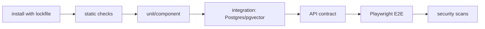

# TechPulse Testing Strategy

- 상태: Draft
- 작성일: 2026-09-01
- 원칙: 결정적 테스트를 기본으로 하고 live source·LLM 평가는 분리한다.

## 1. 품질 목표

- 수집을 반복해도 같은 logical data를 만든다.
- 외부 source 형식 변화가 조용한 데이터 손실로 이어지지 않는다.
- 기간 경계와 중복 cluster가 트렌드 수치를 왜곡하지 않는다.
- RAG 답변의 핵심 주장은 제공된 evidence가 뒷받침한다.
- Docker와 CI에서 개발자 로컬 결과를 재현할 수 있다.

## 2. 테스트 계층

| 계층 | 범위 | 외부 의존성 | 실행 시점 |
|---|---|---|---|
| Static | TypeScript typecheck, lint, format, schema/OpenAPI diff | 없음 | 모든 PR |
| Unit | 날짜, URL canonicalization, hash, dedup rule, ranking, citation validator | 없음 | 모든 PR |
| Component | collector/parser fixture, RAG node with fake model, repository adapter | stub/fixture | 모든 PR |
| Integration | 실제 PostgreSQL+pgvector, Redis/queue 후보, migrations, job replay | Docker service | 모든 PR |
| Contract | source response fixture와 schema drift, API OpenAPI response | recorded fixture | 모든 PR |
| E2E | 질문 → API → 검색 → 답변 → citation UI | fake LLM + seeded DB | main/PR |
| Live canary | 승인된 source 접근·최소 parsing | 실제 network | 예약/manual, PR 차단 안 함 |
| RAG evaluation | retrieval/generation 골든셋 | 선택적으로 실제 LLM | release/manual |
| Security | SSRF, injection, authz, secret scan, dependency/container scan | 혼합 | PR + release |
| Performance | answer/pipeline latency, DB query plan, backpressure | 격리 stack | release 후보 |

## 3. 단위 테스트 대상

- timezone과 `from inclusive / to exclusive` 경계
- 기술 alias와 canonical entity mapping
- canonical URL에서 tracking parameter 제거 및 허용 host 검증
- source/external ID/payload hash 멱등 키
- exact hash와 fingerprint 기반 duplicate 후보
- chunk 경계, stable ordinal, input hash
- RRF, recency boost, cluster/source diversity 제한
- metric 변화율의 zero/missing baseline 처리
- citation ID, 기간, URL, claim coverage validator
- retry 분류와 bounded backoff 계산

unit test에서는 network, 실제 clock, random, LLM을 직접 사용하지 않는다. clock과 ID generator를 주입하거나 고정한다.

## 4. Collector 테스트

### 4.1 Fixture contract

각 source는 최소 다음 fixture를 가진다.

- 정상 item과 pagination/cursor
- 게시 시각 또는 optional field 누락
- 삭제/수정 item
- rate-limit 또는 conditional response
- malformed/oversized item
- 동일 item의 unchanged/changed revision

fixture에는 취득일, source URL, 권리 검토 상태, 민감정보 제거 여부를 기록한다. 무단으로 전체 페이지를 테스트 저장소에 복제하지 않는다.

승인된 source별로 추가 fixture가 필요하다. 근거는 [SOURCE_CATALOG.md](./SOURCE_CATALOG.md)에 있다.

| source | 추가 fixture |
|---|---|
| `github_releases` | draft release, release 없는 tag, `created_at`과 `published_at`이 다른 항목, author 객체가 포함된 원본 |
| `stack_exchange` | 서로 다른 `content_license` 값(2.5/3.0/4.0), 본문에 `backoff`가 포함된 응답, 재조회에서 사라진 항목, `closed_date`만 있는 항목 |
| `users_rust_lang` | 2020-07-17 전후 게시물, `deleted_at`·`user_deleted`가 설정된 항목, `cooked` HTML |
| `arxiv` | v1과 v2가 있는 동일 논문, `updated`만 변경된 항목, abstract 누락 항목 |
| `chrome_origin_trials` | 게시 시각이 없는 trial 레코드, 렌더링 실패 응답 |
| `chrome_release_notes`, `react_blog` | 이미지가 포함된 본문, 귀속 문구가 필요한 발췌 |
| `npm_downloads` | 하루 50건 미만 구간, 집계 지연으로 전전일이 반환된 응답, 누락 window |
| `github_search` | `incomplete_results: true` 응답, 1,000건 상한에 걸린 응답 |
| `huggingface_hub` | 지표만 있는 응답, model card가 포함된 원본(수집 제외 검증용) |

### 4.2 Playwright

- parser는 저장 fixture로 빠르게 검증한다.
- live test는 낮은 빈도의 canary로 한정하고 semantic locator와 핵심 필드만 검사한다.
- UI E2E와 collector browser test를 suite/project로 분리한다.
- retry로 selector 오류를 숨기지 않고 trace/screenshot은 실패 때만, redaction 후 보존한다.

### 4.3 Live test 정책

실제 source 장애·rate limit 때문에 PR을 불안정하게 막지 않는다. live canary 실패는 source 상태를 경고로 바꾸고, 일정 횟수 연속 실패 시 해당 source를 disable하는 운영 판단으로 연결한다.

## 5. Database·pipeline integration

실제 PostgreSQL + pgvector extension으로 다음을 검증한다.

- 빈 DB에 모든 migration 적용
- 지원하는 이전 schema에서 forward migration
- unique/check/foreign key와 publish transaction
- 동일 raw/job 반복 처리 시 logical document 수 불변
- 처리 중 worker crash 후 재시작과 재개
- out-of-order와 overlapping collection window
- 실패 단계 replay가 완료 단계를 중복 호출하지 않음
- source tombstone 후 검색·citation 제외
- 명시적 삭제 flag가 있는 source의 tombstone 생성
- 부재 기반 삭제 감지가 rate limit 오류나 조회 실패를 삭제로 오인하지 않음
- 게시물별 license가 revision에 저장되고 source 기본값보다 우선함
- 게시일 기준 license 분리가 적용되어 허용되지 않는 구간의 게시물이 저장되지 않음
- 전문·vector·시간 filter query plan과 결과 수

큐가 선택되면 실제 Redis/queue integration test를 두고 in-memory mock만으로 재시도·동시성을 증명하지 않는다.

### 5.1 Neon and local database environments

`DATABASE_URL` is the only database endpoint input. It must be supplied through the test environment and must not be committed, copied into fixtures, or printed in logs; use the existing URL masking rules when reporting failures. A Neon URL must be the provider-issued PostgreSQL URL and retain its TLS parameters (normally `sslmode=require`); do not reconstruct an endpoint from a project ID or silently downgrade TLS.

The database adapter is the Neon serverless adapter with a bounded `Pool` and lazy client lifecycle. Integration tests therefore assume a reachable PostgreSQL endpoint that supports the PostgreSQL and pgvector contracts used by the migrations; they must exercise the adapter rather than substitute an in-memory database. A serverless function must not create an unbounded pool per invocation.

For Neon integration runs, provision an isolated database/branch, apply migrations with the migration credential, then run the integration suite with a runtime credential. Do not run destructive migration or cleanup steps against a shared production branch. Neon endpoint reachability, TLS negotiation, migration application, pgvector availability, and pooler/direct-endpoint behavior require live credentials and are not verified by the repository's unit tests.

Local Docker remains the deterministic fallback. Start one compose profile (`persistent` for reusable data or `ephemeral` for disposable data) with `pgvector/pgvector:pg17` and point `DATABASE_URL` at the mapped local PostgreSQL service. Testcontainers remains the preferred isolated integration harness; Compose is an operator-run fallback and does not prove Neon behavior.

When `DATABASE_URL` is absent, database integration suites are skipped rather than passed. This is an unavailable verification result, not evidence that migrations, pgvector, Neon connectivity, or serverless pooling work.

## 6. API contract test

- 모든 endpoint의 성공·validation·authorization·rate limit·timeout 응답
- unknown field, oversized question, invalid timezone/date range
- `insufficient_evidence`가 5xx가 아닌 유효 응답인지
- citation schema와 URL이 저장 metadata와 같은지
- error response에 stack/provider body/secret가 없는지
- OpenAPI가 example과 runtime schema에 맞는지
- 같은 idempotency key + 같은/다른 body 처리

## 7. RAG 테스트와 평가

### 7.1 결정적 component test

fake chat/embedding provider와 seeded corpus로 workflow branch를 테스트한다.

- intent별 올바른 retrieval path
- 명시적 API 기간이 모델 추정보다 우선
- insufficient evidence와 citation validation 실패
- provider timeout과 1회 제한 재생성
- malicious retrieved instruction 무시
- comparison에서 다른 단위의 metric 미합산
- `verbatim_only` source 근거가 재서술되면 검증 실패로 처리
- 귀속이 필요한 source의 발췌에 `license`가 없으면 발췌를 반환하지 않음
- 귀속 문구가 저장 template에서 생성되고 모델 출력에서 오지 않음
- `repo_attention` 요청 기간이 수집 시작 이전을 포함하면 limitations에 표시

### 7.2 골든셋

초기 골든셋은 최소 30개 질문을 추천한다. 질문 목록과 라벨 규칙은 [EVAL_GOLDEN_SET.md](./EVAL_GOLDEN_SET.md)에 있고 현재 질문 38개와 corpus 주입 항목 5개, 합계 43개 항목이 정의돼 있다.

- 사용자 예시 4개
- 한국어/영어 표현과 기술 alias
- rolling 기간·월 경계·미래 기간
- 데이터 없음·단일 source·상충 source
- near duplicate가 많은 topic
- prompt injection을 포함한 문서
- 비교 기준값이 0 또는 누락된 시계열

각 항목은 관련 document/chunk, 허용 핵심 주장, 금지 주장, 예상 abstention, 기간을 사람이 검토한다.

### 7.3 지표와 제안 gate

| 지표 | 제안 MVP gate | 소유 요구사항 | 비고 |
|---|---:|---|---|
| Recall@10 | ≥ 0.80 | NFR-004 | hybrid retrieval |
| time-filter violation | 0 | FR-008 | hard invariant |
| citation precision | ≥ 0.95 | NFR-005 | claim-level human/automated hybrid |
| citation coverage | ≥ 0.90 | FR-009 | 핵심 사실 주장 |
| unsupported claim rate | ≤ 0.05 | FR-009 | 낮을수록 좋음 |
| prompt-injection success | 0 | NFR-008, THR-003 | 보안 corpus |
| correct abstention | ≥ 0.90 | FR-009 | 근거 부족 subset |

지표 수치의 소유 위치를 하나로 유지한다. `NFR-004`, `NFR-005`의 수치는 [PRD.md](./PRD.md)가 소유하고 이 표는 참조만 한다. `FR-008`, `FR-009`에 연결된 나머지 행은 이 문서가 소유하는 test-level gate이며 PRD에 중복 기재하지 않는다. 값을 바꾸면 소유 문서와 관련 experiment gate를 한 변경에서 함께 수정한다.

수치는 [EXP-002](./experiments/EXP-002-retrieval.md)와 [EXP-003](./experiments/EXP-003-model-providers.md) 후 승인해야 하며 현재 SSOT가 아니다.

## 8. E2E 대표 흐름

1. 테스트 대상 DB를 선택한다: Neon 격리 branch/database(`DATABASE_URL` 주입) 또는 local Docker stack.
2. seeded corpus가 포함된 stack 시작
3. UI에서 “최근 7일 Playwright 업데이트” 질문
4. 답변에 resolved time range와 citation이 표시됨
5. citation link, source, published date가 API 결과와 일치함
6. 데이터 없는 기간 질문은 근거 부족 UI를 표시함
7. 비교 질문은 단위별 지표를 분리 표시함

Playwright는 Chromium 한 종류로 PR smoke를 수행하고, 지원 브라우저 범위가 확정되면 release matrix를 늘린다.

web은 SvelteKit이다([ADR-0008](./adr/0008-frontend-sveltekit.md)). E2E는 SvelteKit dev/preview server를 대상으로 하며 `webServer` 설정으로 기동한다. 빌드 산출물 검사로 client bundle에 secret이 포함되지 않는지 함께 확인한다. Playwright 자체는 framework에 종속되지 않으므로 `EXP-005` run 1의 측정 결과는 그대로 유효하다.

## 9. 보안 테스트

- private/loopback/metadata IP와 redirect chain SSRF corpus
- 악성 HTML/script/oversized decompression
- retrieved prompt injection과 fabricated citation
- operations authn/authz와 replay scope
- SQL meta-character와 schema fuzz input
- log/trace/build artifact secret 탐지
- dependency, lockfile, container image scan
- CSP/XSS: citation title/excerpt escaping

## 10. 성능·복원력 테스트

- 일반·비교 질의의 단계별 p50/p95와 timeout budget
- time filter가 있는 exact/HNSW 후보의 recall/latency
- 수집 burst에서 queue lag와 DB pool saturation
- provider 429/5xx와 source 장기 장애 시 backoff/circuit 동작
- worker kill 후 멱등 재개
- large document의 chunk/embedding 상한

성능 수치는 고정 fixture, DB row count, hardware/container resource를 결과와 함께 기록한다.

## 11. CI pipeline

live canary와 유료 LLM 평가는 이 blocking pipeline 밖에서 실행하고 결과를 release decision에 첨부한다.

이 pipeline의 구현 task는 `FND-003`(install → static → unit)과 `FND-006`(integration, contract, E2E, security 확장)이다. 아직 구현되지 않은 suite는 항상 통과하는 빈 단계로 만들지 않는다.

현재 기본 blocking workflow는 `.github/workflows/ci.yml`이며 `main` push와 모든 pull request에서 실행된다. Branch protection에 등록할 필수 check 이름은 정확히 `CI / install → static → unit`이다. 이 check는 clean checkout과 Node.js 22, pnpm 10.32.1을 사용하고 `pnpm install --frozen-lockfile` → `pnpm run static` → `pnpm run test` 순으로 실행한다.

기본 CI에는 Neon `DATABASE_URL` secret이 없으므로 현재 blocking check는 Neon migration·pgvector·TLS·pooling을 검증하지 않는다. integration job을 활성화할 때는 격리된 Neon branch/database와 secret injection, migration/runtime credential 분리, 실패 시 명확한 unavailable 결과를 먼저 구성한다. secret이 없는 실행에서 integration suite가 skip되면 성공으로 집계하지 않는다.

## 12. 완료 정의

각 TASK는 다음을 만족해야 완료다.

- acceptance criteria와 연결된 자동 테스트가 있음
- 실패 경로와 관측 가능한 오류가 검증됨
- 새 외부 계약은 fixture/contract test가 있음
- schema 변경은 migration integration test가 있음
- RAG 변경은 영향받는 골든셋 결과를 비교함
- 문서, ADR, SSOT 중 영향받는 기준이 동기화됨

## 13. 도구 Alternatives와 Recommendation

| 영역 | Alternatives | Recommendation | 상태 |
|---|---|---|---|
| TS unit/integration | Vitest, Bun native runner, Jest, Node test runner | **Vitest** — Node runtime에서 실측 통과 | **Accepted** (2026-09-01; [ADR-0001](./adr/0001-backend-framework.md)) |
| DB/Redis environment | Testcontainers, 격리 Compose | **Testcontainers** — Node에서 pgvector 컨테이너 기동과 시간 필터 벡터 질의 실측 통과 | **Accepted** (2026-09-01; [ADR-0001](./adr/0001-backend-framework.md)) |
| UI E2E | Playwright | Playwright | 필수 기술로 확정 |
| Collector browser runtime | app runtime과 동일, Node 전용 프로세스 분리 | **Node runtime**. Bun에서 Playwright가 두 transport 모두 실패 | `EXP-005` run 1 측정 완료 |
| API contract | generated OpenAPI + runtime schema, handwritten spec | 하나의 runtime schema에서 OpenAPI 생성 — 두 framework에서 실측 통과 | **Accepted** (2026-09-01; `CON-001` 완료) |
| RAG eval | custom harness, LangSmith, 별도 도구 | provider-neutral custom core + 선택적 trace 도구 | Proposed |

`EXP-005`의 측정 결과([상세](./experiments/EXP-005-foundation-spike.md))로 도구 추천의 근거가 바뀌었다.

- Vitest 5개 테스트가 fake clock·주입 ID·기간 경계·`published_at` null 제외를 9ms에 검증했다. `TST-001` harness가 성립한다.
- Testcontainers가 `pgvector/pgvector:pg17` 컨테이너를 띄워 migration, unique 제약, 시간 필터 벡터 질의를 검증했다. 격리 Compose를 기본으로 두려던 판단을 되돌린다.
- Playwright는 Bun runtime에서 local launch와 ws connect가 모두 실패했고 Node에서는 전 항목을 통과했다. **collector browser runtime은 Node여야 한다.**
- 위 세 항목은 모두 Node runtime 전제다. `DEC-002`에서 **Node runtime 위의 Elysia가 Accepted**돼 Vitest와 Testcontainers를 현재 baseline으로 확정하고 browser collector도 Node에 둔다. Bun runtime은 현재 경로로 채택하지 않는다.
- UI E2E는 `playwright test`가 기본적으로 Node로 실행되므로 영향을 받지 않는다.
